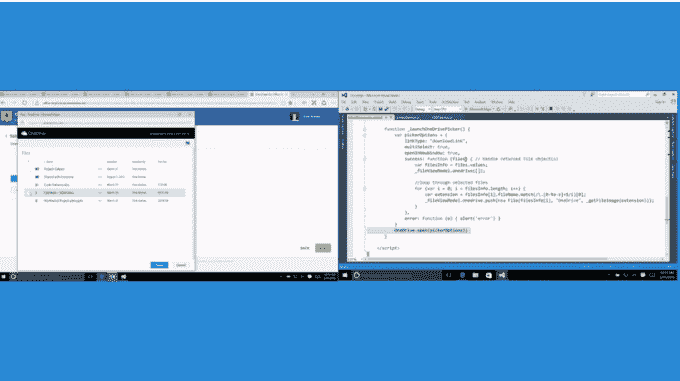
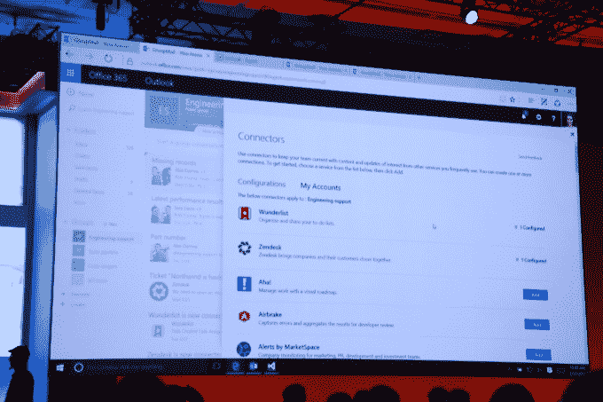

# 微软为开发人员提供了插入 Office 365 TechCrunch 的新选项

> 原文：<https://web.archive.org/web/http://techcrunch.com/2016/03/31/microsoft-gives-developers-new-options-to-plug-into-office-365/>

# 微软为开发人员提供了插入 Office 365 的新选项

今天在旧金山举行的 [Build 开发者大会](https://web.archive.org/web/20230131052256/https://build.microsoft.com/)上，微软宣布了一系列新的 Office 365 开发者工具，旨在增强他们与 Office 365 平台的交互方式。

微软概述了开发人员使用 Office 365 的三种新方法，包括 Graph APIs，以使用来自 Microsoft Graph 的内容在第三方应用程序中提供智能集成，Office 365 内部的集成点，以提供在 Office 365 应用程序内部集成功能的能力，以及 Office 365 连接器，以将外部应用程序的内容引入 Office 365。

去年秋天发布的 Microsoft Graph 发布了五个 API，让程序员只需使用办公应用程序(如任务、日历条目和文档)就可以获取收集到的数据。例如，您可以点击日历，找到所有人的可用空缺(动态变化),这样您就可以看到一组人何时可以见面。同样，你也可以通过这种方式找到有特殊专长的人。

微软希望开发人员以各种方式利用其产品，今天它还宣布了一种方法，让他们构建应用程序，然后将它们放在 Office 365 功能区中，这样用户就可以在 Excel、Word 和 PowerPoint 等办公工具中访问它们。同样，他们也可以将它们放在 Office 365 应用商店中，并以这种方式集成它们。

最后，微软还宣布了一个名为 [Office 365 Connectors](https://web.archive.org/web/20230131052256/https://dev.outlook.com/connectors) 的新开发人员门户，该门户允许开发人员构建自己的连接器，将外部(非微软)应用程序的内容传递到 Office 365 应用程序中。在发布时，它将包括 Asana、Salesforce、Trello、Twitter、UserVoice、Zendesk 等的连接器。

这提供了一种方法来包含信息并在企业应用程序之间平滑移动，而不必显式打开第三方应用程序。随着用户要求更完整的体验，我们将越来越多地看到这种情况。他们不希望在不同的应用程序之间不断转换，这提供了一种从这些其他程序中获取信息的方式

从微软的角度来看，这提供了另一种利用微软产品的方式，并使该平台对使用它的组织更有价值。使用开箱即用的应用程序是一回事，但当您为组织提供一种方式来利用这些功能，甚至以各种方式利用这些应用程序生成的信息，而不仅仅是显式地使用这些应用程序时，这就进入了另一个层次。

它还通过为各种应用程序和平台提供支持来保持微软新的开放性，不管它们是来自微软、中立的第三方还是直接的竞争对手。