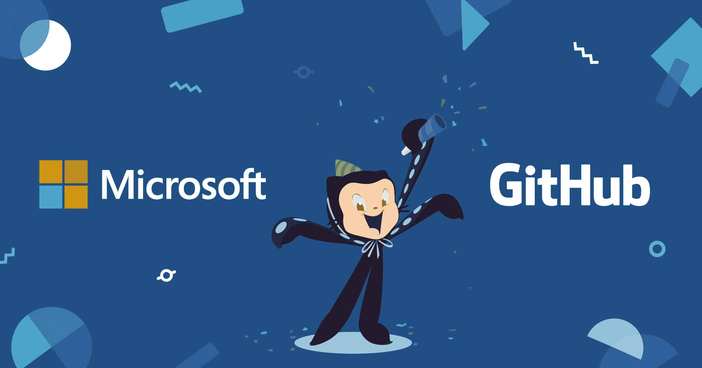

# 微软以 75 亿美元股票收购 GitHub

> 原文：<https://web.archive.org/web/https://techcrunch.com/2018/06/04/microsoft-has-acquired-github-for-7-5b-in-microsoft-stock/>

经过一周的传言，微软今天[证实](https://web.archive.org/web/20230321224601/https://blogs.microsoft.com/blog/2018/06/04/microsoft-github-empowering-developers/)已经收购了 GitHub，这是一个流行的基于 Git 的代码共享和协作服务。收购的价格是 75 亿美元的微软股票。GitHub [筹集了 3.5 亿美元](https://web.archive.org/web/20230321224601/https://www.crunchbase.com/organization/github#section-overview)，我们知道该公司在 2015 年对[的估值约为 20 亿美元](https://web.archive.org/web/20230321224601/https://www.bloomberg.com/news/articles/2015-06-15/github-said-to-seek-2-billion-valuation-in-latest-financing)。

前 Xamarin 首席执行官 Nat Friedman(现微软公司副总裁)将成为 GitHub 的首席执行官。GitHub 创始人兼前 CEO 克里斯·万斯特拉斯将成为微软的技术人员，从事战略性软件项目。2014 年，在联合创始人汤姆·普雷斯顿-沃纳(Tom Preston-Werner)因性骚扰调查辞职后，万斯特拉斯重新担任了首席执行官一职。

微软正在为 GitHub 任命一位新的首席执行官，这一事实清楚地表明，该公司整合 GitHub 的方式将类似于它与 LinkedIn 的合作方式。“GitHub 将保持其开发者至上的精神，并将独立运营，为所有行业的所有开发者提供一个开放的平台，”微软发言人告诉我们。

GitHub [表示](https://web.archive.org/web/20230321224601/https://github.com/about)截至 2018 年 3 月，其社区中有 2800 万名开发人员，8500 万个代码库，这使其成为全球最大的源代码主机，也是科技界构建软件的基石。

但是尽管 GitHub 在企业用户、个人开发者和开源项目中很受欢迎，但它从来没有盈利过，而且公司很可能认为收购比试图上市更好。

GitHub 今天的主要收入来源是付费账户，它允许私人存储库和企业需要的许多其他功能，定价从每个用户每月 7 美元到每个用户每月 21 美元不等。那些构建公共和开源项目的人可以免费使用它。

虽然许多大型企业将 GitHub 作为其代码共享服务的选择，但由于像 [GitLab](https://web.archive.org/web/20230321224601/https://about.gitlab.com/) 和 Atlassian 的 [Bitbucket](https://web.archive.org/web/20230321224601/https://bitbucket.org/) 这样的产品，以及其他各种以企业为中心的代码托管工具，GitHub 在这一领域也面临着相当大的竞争。

微软收购 GitHub 是因为它完全符合自己的野心，即成为每个开发者的首选平台，满足每个开发者的需求，不管是什么平台。

微软长期以来一直采用 Git 协议，并在其当前的 [Visual Studio Team Services 产品](https://web.archive.org/web/20230321224601/https://www.visualstudio.com/team-services/git/)中使用该协议，该产品本身曾用于与 GitHub 的企业服务竞争。知道了 GitHub 在开发者中的地位，微软也很依赖这项服务[本身](https://web.archive.org/web/20230321224601/https://news.microsoft.com/?s=github)，公司中的一些人已经声称它是今天 GitHub 最大的贡献者[。](https://web.archive.org/web/20230321224601/https://twitter.com/lokijota/status/1003375907137118210)

然而，虽然微软对开源的立场在过去几年中有所改变，但许多开源开发者将密切关注该公司在收购后将如何处理 GitHub。这是因为这个群体中有很多人不信任微软，考虑到微软的历史，这是可以理解的。

事实上，TechCrunch 在周五收到了一个提示，不仅指出交易已经结束，而且开源软件维护者已经在关注替代方案，并有可能在交易后放弃 GitHub。一些开发人员(不仅仅是那些在开源领域工作的人)甚至在迁移之前没有浪费时间等待交易的确认。

虽然 GitHub 不仅仅是开源软件的家园，但如果这样的迁移成为现实，这对 GitHub 和微软来说都是非常糟糕的。考虑到 Git 的起源，这将是一个特别具有讽刺意味的转变:版本控制系统是由 Linus Torvalds 在 2005 年创建的，当时他正在开发 Linux 内核，部分是作为对以前的系统 BitKeeper 的回应，改变了其免费使用的条款。

首席执行官塞特亚·纳德拉领导下的新微软给我们的印象是与十年前的微软大不相同——特别是考虑到新微软已经接受了开源——但很难忘记它早先试图压制 Linux 的历史。

纳德拉在今天的声明中表示:“微软是一家开发者至上的公司，通过与 GitHub 联手，我们加强了对开发者自由、开放和创新的承诺。”“我们认识到我们在本协议中承担的社区责任，并将尽最大努力帮助每一位开发者构建、创新和解决世界上最紧迫的挑战。”

然而与此同时，值得记住的是，微软现在是 Linux 基金会的成员，并定期支持一些开源项目。Windows 现在有了 Linux 子系统，而该公司的免费代码编辑工具 VS Code 是开源的，在 GitHub 上也有[。NET Core 和许多其他微软领导的项目。](https://web.archive.org/web/20230321224601/https://github.com/Microsoft/vscode)

甚至在交易宣布之前，该公司的许多人都在捍卫微软对 GitHub 的承诺及其原则。

不过，你不禁会想，微软可能会如何在其更广泛的商业战略中利用 GitHub，该公司可能会在 GitHub 和 Azure、其云托管服务以及其广泛的软件和协作产品之间建立更强大的桥梁。微软对收购大公司并不陌生。其中之一 LinkedIn 可能是微软可能探索协同效应的另一个领域，特别是在招聘、在线辅导和教育等领域。