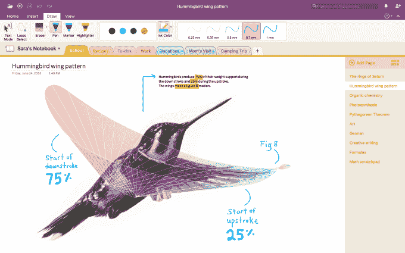

# 微软用新工具 TechCrunch 帮助 Mac 用户抛弃 Evernote for OneNote

> 原文：<https://web.archive.org/web/https://techcrunch.com/2016/08/18/microsoft-helps-mac-users-ditch-evernote-for-onenote-with-new-tool/>

微软正在让 Mac 用户更容易放弃 Evernote，转而使用 OneNote，这是其竞争对手的笔记应用程序，也是微软 Office 套件的一部分。该公司今天发布了一款名为 [OneNote 导入工具](https://web.archive.org/web/20230129062154/https://www.onenote.com/import-evernote-to-onenote)的新应用，它允许 Mac 用户将他们在 Evernote for Mac 应用程序中保存的所有项目自动移动到 OneNote 中。

这不是微软第一次通过让用户更容易转向微软自己的软件来瞄准 Evernote 的不满客户。今年 3 月，[为 Windows 用户推出了类似版本的导入工具，](https://web.archive.org/web/20230129062154/https://techcrunch.com/2016/03/11/microsoft-targets-evernote-users-with-software-that-makes-it-easy-to-switch-to-onenote/)提醒潜在的 OneNote 用户，其应用程序在所有设备上都是免费的。与此同时，该公司指出，Evernote Premium(当时)为每年 50 美元。

然而，Evernote 此后进一步提高了价格。高级产品现在是每年 69.99 美元，而 Plus 是每年 34.99 美元。也有一个基本的计划，这是免费的，但它缺乏一些功能，包括客户支持，搜索 pdf 和 Office 文件中的文本，pdf 的注释支持，名片扫描，等等。它每月只提供 60 MB 的新上传，并且只同步到两个设备上。

Evernote 最近几个月一直处于一些动荡之中，去年 12 月失去了[著名副总裁](https://web.archive.org/web/20230129062154/https://techcrunch.com/2015/12/23/evernotes-exits-continue-as-vps-of-partnerships-and-brand-both-move-on/)，去年联合创始人兼首席执行官[菲尔·利宾(Phil Libin)调任执行董事长](https://web.archive.org/web/20230129062154/https://techcrunch.com/2015/07/20/evernote-executive-shuffle-chris-oneill-named-ceo-phil-libin-executive-chairman/)。2015 年，它还[重组了员工](https://web.archive.org/web/20230129062154/http://blog.evernote.com/blog/2015/09/29/a-note-from-chris-oneill/)并取消了 [Evernote Food](https://web.archive.org/web/20230129062154/https://techcrunch.com/2015/08/26/the-feast-is-over/) ，Skitch(除了用于 Mac 的 Skitch)，显然，它的 Pebble Watch 应用程序，以及[它关闭了其电子商务努力](https://web.archive.org/web/20230129062154/https://techcrunch.com/2016/02/01/evernote-will-shut-down-market-its-e-commerce-effort-on-wednesday/)。

为了在 Evernote 陷入困境时打击它，微软今天开始了强行推销，再次推动了转换到 Office 的优势。该公司表示，Evernote Premium 每年 69.99 美元的定价现在与 Office 365 个人版完全相同。Office 365 附带 OneNote，以及所有其他 Office 应用程序，如 Word、Excel、PowerPoint、Outlook、Publisher、Access。它配有 1TB 的云存储空间，可与手机或座机通话 60 分钟。

另外，微软指出 OneNote 也有一个像 Evernote 一样的 [web clipper](https://web.archive.org/web/20230129062154/https://www.onenote.com/clipper) ，可以在所有主流浏览器上运行。该软件还支持打字、墨迹书写、嵌入视频、录音和数字扫描。

要使用新的 Mac OneNote 导入工具，你需要有一台运行 OS X 10.11 (El Capitan)或更高版本的 Mac，最好安装并登录 Evernote for Mac。当你的 Evernote 笔记导入后，它们会自动在你的设备间同步，包括你的 PC、iOS、Android 和网络浏览器。

微软表示，自从推出 Windows 版本的导入工具以来，已经将 7100 万个 Evernote 页面转移到 OneNote。