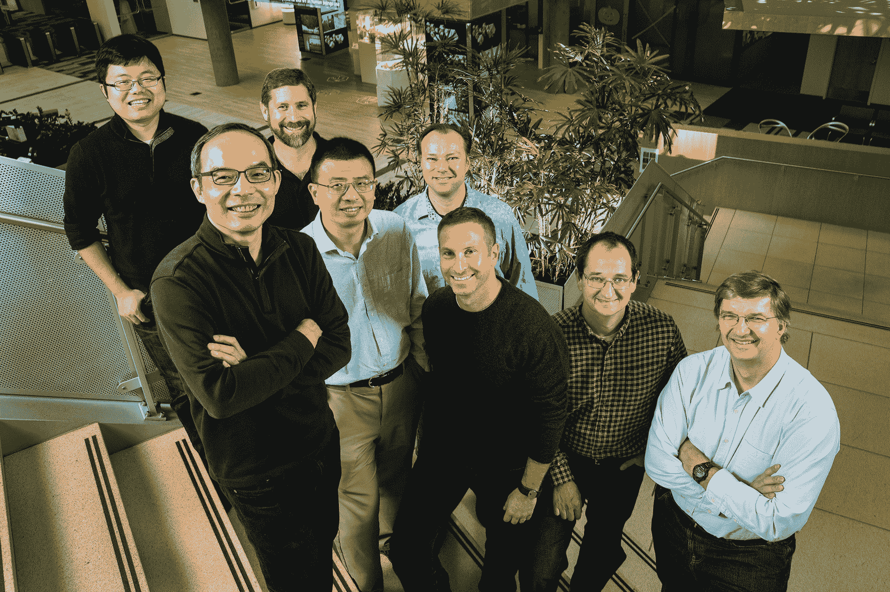

# 微软用一个和人耳一样好的系统达到了语音识别的里程碑

> 原文：<https://web.archive.org/web/https://techcrunch.com/2016/10/18/microsoft-hits-a-speech-recognition-milestone-with-a-system-just-as-good-as-human-ears/>

# 微软用一个和人耳一样好的系统达到了语音识别的里程碑

今天是微软研究院的一个大日子:一个研究语音识别的团队实现了一个重要的象征性目标，他们的系统能像你一样好地听到人们在说什么。

具体来说，该系统的“单词错误率”为 5.9%，与专业人类转录员相当。当然，即使他们不能完全听清事情，但 94%的准确率对于交谈来说已经足够了。

“这一成就是 20 多年努力的结果，”研究员之一杰弗里·茨威格在微软的博客文章中说。

微软语音和对话研究小组的团队。

事实上，语音识别是几十年来几乎所有主要技术企业和研究机构都在追求的任务之一。这些年来，质量一直在稳步上升，最新的进步来自于——你猜对了——神经网络和机器学习。

“我们的进步是卷积和递归神经网络精心设计和优化的结果，”[在论文](https://web.archive.org/web/20221225132637/https://arxiv.org/pdf/1610.05256v1.pdf)中写道。"这些声学模型有能力模拟大量的声学环境."

该团队使用了微软的[开源计算网络工具包](https://web.archive.org/web/20221225132637/https://github.com/Microsoft/CNTK)，显然效果很好。

自然，这是一种最好的情况测量:例如，在嘈杂的环境中，系统听起来不如我们，可能会遇到口音——尽管后一个问题更容易通过调整训练数据集用神经网络来解决。

祝贺微软研究团队——但我怀疑他们会就此止步。计算机被创造出来在某些任务上超越人类的能力，看起来我们可以在这个清单上再增加一个。目前还不知道这项改进的语音转文本技术多久能应用到微软的产品上。