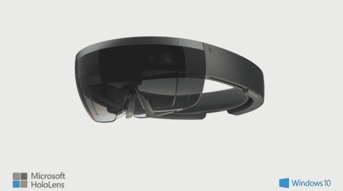

# 微软打造了一款名为 HoloLens  的全息耳机

> 原文：<https://web.archive.org/web/https://techcrunch.com/2015/01/21/microsoft-hololens/>

今天在 Windows 10 发布会上，微软花了很长时间反复讲述全息图。随后，它宣布已经制造了一种全息耳机，似乎将现实世界与数字领域融合在一起。据该公司称，Windows 10 将在其所有排列中包含全息功能。

这款耳机名为 HoloLens。微软承诺它将在 Windows 10“时间框架”内发布。耳机是无线的，不需要与电脑或电话配对。它有自己的 CPU 和 GPU，加上一个专门为这种新型计算设计的新“全息处理单元”。它看起来是这样的:

该产品当然可以与谷歌的眼镜项目、Oculus 耳机、Magic Leap 的最终硬件(尽管仍处于保密状态)、Sulon Cortex 和其他类似项目相媲美。像玻璃一样，硬件是透明的，提供真实世界的实时视图。沙龙的技术做同样的事情，但使用一个完全封闭的护目镜和一个顶部安装的摄像机的现场直播。微软的努力似乎是将最好的玻璃(真实图像)与最好的 Sulon(高级数字 3D 图形)相结合，以获得更令人信服的全息体验。

[YouTube https://www.youtube.com/watch?v=aAKfdeOX3-o&w=854&h=510]

这款耳机将依靠 Windows 10 包含的全息功能——我们还没有时间玩这款设备，所以更多细节将在稍后公布。然而，现在看来，微软又一次加倍努力打造自己的硬件。然而，根据该公司在台上发表的评论，该公司似乎对支持其他可以利用 Windows Holographic 的 OEM 硬件持开放态度。

[gallery ids="1108455，1108456，1108458，1108457，1108490，1108485，1108489"]

在一次演示中，微软让其高管特里·迈尔森(Terry Myerson)以全息图的形式出现，在演示过程中，他说出了一句将会流传千古的话:“我是一个该死的全息图！。“挪过去，莎士比亚。

HoloLens 承诺将互动虚拟存在作为其主要卖点，在研究、远程合作、工程和设计工作方面具有巨大的潜在优势。体验质量将是它被广泛采用的关键。增强现实在移动领域有一些错误的开端，但在这种背景下，它似乎更可行，因此比以往任何时候都更可信。

【YouTube https://www.youtube.com/watch?v=aThCr0PsyuA&w=492&h=277]

微软首席执行官塞特亚·纳德拉谈到了使用 HoloLens 实际控制和体验火星车第一手视角的体验，就令人信服的用例而言，这是很难超越的。幸运的是，我们稍后会有时间来测试这一点，看看有多少是科幻小说，多少是实用的东西。

另外，想象一下通过全息透镜看到的《我的世界》。是啊。