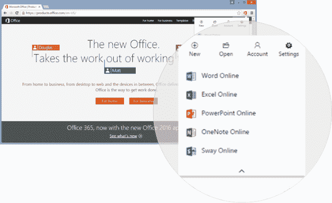

# 微软整合 Skype 和 Office Online，推出 Office Chrome 扩展 

> 原文：<https://web.archive.org/web/https://techcrunch.com/2015/10/29/microsoft-integrates-skype-with-office-online-rolls-out-an-office-chrome-extension/>

# 微软整合 Skype 和 Office Online，推出 Office Chrome 扩展

微软今天宣布，它计划通过将 Skype 集成到 Office Online 来扩展 Office 的社交功能，允许用户在 Word、Excel、PowerPoint 和 OneNote Online 文档中以及在 Outlook.com 中通过语音和视频聊天进行交流。通过集成，用户将能够直接在文件中看到 Skype 联系人并与之聊天，微软表示这将有助于团队更好地合作。此外，Skype 的聊天记录将与该文件保持联系，因此您可以在关闭文件并稍后返回时看到您离开的地方。

微软还推出了新的 Chrome 浏览器扩展，通过点击 Chrome 的工具栏，可以更容易地快速访问或创建新的 Office 文档。

Skype 的整合是微软将旗舰通讯应用捆绑到其办公套件的持续推出的一部分。该公司[上个月](https://web.archive.org/web/20221007120459/https://blogs.office.com/2015/09/22/thenewoffice/)在 Windows 桌面上的 Office 2016 中引入了 Skype for Business(之前的 Lync ),当时承诺在今年秋天晚些时候计划进行类似的 Office Online 集成。

今天，微软宣布推出 Skype for Office Online，但同时指出，从 11 月份开始，任何拥有微软账户的人都可以在全球范围内使用该软件。不过，那还需要几天时间，所以现在应该不会等太久了。

此外，该公司还为谷歌 Chrome 用户推出了网络浏览器扩展[，让你点击 Chrome 工具栏上的小图标就可以创建或打开文件。该扩展能够访问和启动保存在 OneDrive 和 OneDrive for Business 上的文件，以及存储在您计算机上的文档。](https://web.archive.org/web/20221007120459/https://chrome.google.com/webstore/detail/office-online/ndjpnladcallmjemlbaebfadecfhkepb)

这是针对谷歌及其竞争对手谷歌应用套件生产力工具的有趣一击，因为微软实际上是在利用谷歌广受欢迎的网络浏览器及其可扩展性，作为将用户连接到其竞争对手 Office 套件的一种方式。

Chrome 网上商店的描述是:“使用 Word、Excel、PowerPoint、OneNote 和 Sway Online，无需安装 Office”。

虽然上述功能是微软今天发布的关于其 Office 套件的主要公告，但它也在博客[帖子](https://web.archive.org/web/20221007120459/https://blogs.office.com/2015/10/29/the-new-office-october-feature-update/)中提到了一些其他更小的花絮，包括发布 40%的 Android 版 Office 应用程序，支持 Android M 企业版，符合 Android for Work，以及其他调整；以及对 Mac 版 Office 2016 Visual Basic Editor 的改进。