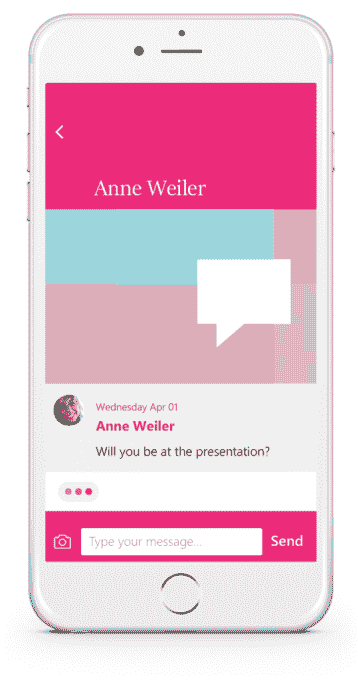

# 微软推出 Send，这是一款简短的电子邮件应用程序，工作方式更像即时通讯技术

> 原文：<https://web.archive.org/web/https://techcrunch.com/2015/07/22/microsoft-introduces-send-a-short-form-email-app-that-works-more-like-instant-messaging/>

微软今天推出了一款新的应用程序，旨在减少你在智能手机上查看和回复邮件的时间。这款应用名为[发送](https://web.archive.org/web/20221006103234/https://www.microsoft.com/garage/#app-send)，其理念是让电子邮件的表现更像即时通讯，因为它摒弃了更正式的电子邮件结构——比如主题行——而支持更快、更短的消息，你可以在几秒钟内匆忙发送。

这并不是第一次有公司将移动电子邮件重新定义为一个移动通讯客户端，或者类似短信的服务。一家名为 Hop 的初创公司也尝试了这一点，它在 2013 年首次推出了一款名为[的应用。另一家名为](https://web.archive.org/web/20221006103234/https://beta.techcrunch.com/2013/10/17/ping-now-called-hop-launches-an-app-that-makes-email-feel-more-like-real-time-mobile-messaging/) [MailTime](https://web.archive.org/web/20221006103234/https://beta.techcrunch.com/2014/09/09/mailtime/) 的初创公司也在去年 9 月参与了 TechCrunch Disrupt Battlefield。

这个概念很有趣，但迄今为止未能引起大量消费者的共鸣。如今，他们往往只是为了简单的沟通而放弃电子邮件，而是使用 Facebook Messenger、WhatsApp 等移动通讯应用，甚至只是短信或 iMessage。

但微软认为，这种简短的信息在电子邮件中也有一席之地，并指出你可能需要快速向同事发送一条信息，如:*“先不要发送演示文稿！”*或*“我们 10 点再聊，”比如*。Send 也可以用于简单的来回对话，比如*“你今天在办公室吗？”* / *“否”*

Send 是微软车库的最新应用，微软车库是微软的内部计划，让员工和团队将想法转化为现实世界的项目，其中许多是跨平台的移动应用。微软车库就像公司内部的孵化器，因为出现的项目实际上只是概念，看它们是否能实现产品市场匹配。

也就是说，Send 的发展并没有随着 iPhone 的发布而停止。微软表示，它将很快在 Windows Phone 和 Android 上推出。

它也只对那些拥有 Office 365 商业和学校电子邮件账户的人有效，但计划是在未来几个月内让这款应用更广泛地可用。

然而，目前，Send 连接到用户的 Office 365 商业或学校电子邮件帐户，以便找到你最频繁和最近的联系人，然后将这些放在其主屏幕上。你可以点击这些联系人中的任何一个来开始对话，或者你可以在他们身上滑动并选择一个内置的“快速回复”，如“*在我的路上*”或“*我会再联系你*”

这是该应用程序更聪明的功能之一，也是它与竞争对手不同的地方，竞争对手主要专注于修改移动电子邮件的用户界面，使其工作起来更像即时通讯，而没有考虑如何加快电子邮件的速度。

但 Send 也考虑了它的用户界面，以及如何让它看起来更像一款短信应用。例如，它会显示一个键入指示器，以便您知道联系人何时回复。此外，Send 不会显示你所有的电子邮件，只会显示你在应用程序中启动的邮件，这使得它比一些替代产品更有用。

此外，虽然其他类似即时消息的电子邮件客户端瞄准了更广泛的消费者基础，但 Send 最初专注于商业用户。微软指出，它甚至会在以后的版本中包含 It 控件。

Send 现在可以从 iTunes 免费下载。