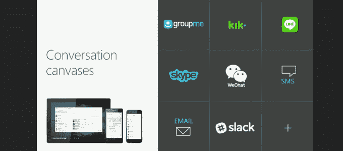
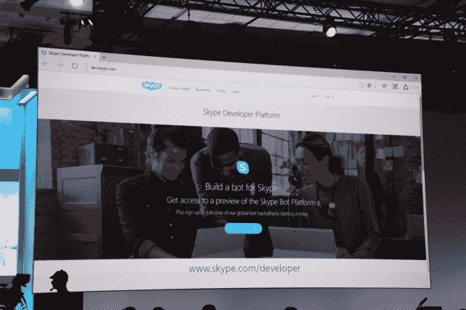
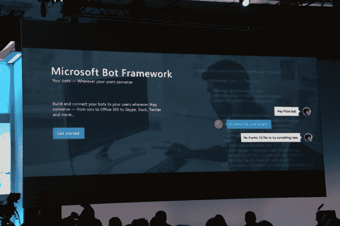
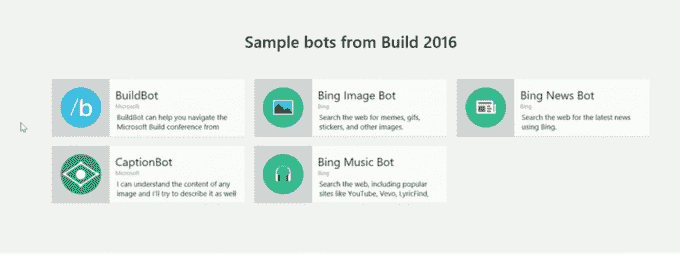
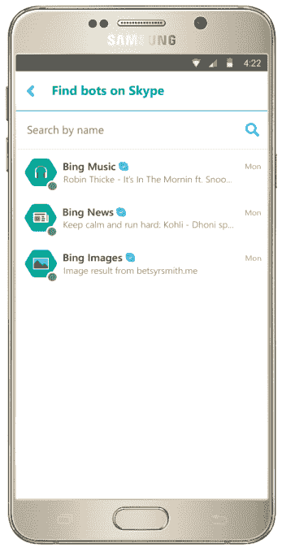

# 微软正在将机器人引入 Skype——以及其他任何地方

> 原文：<https://web.archive.org/web/https://techcrunch.com/2016/03/30/microsoft-is-bringing-bots-to-skype-and-everywhere-else/>

微软最近推出的人工智能机器人 Tay 可能让该公司感到尴尬，因为 [Twitter 用户教机器如何成为种族主义者](https://web.archive.org/web/20230129104248/https://techcrunch.com/2016/03/24/microsoft-silences-its-new-a-i-bot-tay-after-twitter-users-teach-it-racism/)，但微软并没有放弃机器人发展的未来。这才刚刚开始。今天，在微软的年度构建大会上，首席执行官塞特亚·纳德拉公布了该公司将机器人世界引入“对话平台”的计划——这不仅指 Skype，还包括 Slack、Outlook、LINE 等其他通信工具。

机器人发布的消息之前由[彭博](https://web.archive.org/web/20230129104248/http://www.bloomberg.com/features/2016-microsoft-future-ai-chatbots/)报道，但今天的舞台演示揭示了机器人，包括微软自己的虚拟助手 Cortana，旨在为未来的通信、生产力以及与企业和品牌的互动铺平道路。

在 Skype 中，该公司展示了丰富的 Cortana 集成，将助手直接放入应用程序中，她可以帮助用户识别你消息中的人、地点和事物，给它们加下划线，然后在点击时在类似卡片的界面中显示更多信息。

她还能够帮助你完成各种任务，比如在你的日历上添加项目，预订旅行或酒店房间，甚至用文本预先填充与朋友的对话。

关于 Cortana 在 Skype 中的集成，有趣的是它如何对你聊天和做的一切有更大的理解——它不仅仅专注于手头的单一任务。

例如，在今天展示的演示中，Cortana 能够计算出用户正在参加一个在与同事的个人聊天中提到的会议，阻止活动的日历和旅行时间，然后甚至主动将一个酒店机器人引入对话，以建议酒店房间。

威斯汀机器人，然后，弹出，显示了各种房间选择与图像缩略图和价格。在两个步骤中，酒店房间被预订，信息被自动添加到用户的日历中。

因为 Cortana 了解用户的联系，她还建议用户给住在这个城市的朋友发消息——甚至代表用户给朋友写了一些消息文本。

机器人在 Skype 中的集成今天在 Windows、iOS 和 Android 上推出，作为预览。这包括让用户测试 Skype 机器人并提供反馈的方法。

顺便说一下，Skype for Hololens 今天也上线了，但没有集成机器人。

虽然 Cortana 是微软领先的“机器人”，但在微软的愿景中，它只是机器人未来的一个例子。该公司还公布了一个更大的议程，旨在帮助开发者为 Skype 和其他地方开发自己的机器人。

该公司推出了有史以来第一款 [Skype Bot SDK](https://web.archive.org/web/20230129104248/http://www.skype.com/developer?intcmp=blogs-_-generic-click-_-skype-bots-preview-comes-to-consumers-and-developers) ，它让品牌、企业和其他第三方创建自己的可以在 Skype 上工作的机器人，无缝集成到用户的聊天中。该公司表示，这些不仅仅是文本机器人，正如我们迄今为止看到的许多基于短信的虚拟援助初创公司一样——Skype 机器人可以引入音频和视频体验。

这方面的一个例子是 Skype 视频机器人，它提供了一种不同的视频通话方式——基本上，你可以在虚拟环境中通过 Skype 呼叫机器人。

【YouTube https://www.youtube.com/watch?v=FyKYBei9D08]

对于微软来说，机器人不仅仅是一个方便的功能，可以帮助更多的人使用 Skype，或者利用其 Bing 支持的助手 Cortana。该公司提醒与会者，每月有超过 3 亿联网用户使用 Skype，但机器人的潜力远远超出 Skype 的用户群。

根据纳德拉的说法，机器人是下一个应用程序——它们使许多用户能够更容易地使用技术与企业和服务进行互动，这些用户对当今众多的移动应用程序感到困惑，或者对在无尽的网站海洋中导航感到沮丧。机器人工作得更好，因为你只是用自然语言和它们说话。

“我们希望利用人类语言的力量，将其更广泛地应用到所有的计算界面和计算交互中，”他解释道。“机器人就像你与之交谈的新应用程序——你不是真的在寻找多个应用程序，或者网站的页面，”他说。

纳德拉随后推出了微软机器人框架(T1)，该框架允许开发者构建智能机器人，用户可以在任何地方工作——文本/短信、Skype、Slack、Office 365 电子邮件等等。

该公司还推出了一个机器人目录，让我们一瞥它自己创造的几个机器人。这包括一个 BuildBot，帮助与会者导航会议本身；阿炳新闻机器人和另一个必应图片机器人，这两个机器人都可以帮助你浏览网页；理解图像的字幕机器人；和阿炳音乐机器人，搜索 YouTube，Vevo，LyricFind 和更多的歌曲。

纳德拉告诉开发者，机器人“代表着编写新型应用的巨大机会”，并补充说机器人将“像核心一样”。NET 曾经是——所有未来的应用。”

预览机器人现在可以在 Skype 的最新版本中用于 [Windows 桌面](https://web.archive.org/web/20230129104248/http://www.skype.com/go/download?intcmp=blogs-_-generic-click-_-skype-bots-preview-comes-to-consumers-and-developers)、 [Android](https://web.archive.org/web/20230129104248/https://play.google.com/store/apps/details?id=com.skype.raider) 、 [iPhone](https://web.archive.org/web/20230129104248/https://itunes.apple.com/in/app/skype/id304878510) 和 [iPad](https://web.archive.org/web/20230129104248/https://itunes.apple.com/app/skype-for-ipad/id442012681) 。 [Skype 的开发者平台和 bot 创建工具都在这里。](https://web.archive.org/web/20230129104248/http://www.skype.com/en/developer/?intcmp=blogs-_-generic-click-_-skype-bots-preview-comes-to-consumers-and-developers)而[微软 Bot 框架在这里](https://web.archive.org/web/20230129104248/https://dev.botframework.com/)。