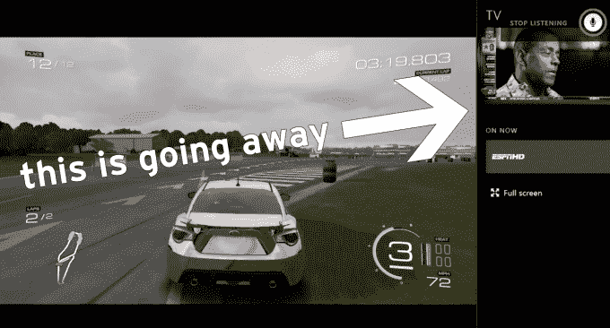

# 微软正在扼杀 Xbox One 的 Snap 模式 

> 原文：<https://web.archive.org/web/https://techcrunch.com/2017/01/25/microsoft-is-killing-xbox-ones-snap-mode/>

# 微软正在扼杀 Xbox One 的 Snap 模式

我一直非常非常喜欢 Xbox One 上“快照模式”的*创意*。它可以让你在 75%的屏幕上运行游戏，同时在垂直的屏幕上运行另一个应用程序。玩*泰坦陨落*看*永远阳光*？是的，请。

唉，这个功能在现实世界中的执行有点糟糕。它运行缓慢，质量低劣，以至于像网飞这样的第三方应用在推出几个月后就彻底抛弃了它，让已经习惯了它的人(比如我！)想知道到底发生了什么。

现在微软完全是倪星 Snap 模式——但是它会有替代品吗？

改变的消息来自微软的迈克·伊巴拉，他在推特上说，作为他们加快 Xbox One 界面的努力的一部分，快照模式将被取消:

但是，请注意，他说的是“替换”，而不是“移除”。这让人们认为微软可能已经有了替代方案——而且希望是实际可行的方案。(亲爱的微软:就给我们视频画中画模式吧。没人想要其他的东西。)

[via [neowin](https://web.archive.org/web/20230130000839/https://www.neowin.net/news/snap-mode-on-xbox-one-being-permanently-removed-for-bigger-things)