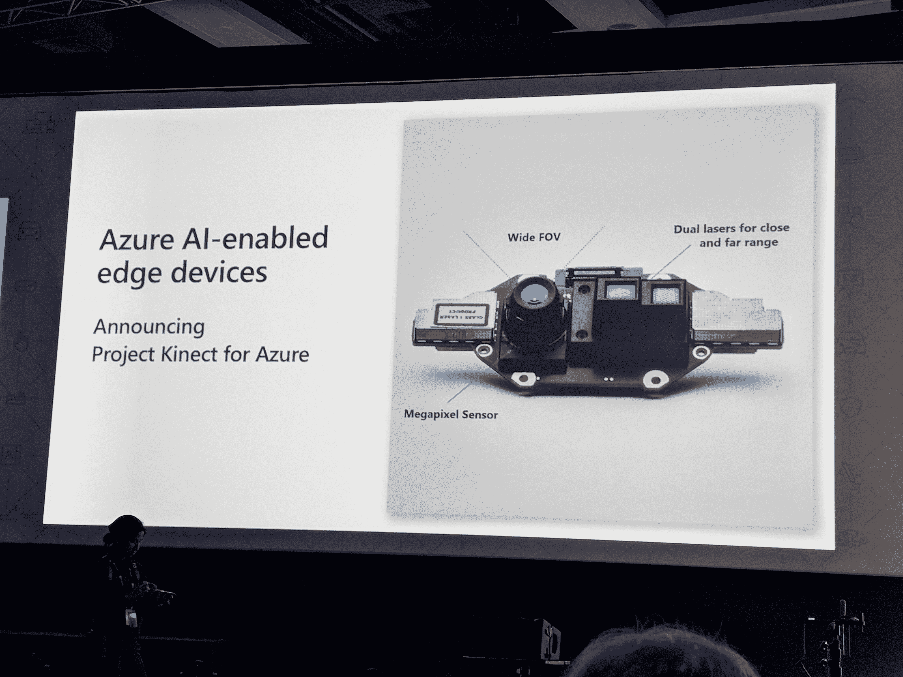
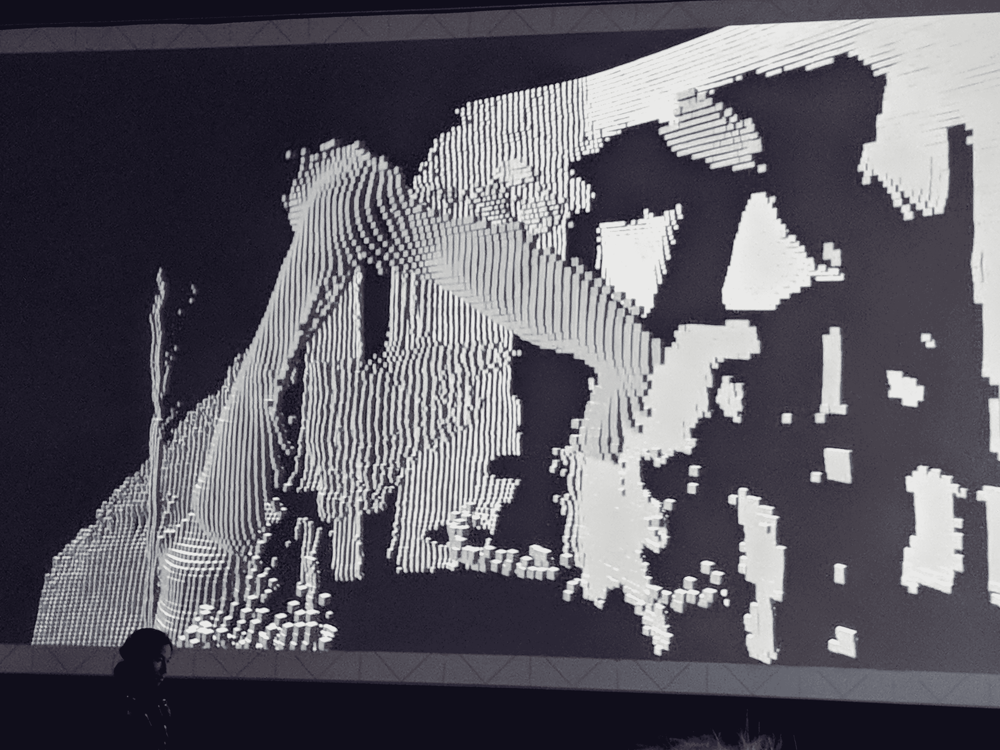

# 微软 Kinect 作为 Azure  的新传感器包继续存在

> 原文：<https://web.archive.org/web/https://techcrunch.com/2018/05/07/microsoft-kinect-lives-on-as-a-new-sensor-package-for-azure/>

# 微软 Kinect 作为 Azure 的新传感器包继续存在

微软用于 Xbox 游戏机的 Kinect 动作感应摄像头在很长一段时间里都是行尸走肉。去年 10 月，它终于平静地离开了人世——至少我们是这么认为的。在今天的 Build 开发者大会上，微软[宣布](https://web.archive.org/web/20230315095316/https://www.linkedin.com/pulse/introducing-project-kinect-azure-alex-kipman)将带回 Kinect 品牌及其杰出的[飞行时间摄像技术](https://web.archive.org/web/20230315095316/https://www.gamasutra.com/blogs/DanielLau/20131127/205820/The_Science_Behind_Kinects_or_Kinect_10_versus_20.php)，但不是游戏主机。相反，该公司宣布了 Project Kinect for Azure，这是一个新的传感器包，它将 [Kinect](https://web.archive.org/web/20230315095316/https://en.wikipedia.org/wiki/Kinect) 摄像头与机载计算机和一个开发人员可以集成到他们自己的项目中的小软件包结合在一起。

该公司表示，Project Kinect for Azure 可以处理完全铰接的手部跟踪，并可用于高保真空间地图绘制。基于这些功能，很容易想象 Project Kinect 在许多机器人和监控应用中的用途。

“Project Kinect for Azure 开启了无数利用机器学习、认知服务和物联网边缘的新机会，”微软的技术研究员、全息透镜之父亚历克斯·基普曼今天写道。“我们预计，Project Kinect for Azure 将带来来自微软和我们合作伙伴生态系统的新人工智能解决方案，这些解决方案建立在与 Azure 人工智能服务集成的越来越多的传感器上。”

该公司表示，这款相机的分辨率将为 1024×1024，并将在下一代 HoloLens 头盔中使用相同的相机。

“Project Kinect for Azure 将这一领先的硬件技术与 Azure AI 结合在一起，为开发人员提供了使用环境智能的新场景，”微软在今天的公告中解释道。事实上，看起来这里的主要想法是将该公司的相机技术与其基于云的机器学习工具相结合——来自微软认知服务套件和物联网边缘平台的预构建和定制模型，用于边缘计算工作负载。

