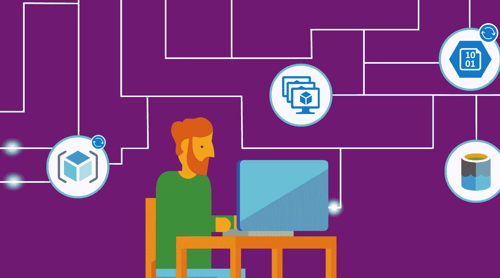

# 微软推出 Azure Event Grid，这是一款完全托管的事件路由服务 

> 原文：<https://web.archive.org/web/https://techcrunch.com/2017/08/16/microsoft-launches-azure-event-grid-a-fully-managed-event-routing-service/>

微软[今天在 preview 中宣布了其 Azure 系列中的一款新产品，这将使开发者更容易构建基于事件的应用。](https://web.archive.org/web/20221208133327/https://azure.microsoft.com/en-us/blog/introducing-azure-event-grid-an-event-service-for-modern-applications/)

Azure 事件网格生成事件(如上传图片或视频、点击按钮、更新数据库等)。)一流的 Azure 对象。事件网格补充了微软现有的无服务器产品 Azure Functions 和 Azure Logic Apps，并为开发人员提供了一个完全托管的事件路由服务。这项新服务让他们能够灵活地接收和响应几乎任何事件——无论是发生在 Azure 内部、第三方服务上还是现有应用程序中。

开发人员可以使用 Event Grid 将事件路由到特定的端点(甚至多个端点),并根据需要进行过滤。

“无服务器”一直是一个误称，因为即使是最无服务器的无服务器应用程序也仍然需要在服务器上运行。尽管如此，无服务器平台背后的基本思想是，您可以使用这种模型来构建事件驱动的应用程序，而不必担心底层的基础设施。的确，微软 Azure Compute 主管 Corey Sanders 告诉我，事件网格实际上位于微软构建微服务的平台 Service Fabric 之上。但是，作为开发人员，您不需要担心管理这些服务——平台会为您处理这些事情。

不过，Event Grid 将 Azure 函数和逻辑应用的想法推进了一点，这要归功于它内置的在 [webhook 端点](https://web.archive.org/web/20221208133327/https://en.wikipedia.org/wiki/Webhook)的帮助下从任何应用程序获取输入的能力。“我们的目标是提供一个客户可以管理和操作的一流事件对象，”桑德斯告诉我。开箱即用，Event Grid 还支持 Azure 博客存储、资源管理器、应用主题、事件中心、Azure 功能、Azure 自动化和逻辑应用，并支持其他基于 Azure 的服务，包括今年晚些时候推出的新的 CosmosDB 数据库服务和物联网中心。鉴于物联网应用程序是这项服务的合理选择，对物联网中心的支持不是最初版本的一部分实际上有点令人惊讶。

除了标准的无服务器应用和集成(这是 Logic Apps 已经非常擅长的)，开发人员还可以使用事件网格来自动化一些操作工作流，以对新启动的虚拟机或数据库做出反应。

事件网格的定价基于您处理的操作数量。前 10 万操作免费；之后，您需要支付每百万次操作 0.60 美元(尽管在预览期间，该价格目前为每百万次操作 0.30 美元)。操作定义为任何进入、高级匹配、交付尝试或管理调用。

