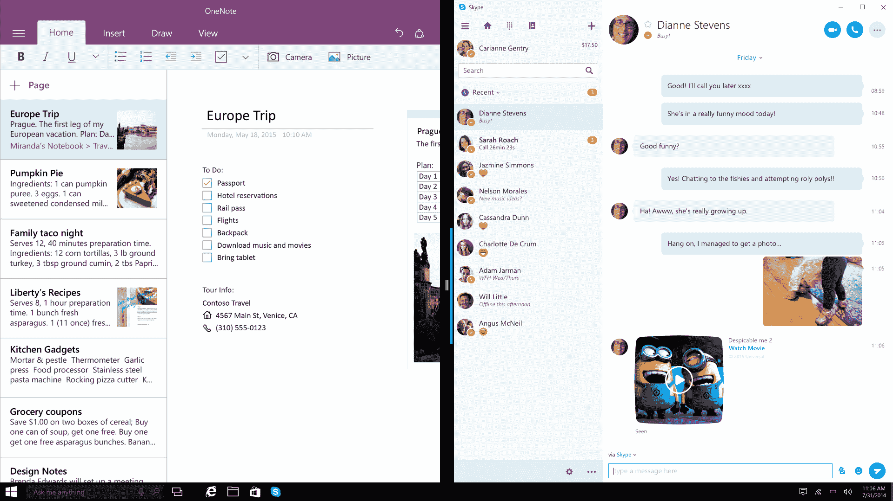
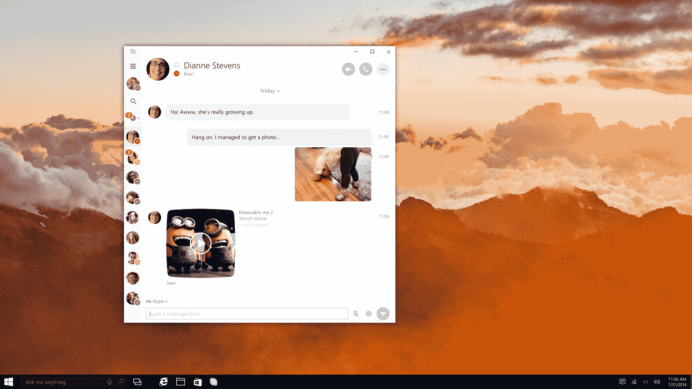

# 微软为通用 Windows 平台 TechCrunch 推出 Skype 的首个预览版

> 原文：<https://web.archive.org/web/https://techcrunch.com/2016/03/24/microsoft-launches-first-preview-of-skype-for-the-universal-windows-platform/>

微软今天[发布了](https://web.archive.org/web/20230130234201/http://wp.me/p2q6gy-jqw)新版 Skype for Windows 10 的预览版。这一预览版是 Skype 的第一个完整的通用 Windows 平台(UWP)版本(UWP 的应用程序是“通用的”,因为它们可以在任何 Windows 平台上运行，从台式机到手机)。新版本是从头开始编写的，具有重新设计的用户界面，尽管功能与以前的版本基本相同(仍缺少一些功能)。

有一段时间，Skype for Windows 既有普通桌面版，也有现代/地铁版。Metro 版本于去年 10 月停产，但更令人困惑的是，微软还在同一时间为 Windows 10 发布了单独的 [Skype 消息和 Skype 视频应用。](https://web.archive.org/web/20230130234201/http://blogs.skype.com/2015/11/12/the-consumer-preview-of-skype-integration-for-windows-10-is-here-tell-us-what-you-want-to-see-next/)

然而，事实证明，虽然移动用户喜欢拥有大量不同的单任务应用程序，但桌面用户并不真正喜欢这种方式(尽管他们在调查中表示喜欢)。

今年早些时候，在一次小型新闻发布会上，Skype 产品营销总监芭比·斯塔福德(Barbie Stafford)告诉一群记者，微软了解到最初的任务型应用可能测试得很好，但在大屏幕上，用户真的希望在一个应用中拥有所有功能——这也是新的 Skype UWP 应用的目标。

随着时间的推移，微软将在 Windows 10 个人电脑上使用这个单一的应用程序，不久，同样的应用程序也将在 Windows 10 移动设备上运行。

因为新版本是从头开始编写的，所以团队也利用这个机会重新思考过去几年中做出的一些用户界面决定。在旧版本中，Skype 窗口的大部分被您的 Skype 朋友提供的最新状态更新所取代。不过，这种饲料很快就变得不新鲜了。在新版本中，背景将由模糊的视频预览和好友列表填充。您只需点击一下这里，就可以进入视频通话。

展望未来，Skype UWP 应用程序还将提供一些新工具——其中一些工具目前在桌面应用程序中，但尚未在此版本中出现。例如，新版本将很快与 Skype 网络体验集成，允许您与非 Skype 用户开始 Skype 聊天。对群组信息、群组语音和视频通话以及屏幕和文件共享的支持也即将到来。

微软还告诉我们，它正在考虑使用机器学习来自动捕捉视频聊天中最有趣的时刻——也许是以图像或 GIF 的形式。

