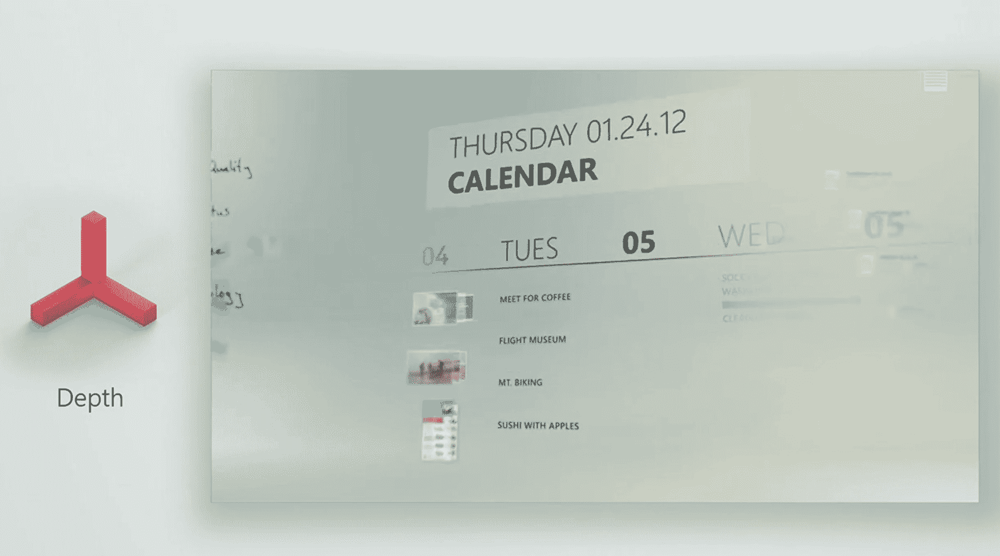
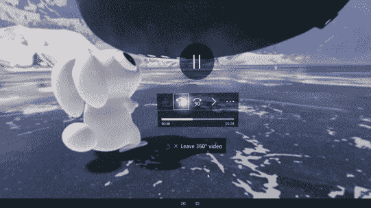

# 微软推出流畅设计系统，取代谷歌的材料设计

> 原文：<https://web.archive.org/web/https://techcrunch.com/2017/05/11/microsoft-launches-fluent-design-its-take-on-googles-material-design/>

# 微软推出流畅的设计系统，它采用谷歌的材料设计

在西雅图举行的 Build 开发者大会上，微软今天宣布了用于构建跨设备用户界面的设计系统 [Fluent Design](https://web.archive.org/web/20230319125447/http://fluent.microsoft.com/) 。在许多方面，Fluent 背后的想法类似于谷歌的[材料设计](https://web.archive.org/web/20230319125447/https://material.io/guidelines/material-design/introduction.html)语言。这里的主要目的是让开发人员能够使用一种在不同设备上都能很好工作的设计语言。

正如微软负责 Windows 开发者平台的副总裁 Kevin Gallo 告诉我的那样，该团队希望建立一个系统，帮助开发者编写更多“令人愉快”的应用程序。

这里的总体设计原则是创造一种设计语言，看起来很轻，有层次、深度、动画和材料。由于这种对材料的支持，Fluent 还将带回 Windows 应用程序在操作系统的最近几次迭代中失去的一些半透明性。

然而，在盖洛看来，使它与类似项目不同的是，它旨在在 2D 和 3D 环境中工作良好，鉴于微软对 HoloLens 和整个“混合现实”生态系统的投资，这显然是微软非常感兴趣的。“我们定义这一点的方式是，我们想要一个设计系统，允许您为所有设备构建，”Gallo 说。

微软还将在下一版本的 Windows 10 中使用 Fluent 更新其笔支持，用户将只能使用笔，如果他们选择这样做的话。这意味着 Fluent 将支持用笔滚动、在文本字段中书写等。

流利还意味着为不同类型的输入提供支持。微软为 Windows 8 开发的设计语言 Metro (后来微软把它的名字改成了现在没人记得的名字)，主要集中在触摸上。另一方面，Fluent 意味着在任何地方都可以很好地工作——包括在 VR 中——并支持触摸、凝视和笔输入。“材料[设计]甚至没有想到那个世界，”盖洛说。

[gallery columns = " 2 " ids = " 1488608，1488619"]