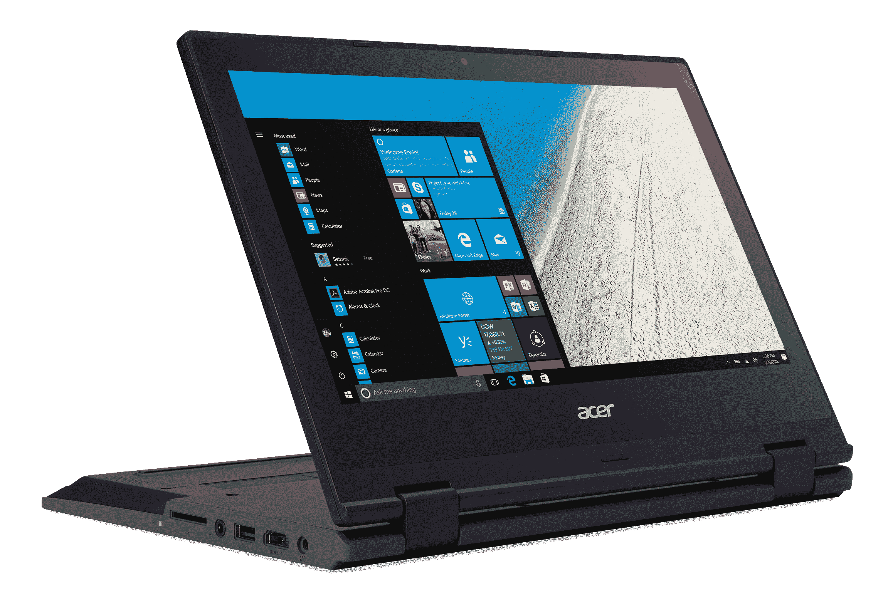

# 微软推出教育版 Intune 以对抗谷歌在学校的 Chromebooks

> 原文：<https://web.archive.org/web/https://techcrunch.com/2017/01/24/microsoft-launches-intune-for-education-to-counter-googles-chromebooks-in-schools/>

# 微软推出教育版 Intune 以对抗谷歌在学校的 Chromebooks

微软今天宣布推出面向教育的 Intune，这是其现有企业应用和设备管理服务的一个新层次，专门面向学校。此外，该公司宣布，它的一些合作伙伴将很快开始发运更多种类的平价 Windows 10 电脑。

在此之前不久，谷歌[宣布](https://web.archive.org/web/20230405001530/https://techcrunch.com/2017/01/24/google-is-making-chromebooks-even-more-useful-for-schools/)再次在学校推广其 Chromebooks，并宣布宏碁和华硕面向学生的新设备。事实上，微软特别提到，它认为这些新设备“以与 Chromebooks 相同的价格提供了学校所需的功能、性能和安全性，没有任何妥协。”这种措辞让人回想起几年前微软[反谷歌搜索广告活动](https://web.archive.org/web/20230405001530/https://techcrunch.com/2013/11/26/microsoft-mocks-googles-chromebook/)。当时，微软招募了爪牙明星[来取笑 Chrome OS 的局限性](https://web.archive.org/web/20230405001530/https://www.youtube.com/watch?v=-y2mqoDjQXI)。

借助 Intune for Education，管理员和教师可以更轻松地管理他们在学校和教室中使用的电脑，这一点尤为重要，因为在许多学校中，教师必须充当自己的技术支持。虽然很容易忘记微软有自己的 Windows 应用商店，但 Intune for Education 将允许管理员决定学生和教师可以查看和安装 Windows 商店中的哪些应用。

当然，所有这些都与 Office 365 for Education 集成在一起，Office 365 具有所有经典的微软生产力工具，以及它的 sleeper hit OneNote。

至于新硬件，微软表示，其合作伙伴专注于坚固性和可负担性。例如，就像宏碁的新 Chromebook 一样，其 Windows 10 TravelMate Spin B118 hybrid(起价 299 美元)具有防泼溅键盘和抗压屏幕。[联想](https://web.archive.org/web/20230405001530/http://blog.lenovo.com/blog/entry/2473)和 [JP。IK](https://web.archive.org/web/20230405001530/http://www.jpik.com/files/ws_editorials/brochura_TURN_T201_jpik_1.pdf) 也在为学生推出新设备。

