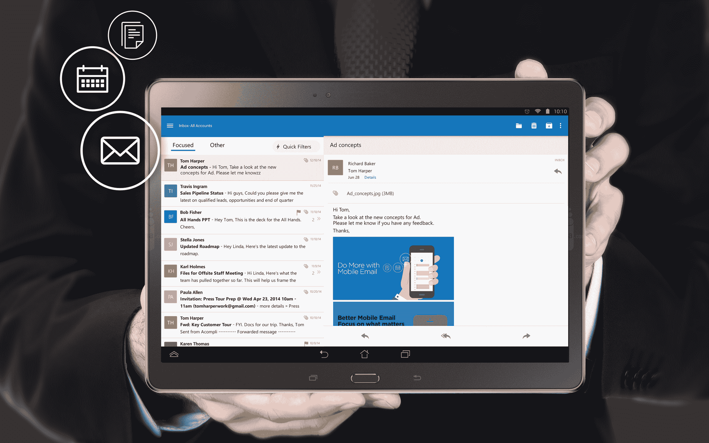

# 微软基于对 Acompli 的收购发布 iOS 和 Android 展望

> 原文：<https://web.archive.org/web/https://techcrunch.com/2015/01/29/microsoft-launches-outlook-for-ios-and-android/>

基于去年 12 月收购[Acompli](https://web.archive.org/web/20230404125100/https://techcrunch.com/2014/12/01/microsoft-buys-email-app-acompli-for-200m-will-still-support-gmail-and-other-competitors/)[时获得的应用程序，微软今天](https://web.archive.org/web/20230404125100/https://techcrunch.com/2014/12/01/microsoft-buys-email-app-acompli-for-200m-will-still-support-gmail-and-other-competitors/)[为](https://web.archive.org/web/20230404125100/https://blogs.office.com/2015/01/29/deeper-look-outlook-ios-android/) [Android](https://web.archive.org/web/20230404125100/https://play.google.com/store/apps/details?id=com.microsoft.office.outlook) 和 [iOS](https://web.archive.org/web/20230404125100/https://itunes.apple.com/app/id951937596) 手机和平板电脑发布了 Outlook。这些新应用将在接下来的几个小时内在各自的应用商店上线。

从长远来看，这些新应用程序将取代微软目前所有的(有些混乱的)Outlook 品牌应用程序，包括用于 Android 的[Outlook.com 应用程序，以及用于](https://web.archive.org/web/20230404125100/https://play.google.com/store/apps/details?id=com.outlook.Z7&hl=en) [Android](https://web.archive.org/web/20230404125100/https://play.google.com/store/apps/details?id=com.microsoft.exchange.mowa&referrer=utm_source%3Doffice365blog%26utm_medium%3Dblog%26utm_content%3Dlaunchdaypost%26utm_campaign%3Dlaunchday) 和 [iOS](https://web.archive.org/web/20230404125100/https://itunes.apple.com/us/app/owa-for-ipad/id659524331?mt=8) 的相当有限的 [OWA 应用程序](https://web.archive.org/web/20230404125100/http://blogs.office.com/2014/06/11/owa-for-android-now-available-on-select-devices/)，后者仅适用于 Office 365 的付费用户。这些旧的应用程序暂时仍然可用，但微软告诉我，它计划随着时间的推移融合这些体验。该公司明确建议安卓系统的 Outlook.com 用户改用新的 Outlook 应用程序。

微软办公部门总经理 Julia White 本周早些时候告诉我，新的应用程序基于微软去年以 2 亿美元收购电子邮件应用程序时获得的技术。“我们带来了这个团队，它现在是我们展望团队的核心部分，”她告诉我。

毫不奇怪，Outlook 应用程序的外观和感觉也与最初的 Acompli 应用程序非常相似。微软已经增加了一些类似 Office 应用程序的小功能，包括一个彩色的带状用户界面，但如果你曾经使用过 Acompli 的应用程序，新的 Outlook 应用程序大多会感觉像是该服务的更名。

然而，令人惊讶的是，微软一意孤行，决定这么快就以 Outlook 的名义重新推出这些应用。不过，最重要的是，这可能说明了 Acompli 应用程序已经有多好了。

[gallery ids="1112277，1112278，1112279，1112280，1112281，1112283"]

在我们的采访中，怀特强调 Outlook 应用程序不仅仅是为了电子邮件分类。“他们兑现了 Outlook 的承诺，”她告诉我。" Outlook 用户群肯定会对此感到兴奋."怀特还认为，现在大多数移动设备附带的电子邮件客户端都非常简单，但“人们希望在它们上面做的不仅仅是基本的电子邮件分类”。

就像之前的微软一样，Outlook 将支持 Office 365、Exchange、Outlook.com、雅虎邮件和 Gmail，以及大多数其他电子邮件提供商。Outlook 应用程序还允许你通过许多云服务发送附件，包括微软自己的 OneDrive，以及 Dropbox 和其他服务。与大多数现代电子邮件应用程序类似，新的 Outlook 应用程序现在也支持各种滑动手势，您可以根据需要进行定制。

[gallery columns = " 2 " ids = " 1112294，1112295"]

微软认为今天的发布是 iOS 版本的完整发布，而 Android 版本仍处于官方预览阶段，尚未得到官方支持。原因在于 Android 广阔的硬件生态系统。一旦微软收集到更多关于应用程序在现实设备上运行的数据，它将推出新版本的应用程序，并宣布其在 Android 上的全面可用。如果 Android 平板电脑的 Office 应用程序有任何迹象的话，那将是从现在起大约两个月的时间。

[gallery columns = " 2 " ids = " 1112298，1112299"]