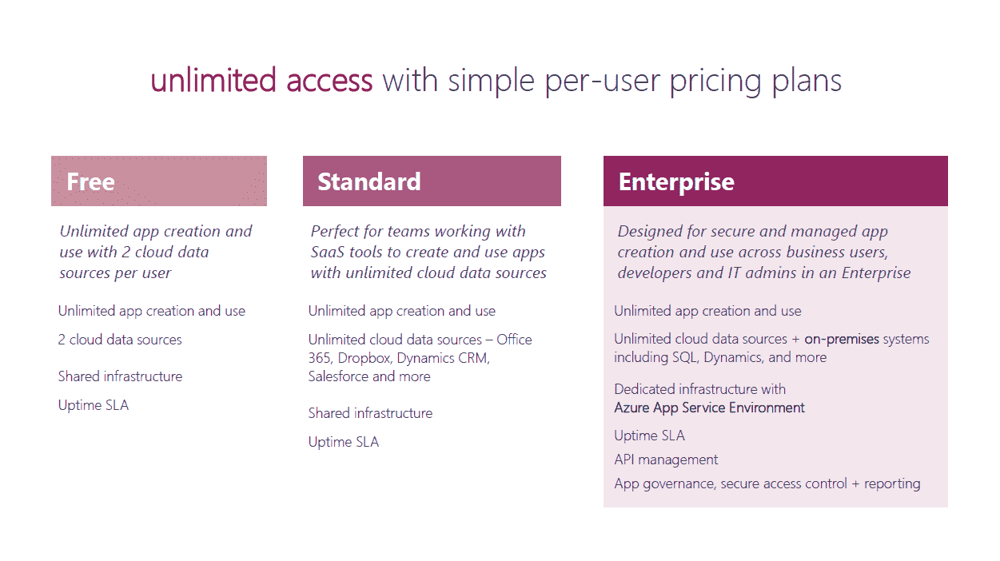

# 微软推出 PowerApps，让构建商业应用更简单 

> 原文：<https://web.archive.org/web/https://techcrunch.com/2015/11/30/microsoft-launches-powerapps-to-make-building-business-apps-easier/>

微软今天发布了 PowerApps，这是一种新的类似 Office 的服务，使公司中的几乎任何员工都可以轻松构建基本的移动和基于网络的业务应用程序，并使 it 部门能够这样做。这项新服务现已正式推出预览版。

正如微软负责应用平台的公司副总裁比尔·史泰博(Bill Staples)在本月早些时候的新闻发布会上指出的那样，该公司认为，尽管员工现在比以往任何时候都更加移动，但许多工作仍然局限于桌面。Staples 认为，这是因为尽管我们有很多很好的应用程序来组织我们的个人生活和与团队合作，但仍然没有很多移动商务应用程序能够利用大多数公司现在每天积累的所有数据。

史泰博在今天的公告中写道:“虽然越来越多的公司使用微软动态、Concur 或 Workday 等服务，转向 SaaS 解决方案来解决特定场景，如 CRM、差旅和人力资源，但大多数商业应用场景仍然局限于内部，依赖于企业连接的个人电脑。”。

所有这些数据都存储在许多不同的系统中，这些系统通常并不相连。与此同时，it 部门不可能为所有场景编写新的业务应用，正如 Staples 强调的那样，根本没有足够的开发人员去编写这些应用。

PowerApps 旨在消除编写这些应用程序过程中的摩擦。一旦 IT 支持，用户将能够从基于云的和内部的数据源将数据拉入他们的应用程序。开箱即用，PowerApps 将允许您连接到 Office 365、Dynamics CRM、Salesforce、Dropbox、OneDrive 等服务，以及 SharePoint、SQL Server、Oracle、SAP 等本地数据库系统。

例如，如果你想让你的应用程序基于你保存在 Dropbox 上的 Excel 文件中的数据，PowerApps 会很乐意让你这么做。有了它，团队可以编写一个定制应用程序来跟踪其招聘工作，或者销售团队可以从 Salesforce 和其他工具连接数据来跟踪其工作。

微软提供了一个高度图形化的界面和一套模板，只需点击几下鼠标就可以构建基本的应用程序。

这些应用程序可以通过 iOS、Android 和 Windows Phone 上的中央 PowerApps 应用程序以及网络获得。与同事分享就像给他们发送应用程序链接一样简单。

虽然这为员工提供了很大的灵活性，但 IT 仍然处于控制之中，并且可以根据公司的政策管理数据访问。对于开发者来说，PowerApps 还包括 [Azure 应用服务](https://web.archive.org/web/20230129064146/https://azure.microsoft.com/en-us/services/app-service/)，这是微软以开发者为中心的服务，用于构建移动和网络应用。

该服务处于预览版时，微软不会共享任何定价信息。一位发言人告诉我，该公司计划按座位收费，因此企业将拥有可预测的账单，随着增长而增长，不必担心“购买多个单独的仪表来提供相同水平的服务”下面是 PowerApps 的定价层。

当然，微软并不是唯一一家试图进军商务应用的公司。事实上，有很多服务承诺让任何人都可以轻松编写一个基本的移动应用程序。例如，我们最近特别推出了 AppGyver 的[作曲家 2](https://web.archive.org/web/20230129064146/https://techcrunch.com/2015/11/11/appgyvers-composer-2-makes-building-b2b-apps-easy/) 。然而，微软既有知名度，又有进入企业的现有销售渠道。