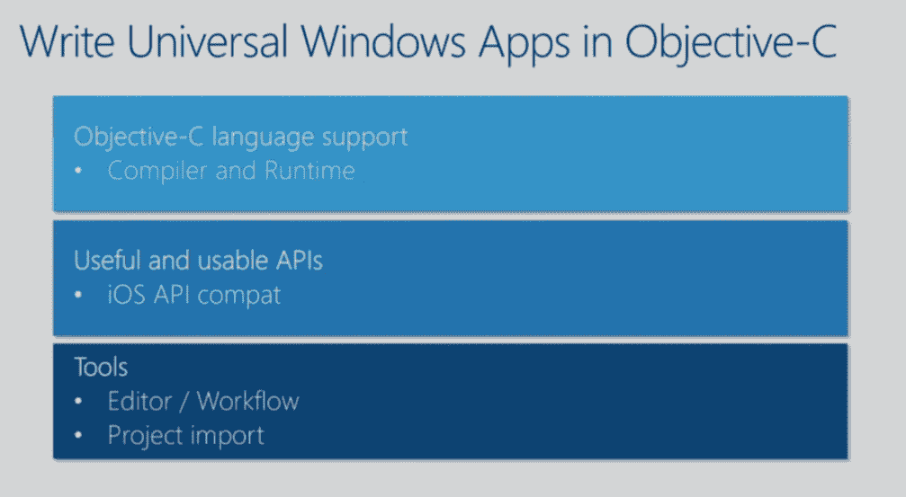
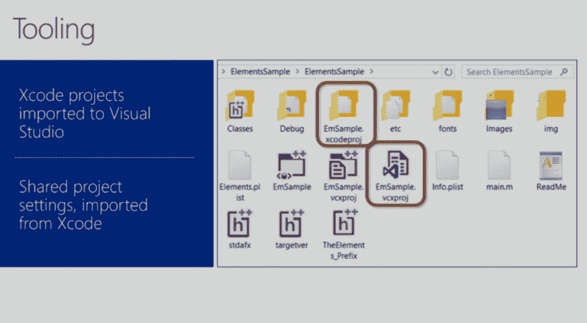

# 微软推出开源工具，帮助 iOS 开发者将其应用移植到 Windows 

> 原文：<https://web.archive.org/web/https://techcrunch.com/2015/08/06/microsoft-launches-project-islandwood/>

在今年早些时候的 Build developer conference 上，微软[宣布](https://web.archive.org/web/20221006141355/https://beta.techcrunch.com/2015/04/29/microsoft-makes-it-easier-for-developers-to-bring-their-android-and-ios-apps-to-windows-10/)将很快发布工具，让 iOS 和 Android 开发者更容易将他们现有的代码和应用移植到 Windows。这个的 Android 版本，官方命名为 Android 的 Windows Bridge，现在正在[进行私人测试](https://web.archive.org/web/20221006141355/https://dev.windows.com/uwp-bridges/project-astoria)。然而，iOS 版本——之前的代号为“岛屿森林计划”——今天将进入第一次公开预览。

Windows Bridge for iOS 的代码现在可以在 GitHub 上作为 MIT 许可[下的开源项目获得。](https://web.archive.org/web/20221006141355/https://github.com/Microsoft/WinObjC/)

微软强调，这在很大程度上仍然是一项正在进行的工作，一些承诺的功能现在已经可用，或者仍然存在很多问题。尽管如此，微软预计最终版本将于秋季登陆，以配合 Visual Studio 2015 首次更新的发布。

使用这个桥梁，开发者将能够把他们的 iOS 应用移植到 Windows 8.1 和 Windows 10 上。目前，他们只能针对标准的 X86 和 X64 架构，但很快，编译器也将支持 ARM(以及移动设备)。

那么所有这些是如何工作的呢？正如 Windows Bridge for iOS 团队的产品经理 Salmaan Ahmed 今天所写的，该项目的总体想法是“让 iOS 开发者能够使用[他们的]现有 Objective-C 代码和技能创建 Windows 应用程序。”

他强调说，团队决定在笔直的港口上修建一座引桥。“我们的 iOS bridge 的目标从来都不是简单地在 Windows 上运行 iOS 应用，”他写道。“相反，我们的目标是帮助您编写出色的 Windows 应用程序，尽可能多地使用您现有的代码和知识。”

为此，该桥由四个组件组成:Objective-C 编译器、Objective-C 运行时、iOS API 头文件和库，以及与 Visual Studio 的集成(因此您可以将 Xcode 项目直接导入 Visual Studio 2015)。

你可以在这里找到所有关于这将如何工作的血淋淋的技术细节，在[这个来自 Build](https://web.archive.org/web/20221006141355/https://channel9.msdn.com/Events/Build/2015/3-610) 的视频中有更多的信息。不过，值得强调的一点是，微软希望让开发人员能够从他们的 Objective-C 代码中使用所有常规的 Windows API，而且 iOS 和 Windows API 应该能够协同工作。

众所周知，微软很难说服 iOS 和 Android 开发者将他们的应用移植到 Windows 上。通过给予他们回收大部分代码的能力，许多开发者现在可能会对 Windows 另眼相看。

目前，微软的移动平台在世界大部分地区仍是第三名。但是由于微软新的关注点放在了一个可以在桌面和移动上运行的应用程序的单一平台上，这些端口的市场突然比 Windows Phone 市场大得多(尽管要让一个移动应用程序在桌面上有价值可能需要比仅仅移植移动体验更多的工作)。