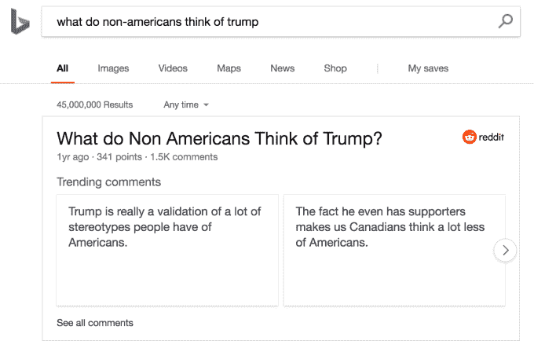

# 微软希望通过新的人工智能功能和 Reddit 合作伙伴关系使必应搜索结果更加智能

> 原文：<https://web.archive.org/web/https://techcrunch.com/2017/12/13/microsoft-looks-to-make-bing-results-smarter-with-a-little-help-from-reddit/>

今天在旧金山举行的一场以人工智能为重点的特别活动上，微软宣布了必应的一系列功能更新，希望通过利用该公司的人工智能研究以及与 Reddit 的新合作伙伴关系，使结果更加智能。

该公司展示了将人工智能注入 Bing 搜索引擎的方式，一位微软高管重申，通过与雅虎的合作，实际上有很多人在使用 Bing 搜索引擎——不管他们是否知道。该公司表示，美国三分之一的桌面搜索结果是在必应上完成的。

更新的重点是在谷歌等竞争对手使用的“卡片”用户界面上为用户带来更多对话式的、微妙的答案。今天开始推出的新功能包括:智能搜索、智能图片搜索和对话搜索。

“人工智能在寻找信息的能力方面已经取得了很大进步， 但是理解 那些信息 才是真正的挑战，”克里斯蒂娜·贝尔说， 一位与微软的人工智能和研究小组合作伙伴设计和规划项目经理 。

智能和对话式搜索几乎只是专注于确保微软在将机器学习的见解整合到搜索解释中与谷歌保持竞争力。有趣的是，他们希望领先谷歌的一个领域是给用户机会获得关于一些问题的多种观点，所以如果你问谷歌某种食物是否健康，他们可能会告诉你它对什么有好处，在哪里可能没有好处。

搜索服务没有将此应用于一些更有争议的查询；关于大麻对健康影响的快速搜索没有显示智能搜索卡，关于堕胎等热点话题的问题也是如此。

智能图片搜索是一项非常有趣的发展，它允许用户深入搜索，这样你不仅可以找到名人的照片，还可以找到他们佩戴的一件珠宝的更多图片。只需点击一个“在图片中搜索”按钮，它就会假设你正在寻找的东西；它并不完美，但比我想象的要好。

此外，该公司宣布与 Reddit 合作，以更有效地展示该网站的结果。Reddit 联合创始人亚历克西斯·奥哈尼安(Alexis Ohanian)宣布，两人正在合作，将 Reddit 内容更直接地整合到 Bing 搜索结果中，将 Reddit 众包 ama 和其他帖子的信息导入 Bing。你可以问 Bing 这样的问题，“HBO 的兄弟乐队有多准确？”Bing 上的用户会得到高投票率的回复。

“我们认为这是帮助人们发现新社区的新窗口，”奥哈尼安说。“因此，我们可以让我们的两个平台都变得更好。”

该合作伙伴还专注于从 Reddit 帖子中获取详细的高度本地化的信息，并将其导入 Bing 搜索，以便具有类似提示的用户可以获得更细微的答案。众所周知，Reddit 的用户界面在桌面上并不出色，所以微软以更有效的方式提取文本墙是非常必要的。

Bing 在桌面搜索上的地位可能比一些人想象的更稳固，但奇怪的是，很少有人谈到移动 Bing 搜索以及这些新功能如何集成到移动浏览器中。利用 Reddit 的数据可能是 Bing 的一大优势，尽管很少有来源能够像争议一样展现才华。