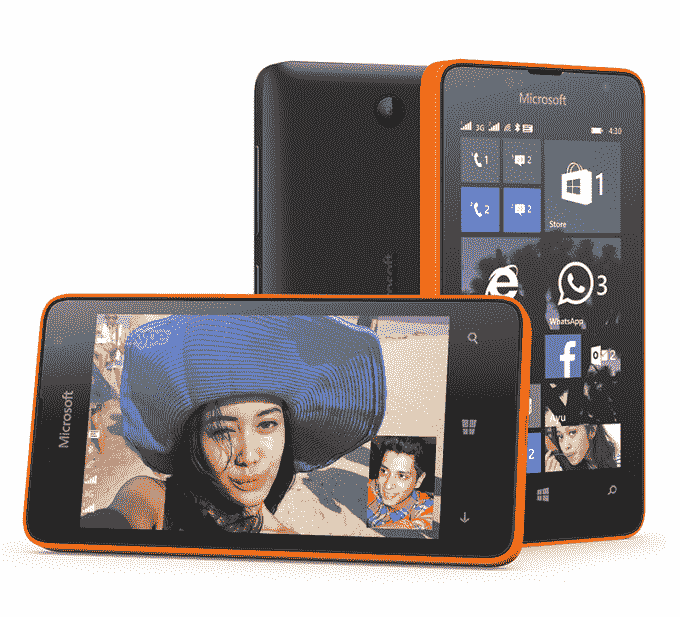

# 微软的 Lumia 系列随着新的 70 美元的 Lumia 430 TechCrunch 变得更加便宜

> 原文：<https://web.archive.org/web/https://techcrunch.com/2015/03/19/microsoft-lumia-430/>

# 微软的 Lumia 系列随着新的 70 美元的 Lumia 430 变得更加便宜

又是一天，微软又一款新的“最实惠的 Lumia”。或者至少看起来是这样。在推出 81 美元的 Lumia 435(和略贵的 93 美元的 Lumia 532)几个月后，微软又推出了另一款产品:[70 美元的 Lumia 430(T3)。](https://web.archive.org/web/20221007134248/http://lumiaconversations.microsoft.com/2015/03/19/lumia-430-dual-sim/)

除了(未锁定的)价格和双 SIM 卡功能(这在印度和亚洲其他地区很受欢迎)，Lumia 430 是你可以从微软的预算产品中期待的。这款 4 英寸的设备配有一个 200 万像素的摄像头，规格与 Lumia 435 和 Lumia 532 相同。它由 1.2 GHz 的骁龙驱动，具有 1 GB 的内存和 8 GB 的设备存储。当然，后者可以通过 MicroSD 卡升级。

如今，人们对捆绑在这些低成本 Lumias 上的服务更感兴趣，微软又一次推出了一系列名副其实的产品。Skype、30gb one drive 存储和 Office 都是预装的。该设备最初将运行 Windows 8.1(带有最新的 Denim 更新)，但微软证实，当今年晚些时候登陆时，它将有资格[进行 Windows 10 升级](https://web.archive.org/web/20221007134248/https://beta.techcrunch.com/2015/03/01/windows-10-for-mobile-8-1/)。

所以你有它。Lumia 430 将于下月发售，首先在中东、非洲、APAC 和俄国的“精选市场”发售。如果你想要的话，这是在移动设备上使用 Windows 10 最便宜的途径。它将在四月底前往印度，在那里它可能会做得很好——至少在纸面上。

