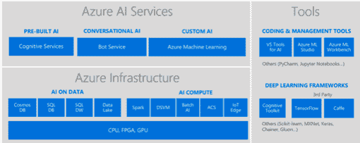

# 微软让 Azure Bot 服务面向开发者全面开放 

> 原文：<https://web.archive.org/web/https://techcrunch.com/2017/12/13/microsoft-makes-azure-bot-service-generally-available/>

# 微软使 Azure Bot 服务对开发者普遍可用

两年多前，微软推出了 Azure Bot 框架，从那以后，各公司一直在为各种场景开发聊天机器人。今天，该公司普遍提供了[微软 Azure Bot 服务](https://web.archive.org/web/20221208175847/https://azure.microsoft.com/en-us/services/bot-service/)和微软认知语言理解服务(称为 LUIS)。

“在 Azure 上同时提供这两种服务扩展了开发者构建定制模型的能力，这些模型可以自然地解释人们与机器人交谈的意图，”微软人工智能和研究部门的公司副总裁程立丽在公司博客文章中写道[。](https://web.archive.org/web/20221208175847/https://na01.safelinks.protection.outlook.com/?url=https%3A%2F%2Faka.ms%2Fltbotluis&data=04%7C01%7Cpstubbs%40microsoft.com%7Cc6acdcc7e7bd41a3bd8908d5424be270%7C72f988bf86f141af91ab2d7cd011db47%7C1%7C0%7C636487816061682628%7CUnknown%7CTWFpbGZsb3d8eyJWIjoiMC4wLjAwMDAiLCJQIjoiV2luMzIiLCJBTiI6Ik1haWwifQ%3D%3D%7C-1&sdata=kXHTpFEHHWY1PvRvfGtMG1KpYYV9CmWZ1L2BrFf7XT0%3D&reserved=0)

对话式人工智能允许人类与机器人进行对话，例如在线聊天或在 Facebook Messenger 或 Kik 等聊天工具中进行对话。客户问了一个问题，如果是例行公事，机器人可以以自然的对话方式回答，感觉就像你在和一个人说话——至少理论上是这样。

微软为开发者创建了一整套工具来创建他们的机器人，包括机器人框架和认知服务。程说，微软已经设计了尽可能灵活的机器人框架。如果你不愿意，你甚至不需要在 Azure 上托管它。Bot 服务实际上是微软创建的一套更广泛的 Azure 服务的一部分，以帮助开发人员建立人工智能基础的应用程序。

图形:微软

“你可以在 Azure 上建立一个机器人和自动供应，你可以在 Facebook Messenger，Slack 和大多数微软渠道(如 Cortana，Skype 和 Skype for teams)上发布，”程解释说。你也可以将机器人嵌入到网页或应用程序中，并根据你的需要定制用户界面。

当您将 bot 构建工具与 LUIS 语言理解工具相结合时，您会得到一个强大的组合。后者帮助机器人理解和解析查询，以提供正确的答案(并理解相关的查询)。

程表示，已有超过 20 万名开发者注册了机器人服务，目前他们在零售、医疗保健、金融服务和保险等领域有 33，000 个活跃的机器人。使用微软工具开发机器人的公司包括 Molson Coors、UPS 和 Sabre。