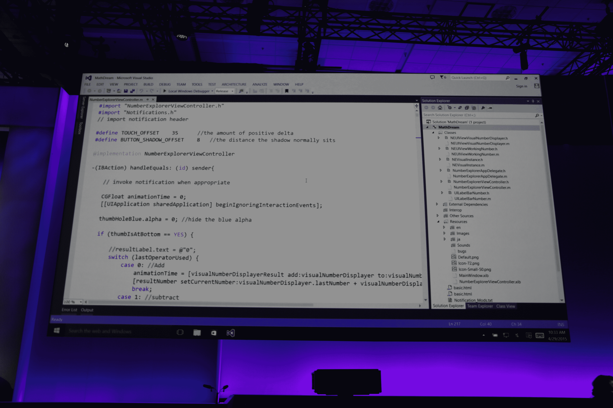

# 微软让开发者更容易将他们的 Android 和 iOS 应用程序带到 Windows 10 

> 原文：<https://web.archive.org/web/https://techcrunch.com/2015/04/29/microsoft-makes-it-easier-for-developers-to-bring-their-android-and-ios-apps-to-windows-10/>

# 微软让开发者更容易将他们的 Android 和 iOS 应用程序带到 Windows 10 上

正如预期的那样，微软今天宣布，开发者将能够更容易地将他们的 Android 应用程序带到 Windows 设备上。该公司表示，开发者将能够“重用安卓手机应用程序中几乎所有的 Java 和 C++代码，为运行 Windows 10 的手机创建应用程序。”开发人员还可以使用 Visual Studio 中的新工具来回收他们在 iOS 上的 Objective-C 应用程序。

例如，King 利用这些工具将 Candy Crush Saga 引入 Windows Phone。

在今天的演示中，微软对这将如何工作的细节相对较少。明天的构建主题演讲，传统上侧重于阶段编码，可能会为我们提供更多的细节。

微软 Windows Phone 和 Windows 8.x 平台上的应用程序长期短缺。这个问题是由负面强化造成的:Windows 8 早期应用的缺乏可能会阻止用户经常光顾商店，限制下载，从而限制开发者的注意力。

Android 和 iOS 是挑战 Windows 全球渗透率的平台，不存在应用短缺问题。虽然对于许多仍然坚持 iOS 优先的开发者来说，它仍然是第二平台，但 Android 确实有很多一流的应用程序，而且它仍然是一个你不能不开发的地方。因此，找到一种方法来帮助 Android 应用程序进入 Windows 是微软部分承认失败，部分再次在自己的平台上加倍努力。

微软还宣布，网络开发者现在可以将他们的网络应用和传统的 Windows 桌面应用带到 Windows 商店。

到目前为止，开发者可以在商店中展示他们的常规 Windows 应用，但实际购买必须在开发者的网站上进行。现在他们可以直接从商店安装。微软指出，这兑现了公司给用户更好体验的承诺。在今天的演示中，微软展示了它如何与 Adobe [Photoshop Elements 和 Premiere Elements](https://web.archive.org/web/20221006214221/http://www.adobe.com/products/elements-family.html) 一起工作。

此外，web 开发人员可以在商店中使用他们的 web 应用程序，他们可以在桌面上作为常规应用程序运行，可以使用微软的店内购买功能和通知工具。

