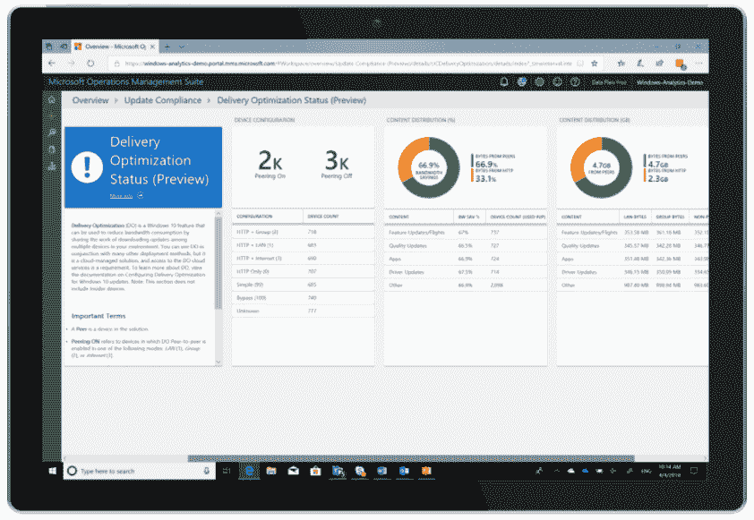
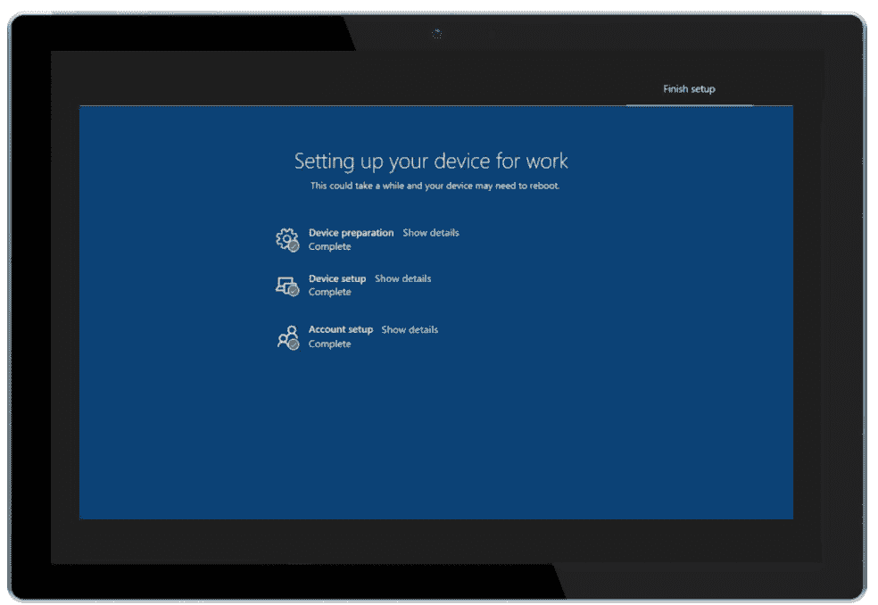

# 微软让企业用户更轻松地管理和更新 Windows 10 

> 原文：<https://web.archive.org/web/https://techcrunch.com/2018/04/27/microsoft-makes-managing-and-updating-windows-10-easier-for-its-business-users/>

随着[Windows 10 2018 年 4 月更新](https://web.archive.org/web/20221204202409/https://techcrunch.com/2018/04/27/its-windows-10-april-2018-not-the-spring-creators-update/)，微软今天为其桌面操作系统推出了许多新功能。其中大部分适用于所有用户，但除了所有常规的功能更新外，该公司今天还宣布了几个专门为拥有[微软 365 订阅的企业用户设计的新功能和工具](https://web.archive.org/web/20221204202409/https://techcrunch.com/2017/10/31/microsoft-365-for-small-and-medium-businesses-is-now-generally-available/)，这些功能和工具将 Windows 10 的许可证与 Office 365 订阅和设备管理工具相结合。

微软负责企业和移动服务的副总裁布拉特·安德森表示，所有这些新功能背后的总体思路是让企业更容易让员工获得“现代桌面”按照微软的说法，这基本上是微软 365 订阅的一部分。但是在很多方面，这更多的是关于员工，而不是支持他们的 IT 部门。对他们来说，这些更新可能会简化他们的日常生活。

今天更新中最引人注目的功能可能是 Windows 10 增加了一个 S-mode。顾名思义，这允许管理员将 Windows 10 企业设备切换到更加受限和安全的 [Windows 10 S 模式](https://web.archive.org/web/20221204202409/https://www.microsoft.com/en-us/windows/windows-10-s)，在这种模式下，用户只能从集中管理的微软商店安装应用程序。到目前为止，唯一的方法是购买 Windows 10 S 设备，但现在，管理员可以自动配置任何运行 Windows 10 Enterprise 的设备进入 S 模式。

众所周知，Windows 10 S 作为一个独立的操作系统并不十分受欢迎(在 Surface 笔记本电脑上以教育为重点的活动上推出它可能也没有帮助)。但是，总体想法是合理的，并且可能对许多 IT 部门很有吸引力。

“我们建立 S 模式是为了让它能够确保设备上安装了什么，”安德森告诉我。“这是配置 Windows 最安全的方式。”

这里最大的惊喜实际上是 S 模式现在已经可以使用了，因为直到三月份微软的 Joe Belfiore [说](https://web.archive.org/web/20221204202409/https://techcrunch.com/2018/03/07/windows-10s-will-become-s-mode-next-year/)它将在明年推出。

此次更新的另一部分是微软所谓的更新“交付优化”。这样，单个设备就可以下载更新，并通过本地网络将其分发到其他 Windows 10 设备。毕竟，下载需要一段时间，而且会消耗大量带宽。为了监控这些部署，Windows Analytics dashboard 现在包括一个选项卡，用于对这些部署进行监控。

微软今天推出的另一个新部署功能是对 AutoPilot 服务的改进。AutoPilot 允许它将笔记本电脑分发给员工，而无需首先按照公司的规格进行设置。一旦用户登录，系统将检查需要做什么，然后根据需要应用这些设置、供应策略和安装应用程序。在这次更新中，AutoPilot 现在包括了一个注册状态页面，在用户到达桌面之前就完成了所有这些工作。这样，用户就不会妨碍设置过程，IT 也知道一切都符合规范。

包括联想和戴尔在内的许多个人电脑供应商现在也支持自动驾驶，惠普、东芝和富士通计划在今年晚些时候推出他们支持自动驾驶的个人电脑。

为了管理所有这些，微软今天还推出了新的微软 365 管理中心，将 Office 365 和微软 365 的所有以前不同的配置和监控工具集中在一个屋檐下。

此次发布的另一个方面是为一线员工增加了微软 365。S 模式的 Windows 10 是其中的一部分，但该公司也在更新 Office 移动应用许可条款，将该公司的 iOS 和 Android 应用添加到 Office 365 E1、F1 和 [Business Essential](https://web.archive.org/web/20221204202409/https://products.office.com/en-us/business/office-365-business-essentials) 许可中。不过，就目前而言，只有在这些许可下，才能访问 iOS 和 Android 版的 Outlook。对 Word、PowerPoint、Excel 和 OneNote 的支持将在未来几个月内推出。