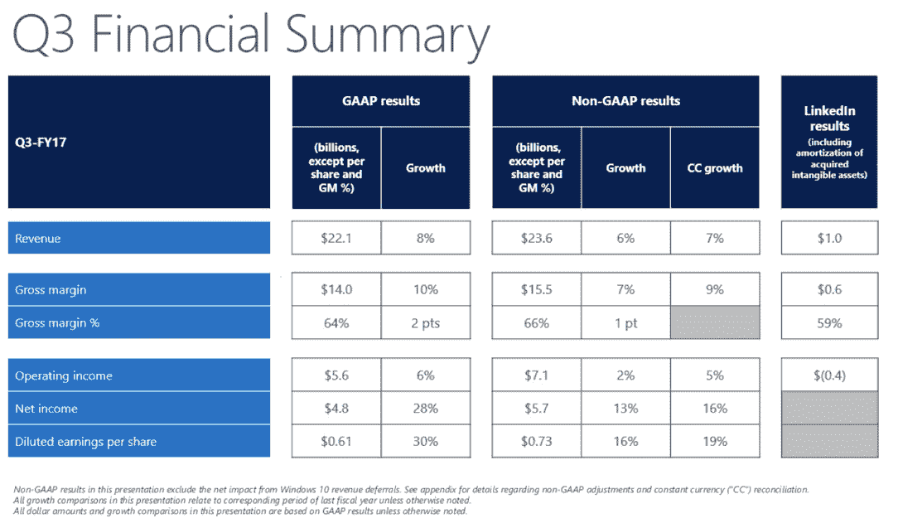
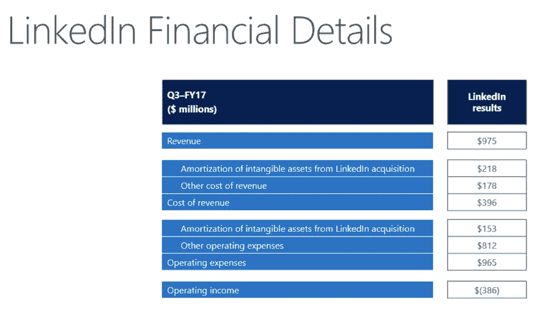

# 微软收入达到预期 236 亿美元，Azure 收入增长 93%

> 原文：<https://web.archive.org/web/https://techcrunch.com/2017/04/27/microsoft-meets-expectations-with-23-6b-in-revenue-azure-revenue-up-93/>

微软刚刚公布了上个季度的收益。该公司报告的非 GAAP 收入为 236 亿美元，非 GAAP 每股收益为 0.73 美元。华尔街的精英分析师预计该公司每股收益约为 0.70 美元，收入约为 236 亿美元。在去年同期，微软报告每股收益为 0.62 美元。

尽管华尔街的预测基本正确，但华尔街对这些收益并不感冒，微软的股票目前在盘后交易中[下跌了近 2%。](https://web.archive.org/web/20221202212307/https://www.google.com/finance?q=NASDAQ:MSFT)

“我们本季度的结果反映了客户对微软云的信任，”微软首席执行官塞特亚·纳德拉在收益公告中说。“从大型跨国公司到中小型企业，再到遍布全球的非营利组织，各种组织都在使用微软的云平台来推动他们的数字化转型。”

以下是今天报告的重点:

**云:**本季度，微软“智能云”业务的总收入达到 68 亿美元。微软预计其云计算业务到 2018 年将达到 200 亿美元。这比去年的 61 亿美元增长了 11%。然而，最重要的是，Azure 的收入增长了 93%，这一数字是由对核心 Azure 计算服务以及 Azure 高级服务的需求增长所驱动的。微软的“智能云”年运营成本现在是 152 亿美元，这使其有望达到微软长期以来预计到 2020 年实现的 200 亿美元的运营成本。

这也是微软 260 亿美元收购 LinkedIn 交易完成以来的第一个完整季度。这里的预期是，LinkedIn 将为微软的**生产力和业务流程**部门贡献约 9.5 亿美元，LinkedIn 的数字略高，为 9.75 亿美元。

生产力细分市场往往由 Office 和 Dynamics 等产品的收入主导。微软公布的这组产品的总收入为 80 亿美元，而一年前为 65 亿美元。

正如微软投资者关系总监扎克·莫克赛(Zack Moxcey)在财报发布后告诉我的那样，值得注意的是，Office 365 的商业版现在拥有超过 1 亿用户，这项业务的年增长率为 45%。Moxcey 指出，这是由新客户的获得推动的，但也是因为微软越来越善于随着时间的推移将客户转移到更高的价格水平。

自从推出 Surface 系列以来，微软自己的设备已经成为该公司收入中越来越重要的一部分(当然，来自手机的收入已经连续几个季度下滑，并且还在继续下滑)。包括 Windows、设备、游戏和搜索在内的**更多个人计算**部门报告收入为 88 亿美元，而一年前为 95 亿美元。收入的下降主要是由较低的表面收入造成的，其降幅高达 26%。根据 Moxcey 的说法，这种下降主要是由更激烈的价格竞争和当前产品组合的生命周期所驱动的。

其他领域，如 Windows OEM 收入、游戏收入甚至搜索收入都增长了 4%到 8%。