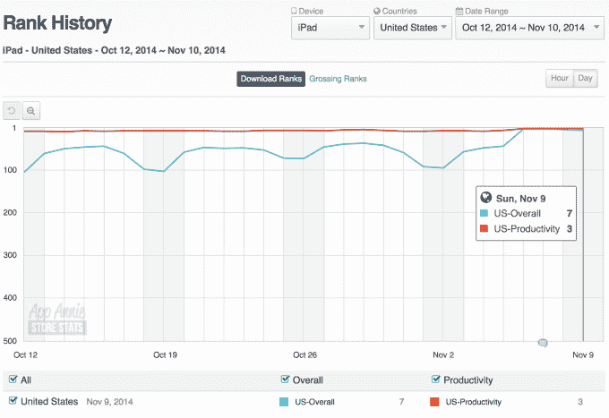

# 微软 Office 应用在价格调整后飙升至应用商店榜首 

> 原文：<https://web.archive.org/web/https://techcrunch.com/2014/11/10/microsoft-office-apps-skyrocket-to-the-top-of-the-app-store-following-pricing-changes/>

# 微软 Office 应用在价格调整后飙升至应用商店的首位

没有什么比“免费”卖得更好微软 Word 现在是 iTunes 上排名第一的免费 iPhone 和 iPad 应用程序，紧随其后的是其他微软 Office 应用程序，包括 Excel 和 PowerPoint。在上周的价格调整后，这些应用程序已经飙升至苹果应用商店的顶部。此前，微软要求 iPad 用户订阅 Office 365 以创建新文件，并在 iPhone 上提供了有限的功能集。但是这一切在周四都改变了。

微软终于开始允许[更多的公众免费使用其 Office 应用](https://web.archive.org/web/20221209035653/https://beta.techcrunch.com/2014/11/06/microsoft-doubles-down-on-office-for-tablets/)，发布新的统一应用作为其 iOS 版 Office 套件的一部分。更新的应用包括[与 Dropbox](https://web.archive.org/web/20221209035653/https://beta.techcrunch.com/2014/11/06/microsoft-doubles-down-on-office-for-tablets/) 的集成，以及更少的使用限制，因为该公司采用了“免费增值”策略来增加 iOS 市场份额。

该公司上周还表示，有 10 亿人使用 Office，其 iPad 版 Office 已经被下载了 4000 多万次。当然，这些都是不错的数字。

但随着移动生态系统的增长，该公司长期推迟了 Office for iOS 的发布，希望利用 Office 的市场地位吸引用户和企业使用微软 Windows 平台。这给了苹果和谷歌等竞争对手在移动设备上建立自己立足点的空间，消费者现在可以免费使用这些软件。虽然谷歌的在线办公软件一直对消费者免费，但苹果去年秋天宣布，其生产力应用程序也将免费，并随每一款新的 Mac 和 iOS 设备提供。

权威人士可能会说，微软跳到这种免费模式是一个太小、太晚的举动。但随着微软的 Office iOS 应用被更广泛地开放，成群结队的消费者开始尝试使用它们。

iTunes 早期的一些评分也不错。一位评论者甚至在使用该应用程序之前就给了微软 Word 5 颗星，因为他们对苹果的页面非常失望。其他人吹捧新价格(“免费”)是最大的优势，或者称赞 Dropbox 集成。但许多人也抱怨缺乏功能或漏洞，导致 Word 的总体评分仅为 3.5 星。这表明微软仍然可以做出许多改进，至少在消费者眼中是这样。

在 iPhone 上，微软 Word 是第一名，而 Excel 和 PowerPoint 分别是第八名和第十名。在 iPad 上，微软 Word 再次成为第一大免费应用，而 Excel 和 PowerPoint 分别位居第二和第七。

下面，来自 App Annie 的图表显示，自上周宣布以来，下载量急剧增加。

**Word (iPhone，iPad)**

**Excel (iPhone，iPad)**

**PowerPoint (iPhone，iPad)**

