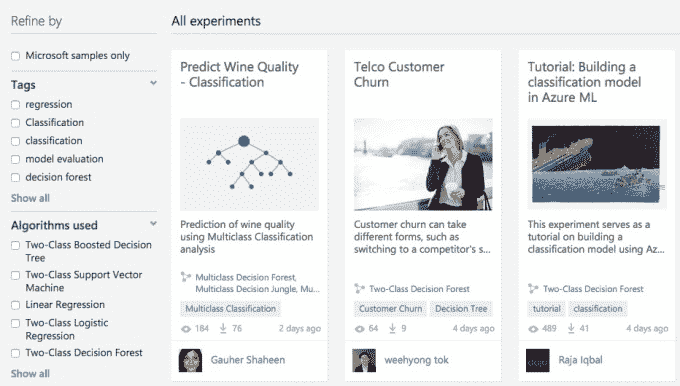

# 微软正式推出 Azure 机器学习平台 

> 原文：<https://web.archive.org/web/https://techcrunch.com/2015/02/18/microsoft-officially-launches-azure-machine-learning-big-data-platform/>

您知道从传感器、客户、社交媒体、Excel 电子表格和遍布互联网的数据源流入您公司的所有大数据吗？微软希望帮助你处理所有这些，构建 API，并利用机器学习技术在云中使用这些数据。

为此，[微软](https://web.archive.org/web/20230204161919/http://www.microsoft.com/en-us/default.aspx)在今天的 [Strata 会议](https://web.archive.org/web/20230204161919/http://strataconf.com/)上正式宣布，面向云计算大数据处理的 Azure 机器学习服务全面上市。它还宣布了自六月测试版发布以来对平台[的一些改进。](https://web.archive.org/web/20230204161919/https://techcrunch.com/2014/06/16/microsoft-announces-azure-ml-cloud-based-machine-learning-platform-that-can-predict-future-events/)

正如我们在 6 月份所写的那样，“该产品建立在包括 Xbox 和 Bing 在内的几个微软产品中已经可用的机器学习功能上，并使用预定义的模板和工作流来帮助公司以比传统开发方法更快的速度启动预测应用程序，甚至允许客户在 Azure ML 平台上发布 API 和 web 服务。”

微软公司副总裁 Joseph Sirosh 负责 Azure ML，在加入微软领导这个项目之前，他曾在亚马逊工作多年，他说最新版本除了支持流行的 R 之外，还支持 Python。

“我们增加了 Python，这是数据科学家的最爱。这是一个巨大的生态系统，”西罗什告诉 TechCrunch。

他说，这种能力对数据科学家来说将是强大的。“我们做了很多改进，添加 Python 是其中的一部分。Azure 机器学习是平台。你可以复制一点 Python 代码，把它插入到工作室中，然后创建一个 API，”他解释道。

此外，该平台现在支持 Hadoop 和 Spark，为其提供了一套相当全面的工具来处理大数据，无论您选择什么平台。

这个平台的真正优势是能够非常快速地创建 API 并开始处理数据。

“云解决了最后一英里的问题，”西罗什解释道。在这样的服务出现之前，你需要数据科学家来识别数据集，然后让他们构建一个应用程序来支持它。最后一部分通常需要几周或几个月的时间来大规模编码和设计。他说 Azure ML 采用了这一过程，并提供了一种在几个小时内构建相同应用的方法。

西罗什显然很兴奋地描述了可供选择的范围。“数据科学家只需点击几下鼠标就可以发布 API。应用程序可以包括 R 代码、python 代码[或它们的组合]。这是如此令人难以置信的能力选择，”西罗什说。

他说，虽然 IBM 和 SAS 等竞争对手提供了一系列服务，但他声称没有一家公司以 Azure Machine Learning 为用户提供的这种集成方式提供服务。

“这是一套得到全面管理的集成工具，”他说。“你不必安装硬件和软件，你可以进行高级学习和分析。”

除了为云中的大数据处理提供工具，微软还提供了一个市场，人们可以在这里分享他们创建的应用程序和 API。西罗什说，这是数据科学家公开测试他们想法的好方法。

目前市场上有 20 多种启动实验，但西罗什认为它有巨大的潜力。他认为，随着时间的推移，绝大多数企业可以通过在市场上找到合适的工具来满足他们的大数据处理需求。

“当 Azure 机器学习到来时，它非常容易使用，生产 API 的成本非常低，数据科学家和开发人员可以很容易地在云中制作完全的机器学习 API，”他说。

在可视化数据方面，该平台具有一些内置功能，但它也兼容[微软 Power BI](https://web.archive.org/web/20230204161919/http://www.microsoft.com/en-us/powerbi/default.aspx) 和 [IPython Notebook](https://web.archive.org/web/20230204161919/http://ipython.org/notebook.html) 以进一步绘制和可视化处理的数据。