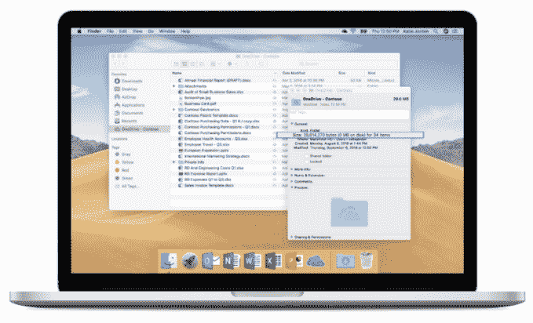

# 微软 OneDrive 的点播文件来到 MAC OS Finder 

> 原文：<https://web.archive.org/web/https://techcrunch.com/2018/09/24/microsoft-onedrives-on-demand-files-come-to-the-macos-finder/>

# 微软 OneDrive 的点播文件来到 MacOS Finder

如果你在微软 Office 生态系统中生活和工作，但经常使用 Mac，这里有一些好消息: [OneDrive Files On-Demand](https://web.archive.org/web/20221210000700/https://support.office.com/en-us/article/learn-about-onedrive-files-on-demand-0e6860d3-d9f3-4971-b321-7092438fb38e) 现已在 MacOS 的公共预览中提供。

文件点播是 Windows 10 秋季 Creators 更新的[特色](https://web.archive.org/web/20221210000700/https://techcrunch.com/2017/05/11/microsoft-blurs-the-line-between-desktop-and-cloud-with-onedrive-update/)之一。这里的总体想法是，你可以将文件存储在云中，并在设备之间同步它们，但当它们出现在 Windows 资源管理器和现在的 MacOS Finder 中时，这些文件实际上并不需要下载。相反，顾名思义，按需文件只在需要时下载，释放了宝贵的本地存储空间。

当然，你也可以选择同步每个文件。毕竟，你真的不想通过慢速的飞机 Wi-Fi 同步一个 2 GB 的文件。

微软指出，它致力于“将 Mac 作为一流的终端”，并将继续投资于该平台。如今，Mac 和 Windows 版本来自相同的代码库，Mac 更新每月都有。

虽然文件点播不仅仅是关于 Office，但有可能许多用户都是使用内置 OneDrive 功能在云中存储文档的 Office 用户。

