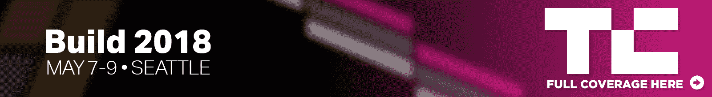

# 微软全面检查其对话式人工智能聊天工具 

> 原文：<https://web.archive.org/web/https://techcrunch.com/2018/05/07/microsoft-overhauls-its-conversational-ai-chatbot-tools/>

微软首席执行官塞特亚·纳德拉简要介绍了公司对话式人工智能工具的重大更新。你现在可以更容易地创建、测试和改进运行在 Azure 或你自己的服务器上的[机器人，并跨多个平台工作。](https://web.archive.org/web/20221209210256/https://azure.microsoft.com/en-us/services/bot-service/)

纳德拉说:“在这次会议上，我们将推出机器人框架的 100 多项功能，这样你就可以继续构建这些对话界面，并为它们提供更多定制。”

现在每月有 3 万个活跃的机器人使用微软的对话式人工智能工具。他们每天为 1000 家公司处理 3000 万条消息，包括 Macy's、韩亚航空、Stack Overflow、KPMG、Telefonica、HP 和 UPS。

很可能你已经在没有意识到的情况下与这些机器人交谈过，因为你不需要使用微软的产品来与利用微软技术的机器人进行交互。

微软的对话式人工智能工具可以让你在网站上部署机器人，Slack，Facebook Messenger，Kik，使用 Twilio 的短信，Telegram，Cortana，Skype for Business，微软团队，GroupMe 和电子邮件。

不过，它不能与亚马逊、谷歌或苹果的任何产品兼容。

微软的 Bot Builder SDK 已经更新。它让你选择一个机器人设计，然后从这个模型中创建你自己的机器人。从今天开始，QnAMaker 现在也可以作为最终版本使用。它让你把一个很好的老 FAQ 变成你的机器人的一组问题和答案。

机器人模拟器也已经更新，使调试你的机器人更容易。有一个名为 Dispatch 的新组件，可以让您将查询发送到正确的模型或知识库。您还可以管理第三方应用程序的鉴定，以便与其他应用程序进行交互。这对电子商务网站和按需服务很重要。

微软的语言理解模块 LUIS 可以让你将语音转换成意图。现在，您可以更轻松地整合 LUIS 中的地址、人员和组织。

最后，还有两个新项目，叫做项目对话学习者和项目个性聊天。通过第一个项目，你可以将对话输入到平台中，并让微软使用机器学习来学习新的对话序列。第二个项目让你创造一些闲聊的互动来创造你在和一个真实的人交谈的幻觉。

