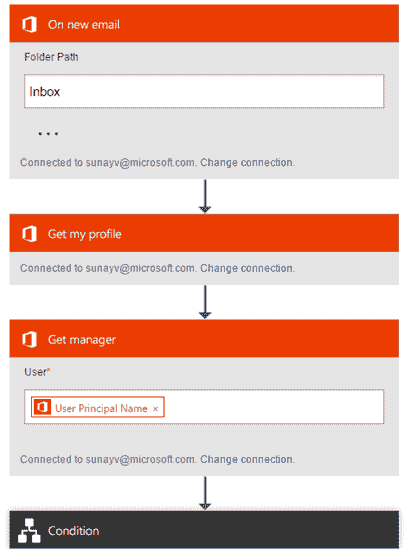

# 微软用于构建业务线应用的新工具现已公开预览 

> 原文：<https://web.archive.org/web/https://techcrunch.com/2016/04/29/microsoft-powerapps-is-now-in-public-preview/>

# 微软构建行业应用的新工具现已公开预览

微软 PowerApps 允许任何人不用接触任何代码就能开发基本的商业应用。这些应用程序可以在网络和手机上运行(通过 iOS 和 Android 的 PowerApps 应用程序)。微软在去年 11 月[首次宣布了这个项目的私人预览](https://web.archive.org/web/20221207103659/https://beta.techcrunch.com/2015/11/30/microsoft-launches-powerapps-to-make-building-business-apps-easier/)，但是[从今天](https://web.archive.org/web/20221207103659/https://powerapps.microsoft.com/en-us/blog/powerapps-public-preview/)开始，它对任何想尝试的人开放。

在 PowerApps 中构建应用程序主要是一件拖放的事情。虽然该服务提供了一个在线仪表板，但设计工作是在 Windows 10 桌面应用程序中进行的。

大多数业务线应用程序依赖于连接到各种数据源的能力。令人欣慰的是，微软让它既可以轻松连接到自己的工具，如 Excel、Office 365、SharePoint Online、OneDrive 和 Dynamics CRM，也可以连接到第三方工具，如 Google Drive、Salesforce、Dropbox、Slack 和 Twitter。如果你依赖一个尚未集成到 PowerApps 中的服务，你也可以将你的应用连接到任何 RESTful API。

为了让新用户适应，微软提供了一些标准用例的模板。不过，在很大程度上，从头开始构建新的应用程序非常简单——尽管可能不像微软的营销想让它看起来的那样微不足道。

 PowerApps 还包括与[微软 Flow](https://web.archive.org/web/20221207103659/https://flow.microsoft.com/) 的一些基本集成——这是一种类似 IFTTT 的服务，用于连接通常不互相交谈的应用程序，该公司于本周早些时候悄悄发布。例如，由于这一点，你可以从你的 PowerApps 应用程序中触发流操作。

与 IFTTT 和 Zapier 等类似工具相比，Flow 在很大程度上为您提供了更多的灵活性，让您可以更灵活地[触发操作](https://web.archive.org/web/20221207103659/https://flow.microsoft.com/en-us/blog/work-smarter-with-email/)，但目前来看，它还不能提供足够多的服务供您相互连接。不出所料，Flow 的重点更多地是像 Office 365、Dynamics CRM、Yammer、MailChimp、Slack、GitHub 和 SalesForce 这样的商业工具，但它也支持一些标准的脸书和 Twitter 操作。