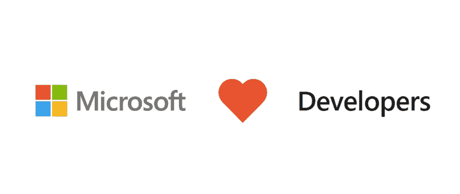
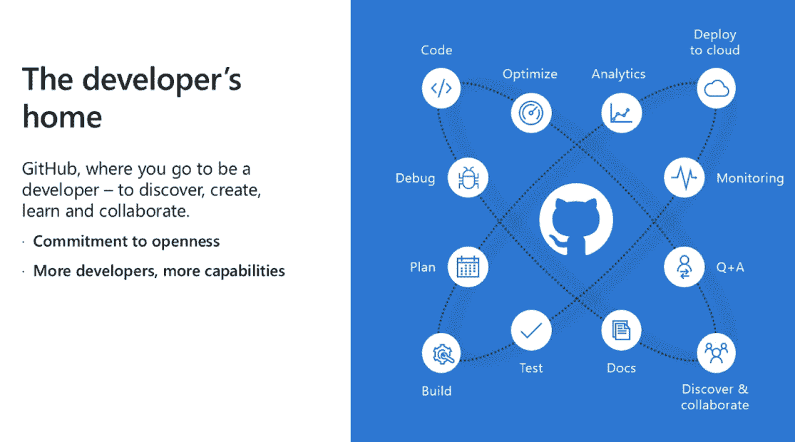

# 微软承诺保持 GitHub 的独立性和开放性

> 原文：<https://web.archive.org/web/https://techcrunch.com/2018/06/04/microsoft-promises-to-keep-github-independent-and-open/>

微软今天宣布了以 75 亿美元股票收购 GitHub 的计划。不出所料，这给开发者社区带来了一些冲击，他们仍然经常带着相当大的不安看着微软。在今天上午的电话会议上，微软首席执行官塞特亚·纳德拉、GitHub 新任首席执行官(Xamarin 创始人)纳特·弗里德曼和 GitHub 联合创始人兼即将离任的首席执行官克里斯·万斯特拉斯(Chris Wanstrath)为 GitHub 在微软的未来制定了计划。

在今天的电话会议上，每个人都强调的核心信息是 GitHub 将继续作为一家独立的公司运营。这很大程度上是微软收购 LinkedIn 时采取的方法，但在某种程度上，这也是承认微软意识到自己在许多以 GitHub 为家的开发者中的声誉。微软承诺，GitHub 仍将是一个开放平台，任何开发者都可以插入并扩展。它将支持任何云和任何设备。

不出所料，虽然 GitHub 的核心不会改变，但微软确实计划扩展 GitHub 的企业服务，并将其与自己的销售和合作伙伴渠道整合。纳德拉指出，该公司将使用 GitHub 将微软的开发工具和服务“带给新的受众”

随着 Nat Friedman 接任首席执行官，GitHub 将有一位受人尊敬的技术专家掌舵。微软对 Xamarin 的收购和整合是成功的，至少从外部来看是如此(当我与弗里德曼交谈时，他本人似乎总是对结果非常高兴)，所以我认为这对 GitHub 来说是个好兆头。加入微软后，弗里德曼在公司负责开发人员服务团队。万斯特拉斯在上一任首席执行官因公司骚扰丑闻被驱逐后才再次担任首席执行官一职，他早就说过他想辞职并承担更积极的产品角色。这就是现在弗里德曼接手的情况。万斯特拉斯将成为一名技术研究员，在微软从事“战略软件项目”的工作。

事实上，在收购宣布后的一次采访中，弗里德曼多次指出，他认为 GitHub 是当今最重要的开发者公司——事实证明，他在两年前加入微软后就开始倡导两家公司建立更密切的关系。

在今天的新闻发布会上，弗里德曼还强调了微软保持 GitHub 像今天一样开放的承诺——但他也计划扩大这项服务及其社区。"我们 要 要 带来 更多 开发者更多 能力 要 GitHub 他说. "B 因为 为 a 网络 和 为 a 群人 在 a 社区GitHub”

Friedman 在当天晚些时候的采访中重复了这一点，并指出他预计开发人员社区会对这两家公司的 mashup 持怀疑态度。“在开发者社区中总是有健康的怀疑，”他告诉我。“我想让开发者看看微软过去几年的历史，真正诚实地看看微软向开源公司的转变。”他要求开发者以此来判断微软，并指出，真正重要的是，当然，该公司将贯彻其今天所做的承诺。

至于产品本身，Friedman 指出 GitHub 所做的一切都应该是为了让开发者的生活更轻松。首先，这意味着让在云中开发变得更加容易。“W e 想 阔 关于 新引人注目 类型方式 认为 我们 可以 整合 云 服务“这不仅仅适用于我们的云。GitHub 是一个开放的平台。所以我们有能力让任何人把他们的云服务插入 GitHub，让你从代码到云更容易。它也延伸到了云之外。代码到云。码到移动，码到边缘设备，码到物联网。开发者想要追求的每一个工作流程，我们都会支持。”

该公司将致力于的另一个领域是 GitHub 市场。微软表示，它将在 GitHub Marketplace 中提供所有的开发者工具和服务。

不出所料，微软的免费开源代码编辑器 VS Code 将获得深度集成的 GitHub 支持。

“我们的愿景是真的 所有 关于 赋权 开发者创作 一个 家 哪里 你 能 使用 任何 语言 任何 设备每一个 开发者 ， 是否学生 ， 业余爱好者 ， GitHub 是家 为 所有 的开发者，弗里德曼说。在我们的采访中，他还强调，他的重点将是让“GitHub 更好地制作 GitHub ”,他计划通过将微软的资源和基础设施引入代码托管服务来实现这一点，同时让它独立运营。

目前还不清楚所有这些承诺是否会减轻开发者对失去 GitHub 作为生态系统中相对中立的第三方的担忧。

纳德拉肯定意识到了这一点，他今天直接谈到了这一点。“W e 认 对 负责 我们 拿跟约定，”他说。我们 被 委身 到 被 管家被 GitHub 社区其中 将 保留 W e 会 总 听 要 培养 一个 反馈和投入 于 两者

在他准备的发言中，纳德拉还强调了微软作为一家以开发者为中心的公司的传统，那就是它已经是 GitHub 上最活跃的组织。但更重要的是，他也提到了微软在开源社区中的角色。“我们 有 总 爱 开发商我们 爱 开 源 开发商，”他说。" We vea旅程 自己 跟 开 源码 和 开源码 社区。 T oday ， 我们 都是中的 跟 开 源码。 W e 都是 主动 中的开放 来源 的生态系统。 W e 投稿开放 来源 项目一 nd 一些 的 我们的 最 充满活力的 开发者【T115 所有 来源 判断通过动作 我们 有 拍摄最近的