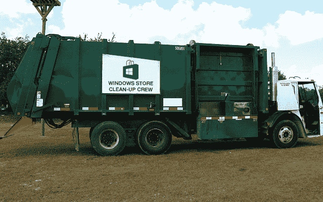

# 微软承诺从 Windows 商店中移除 Scammy 应用程序，关闭 1500 个应用程序以启动 

> 原文：<https://web.archive.org/web/https://techcrunch.com/2014/08/27/microsoft-promises-to-remove-scammy-apps-from-the-windows-store-kills-off-1500-apps-to-start/>

# 微软承诺从 Windows Store 中移除诈骗应用，首先关闭 1500 个应用

Windows 应用商店有一个问题:它充满了垃圾。

对于每一个受欢迎的应用程序，都有十几个应用程序竭尽全力欺骗用户购买它。

没有一个应用程序商店没有可疑的应用程序——即使是苹果，有着臭名昭著/令人痛苦的严格限制(值得注意的是，随着时间的推移，似乎已经有所放松)，也有相当一部分可疑的克隆和商标侵权。

但是 Windows Store 上的许多应用远远不止是俗气的概念克隆；他们中的许多人甚至懒得创造新的图标，或者想出除了改变几个字符以外的新名字。

与此同时，公然侵犯商标的行为非常普遍。你想要 iTunes？“Itunes PC”怎么样，4 美元？或者 9 美元的“Itunes Play App”？图标是一样的；这些名字是故意混淆的。唯一的区别是，在下载按钮后面是一堆垃圾，没有人会故意去下载。直到现在，看起来微软并不想为此做些什么。

[How-To Geek](https://web.archive.org/web/20230217122925/http://www.howtogeek.com/194993/the-windows-store-is-a-cesspool-of-scams-why-doesnt-microsoft-care/) 上周就这个问题抨击微软，现在微软承诺会解决这个问题。

在[刚刚发表的博客文章](https://web.archive.org/web/20230217122925/http://blogs.windows.com/buildingapps/2014/08/27/how-were-addressing-misleading-apps-in-windows-store/)中，微软宣布了他们认证过程的三项改变:

*   应用程序的名字必须清楚(所以“iTunes PC”可能是不行的。)
*   应用程序必须正确分类(所以不要再有伪装成功能性应用程序的高级“操作”指南)
*   图标必须足够独特，你不会把两个应用程序弄混。

它们看起来都是显而易见的规则，或许一开始就应该存在——但至少现在已经存在了。

微软表示，新规则将影响所有未来的应用程序提交和更新，但他们也将尽快回顾和重新审查他们的目录。迄今为止，他们已经关闭了大约 1500 个应用程序。如果你运气不好，买了一个被拒绝的，他们会退钱给你。

【照片修改；Clyde Robinson 在 Flickr 上的原始照片。在知识共享下使用]