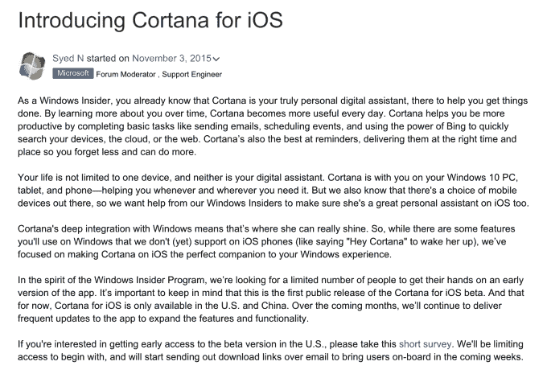

# 微软为 iOS 测试版准备好 Cortana，承诺在“数周内”发出邀请

> 原文：<https://web.archive.org/web/https://techcrunch.com/2015/11/04/microsoft-readies-its-cortana-for-ios-beta-promises-invites-in-weeks/>

# 微软为 iOS 测试版准备好 Cortana，承诺在“数周内”发出邀请

微软早些时候表示，其 Cortana 个人助理——谷歌 Now 和苹果 Siri 的竞争对手——将通过提供跨平台支持(包括通过 iOS 和 Android)来应对竞争。8 月，当[推出安卓测试版](https://web.archive.org/web/20221209230400/https://beta.techcrunch.com/2015/08/24/microsoft-launches-first-public-beta-of-cortana-for-android/)Cortana 时，它兑现了这些承诺。现在，iOS 版本似乎也快到了——该公司已经开始招募 iOS 版本的测试人员，邀请函预计将在几周内通过电子邮件发送。

这个消息早些时候由 [ZDNet 的](https://web.archive.org/web/20221209230400/http://www.zdnet.com/article/microsoft-lining-up-testers-for-cortana-on-ios-app/) Mary Jo Foley 和 [The Verge](https://web.archive.org/web/20221209230400/http://www.theverge.com/2015/11/4/9668492/microsoft-cortana-ios-beta-preview-iphone) 报道，他们都指向[一个链接，指向微软官员最近在](https://web.archive.org/web/20221209230400/https://www.surveymonkey.com/r/VVWNRBY#vrg)[一个在线社区论坛](https://web.archive.org/web/20221209230400/https://answers.microsoft.com/en-us/insider/forum/insider_wintp-insider_cortana/introducing-cortana-for-ios/088dbee0-c66e-41a6-b25d-f83b59e9571a?auth=1#vrg)上发布的一个针对测试人员的调查。

该公司指出，根据调查，Cortana for iOS beta 仅在美国和中国可用，但随着时间的推移，它将在所有支持 Cortana for Windows 的地区可用。微软似乎也在寻找在 Windows 10 PC 上使用该应用的测试人员，因为调查问题之一与他们使用 Windows 10 的频率有关。

配套应用是 Windows 10 的突出特点之一，提供语音搜索；获得关于体育比分、电影放映时间、餐馆和其他项目的答案的能力；能够设置提醒和警报，跟踪航班，拨打电话，口述短信，等等。

根据 Google Play 的数据，Android beta 版的安装量已经增长到了 5 万到 10 万次之间——考虑到这是一次私人测试，这是一个相当不错的数字，但也表明许多 Android 用户非常乐意使用内置的 Google Now 助手。

在移动设备上，Cortana 应用的功能不如在 Windows 和 Windows Phone 上那么强大。例如，[微软早些时候](https://web.archive.org/web/20221209230400/https://beta.techcrunch.com/2015/08/24/microsoft-launches-first-public-beta-of-cortana-for-android/)表示，启动应用程序的“嘿，Cortana”热门词功能最初将不会提供。如果 iOS 测试版像 Android 版本一样，你也将无法从 Cortana 打开应用程序，或者像在 Windows PCs 上一样切换设置。

微软表示，将在“未来几周”开始通过电子邮件向板载测试人员发送下载链接。

