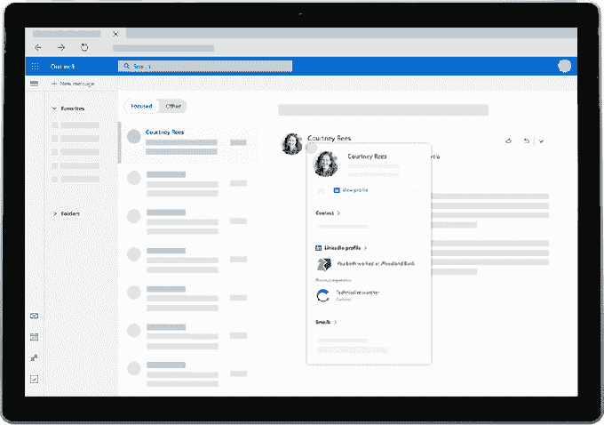

# 微软在 Outlook.com 推出 LinkedIn 集成

> 原文：<https://web.archive.org/web/https://techcrunch.com/2017/10/31/microsoft-rolls-out-linkedin-integrations-in-outlook-com/>

微软以 262 亿美元收购商务社交网站 LinkedIn 开始获得回报——至少在有意义的产品整合方面。该公司今天[宣布【LinkedIn 在 Outlook.com 的整合现已上线，允许电子邮件用户在其收件箱中查看见解、个人资料图片、工作经历等。](https://web.archive.org/web/20230316060329/https://blogs.office.com/en-us/2017/10/31/new-to-office-365-in-october-online-tools-microsoft-ai-and-more/)

之前在 9 月份的微软 Ignite 上，T4 详细介绍了 LinkedIn 加入 Outlook 的情况。在那里，微软首席执行官塞特亚·纳德拉预览了拥有 LinkedIn 个人资料的商业 Office 365 用户将很快能够在微软的应用和服务中查看 LinkedIn 信息。

在一个示例中，Outlook 用户在 Office 365 的 Outlook 日历中使用附加到其联系人卡片的 LinkedIn 简档信息来搜索他们要会见的人。Ignite 还宣布了 LinkedIn 与其他微软产品和服务的集成，包括 Dynamics 365 for Sales 和微软的 CRM 解决方案。

这不是 LinkedIn 数据第一次出现在电子邮件中。在被微软收购之前，LinkedIn 本身[收购了一家名为 Rapportive](https://web.archive.org/web/20230316060329/https://techcrunch.com/2012/02/22/rapportive-linkedin-acquisition/) 的较小公司，该公司制作了当时流行的 Gmail 插件，将社交档案数据集成到 Gmail 的网络应用程序中。后来它修改了应用程序，更加关注 LinkedIn 的整合，而不是与脸书和 Twitter 等其他服务的连接。

通过新的 Outlook 集成，客户可以在收件箱中点击电子邮件联系人的姓名，然后查看包含 LinkedIn 个人资料链接的丰富联系人卡片。

只需点击一下，你就可以在这个弹出式办公室简介卡中查看他们的迷你版简介，其中包括相互联系或共享工作经历等亮点——例如，如果你们过去都曾在同一家公司工作过。

您也可以选择与 LinkedIn 上的联系人联系。

详细的个人资料信息应该是电子邮件体验的一部分这一前提并不是微软 Outlook 独有的。各种创业公司，包括[会议准备工具查理](https://web.archive.org/web/20230316060329/https://techcrunch.com/2014/10/23/charlie-briefs-you-on-your-upcoming-meetings-by-emailing-you-one-pagers-on-attendees/)(后来已经转向)，甚至 Rapportive 的创始人拉胡尔·沃赫拉的[新创业公司超级人类](https://web.archive.org/web/20230316060329/https://techcrunch.com/2017/08/18/rapportive-founders-new-startup-superhuman-is-what-gmail-would-be-if-built-today/)，都在电子邮件联系人上提供了类似的档案。

微软[上个月](https://web.archive.org/web/20230316060329/https://blog.linkedin.com/2017/september/250/adding-linkedin_s-profile-card-on-office-365-offers-a-simple-way)表示，Outlook 和 LinkedIn 之间的整合将在网络上推广到 Outlook.com，以及 SharePoint 和 OneDrive for Business。该公司当时表示，未来几个月，它还将在 Outlook for Windows、Outlook for iOS 和其他 Office 产品中推出。

与 Outlook.com 的集成从现在开始推出。