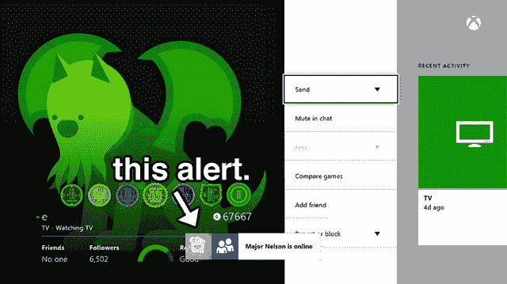

# 微软推出 4 月 Xbox One 更新——以下是内容

> 原文：<https://web.archive.org/web/https://techcrunch.com/2014/04/14/microsoft-rolls-out-the-april-xbox-one-update-heres-whats-inside/>

# 微软推出 4 月 Xbox One 更新——以下是内容

你有 Xbox One 吗？更新时间到了！兴奋起来！嗯，不太兴奋。中度兴奋。

像过去几个月的更新一样，这个月的补丁主要是为了引入一些新功能，这些功能不是全新的，而是从 Xbox 360 跳到 Xbox One 后令人惊讶地缺失的东西。

新的更新应该会在今晚登陆 Xbox Ones。

**你可能会直接注意到的事情:**

*   游戏现在可以在保存时显示一个进度条，而不仅仅是一个旋转的图标。
*   当 Xbox Live 好友登录时，您将会看到提醒。微软称这是“最受欢迎的功能之一”——这是有道理的，因为它一开始就不存在，这有点疯狂
*   他们调整了 GameDVR 算法(当你说“Xbox，把它录下来！”时，这个系统会记录游戏的最后几秒钟)以获得更好的视频质量。

**不太明显的(幕后)东西:**

*   Kinect 的语音/动作算法已经得到了改进，主要的改进是降低了触发传感器的“非手物体”的误报率。如果你曾经躺在沙发上，让 Kinect 开始跟踪你的脚，这就是他们所说的
*   蓝光播放器硬件现在可以支持 50 赫兹的视频内容，尽管蓝光播放器的应用程序还有几天不支持它。
*   改进的控制器/无线耳机连接
*   Xbox One 现在可以在通宵/待机更新后自动重启；以前，如果 Xbox One 在待机模式下更新，你必须手动重置它。

唉，还是没有 HBO GO 的迹象。