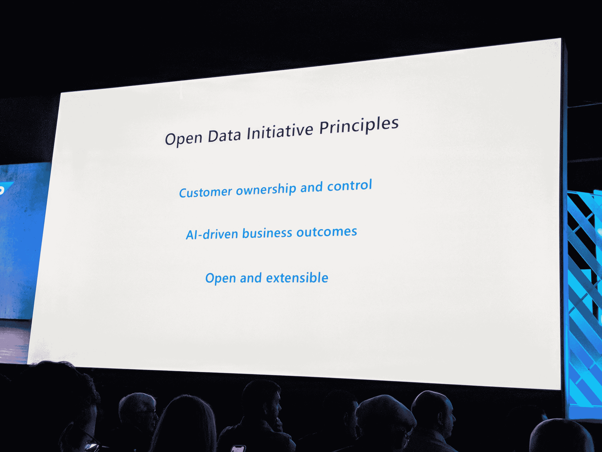

# 微软、SAP 和 Adobe 针对客户数据推出了新的开放数据计划 

> 原文：<https://web.archive.org/web/https://techcrunch.com/2018/09/24/microsoft-sap-and-adobe-take-on-salesforce-with-their-new-open-data-initiative-for-customer-data/>

# 微软、SAP 和 Adobe 通过新的客户数据开放数据计划与 Salesforce 展开较量

微软、 [SAP](https://web.archive.org/web/20230110180559/http://www.sap.com/opendatainitiative) 和 [Adobe](https://web.archive.org/web/20230110180559/https://www.adobe.com/experience-platform/open-data-initiative.html) 今天[宣布](https://web.archive.org/web/20230110180559/https://news.microsoft.com/2018/09/24/adobe-microsoft-and-sap-announce-the-open-data-initiative-to-empower-a-new-generation-of-customer-experiences/)一项新的合作关系:开放数据倡议。这个联盟是对 Salesforce 的明显攻击，旨在为消费者数据创建一个单一的数据模型，然后在平台之间移植。这些公司认为，这将为消费者提供更多的透明度和隐私控制，但这里的核心思想是让企业更容易移动客户的数据。

这些数据可以是标准的 CRM 数据，也可以是关于购买行为的信息和关于客户的其他信息。目前，在平台之间移动数据通常很困难，因为没有标准的方法来组织数据。当然，这阻碍了这些公司利用他们的数据做什么，在这个机器学习的时代，数据就是一切。

“我们希望这是一个开放的框架，”微软首席执行官塞特亚·纳德拉在该公司年度 Ignite 大会的主题演讲中说道。“我们对真正让客户控制我们整个行业的数据的潜力感到非常兴奋，”他补充说。

然而，这意味着如何工作的确切细节现在还有点模糊。不出所料，Adobe 计划将这一模式用于其客户体验平台，而微软将把它内置于其 Dynamics 365 CRM 服务中，SAP 也将在其 Hana 数据库平台和 CRM 平台上支持它。在所有这些的下面是一个单一的数据模型，当然，还有微软 Azure——至少在微软这边是这样。

Adobe 首席执行官尚塔努·纳拉延说:“Adobe、微软和 SAP 正在合作重新构想客户体验管理类别。“我们将共同为企业提供驾驭和处理海量客户数据的能力，从而大规模提供个性化的实时客户体验。”

这三家公司共同挑战 Salesforce 在 CRM 市场的垄断地位，并创造了一个新的标准。特别是 SAP，最近非常重视 CRM 市场，虽然增长很快，但仍然远远落后于 Salesforce。

