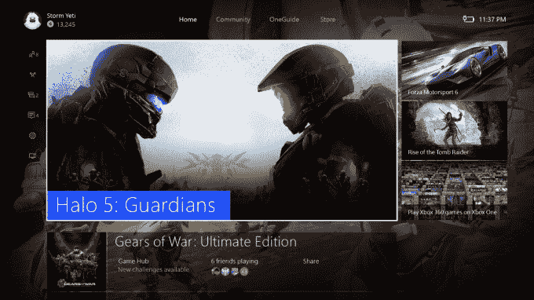

# 微软称 Windows 10 现在运行在超过 2 亿台设备上 

> 原文：<https://web.archive.org/web/https://techcrunch.com/2016/01/04/microsoft-says-windows-10-is-now-running-on-over-200-million-devices/>

微软今天早上[宣布了](https://web.archive.org/web/20221007004446/https://blogs.windows.com/windowsexperience/2016/01/04/windows-10-now-active-on-over-200-million-devices/)与其 Windows 10 操作系统的增长和牵引力相关的有希望的数字。该公司今天证实，Windows 10 现在运行在全球每月超过 2 亿台活跃设备上，也是有史以来增长最快的 Windows 操作系统版本。

微软表示，Windows 10 的增长速度比 Windows 7 快了近 140%，比 Windows 8 快了 400%。

此外，微软似乎受益于今年黑色星期五的销售，注意到自黑色星期五以来，超过 40%的新 Windows 10 设备变得活跃。自销售假期以来，与前四周相比，Windows 10 的美国零售份额增长了 16 个百分点，达到 62%。Windows 10 个人电脑的比例从节前的 58%上升到了 87%。

企业对操作系统的需求也在增长，该公司声称，超过 76%的企业客户正在积极试用 Windows 10，超过 2200 万台设备正在由企业和教育客户运行。

正如商业内幕[指出的](https://web.archive.org/web/20221007004446/http://www.businessinsider.com/windows-10-is-looking-like-a-huge-success-and-thats-a-big-deal-2016-1)，2 亿台设备的数字已经[之前](https://web.archive.org/web/20221007004446/http://www.businessinsider.com/microsoft-windows-10-is-on-10-of-pcs-in-the-world-2015-12?r=UK&IR=T)由像 Statistica 这样的独立第三方报告过，但是还没有得到微软的公开确认。

除了这些数字，微软还详细介绍了 PC 用户对该操作系统的参与度，指出它在 12 月达到了另一个里程碑，当时用户在 Windows 10 操作系统上花费了超过 110 亿小时。该公司表示，这比以往任何时候都要长。

该公司详细列举了其他几个值得注意的数字:

*   上个月，Windows 10 设备在 Microsoft Edge 上花费的时间超过 445 亿分钟。
*   自发布以来，Cortana 收到了超过 25 亿个问题。
*   每台 Windows 10 设备上的 Bing 搜索查询比之前的 Windows 版本多 30%左右。
*   在 Windows 10 照片应用中查看了超过 820 亿张照片。
*   2015 年，游戏玩家在 Windows 10 上玩 PC 游戏的时间超过 40 亿小时。
*   游戏玩家已经向 Windows 10 PCs 传输了超过 660 万小时的 Xbox One 游戏。
*   新的 Windows 商店已经有 30 亿次访问。付费交易数量增加了 2 倍。
*   12 月，60%的付费客户是 Windows 商店的新用户，与 Windows 8 相比，Windows 10 的每台设备收入增长了 4.5 倍以上。

当然，与今天的数字有关的一个重要因素是，微软的 Windows 10 是免费升级的——这是该公司多年来战略的一个变化。微软还将 Windows 10 个人电脑和移动设备结合起来，推出其 Windows 10 数字。

该公司重申了其目标，即看到超过 10 亿台设备安装 Windows 10——之前它曾表示可能会在两三年内实现这一目标。

虽然吹捧 Windows 10 的成功是今天发布会的更大焦点，但微软也分享了一些与 Surface Book 和 Xbox 有关的数字。

它表示，2015 年是 Xbox 历史上最大的一年，但没有分享与售出多少台相关的数字。相反，微软表示，Xbox One 创下了全球销售和参与的纪录，12 月 28 日登录 Xbox Live 的用户比以往任何一天都多。

微软的 Surface Book 也没有获得详细数据，但将在美国、加拿大、中国和香港以外的地区发售。从明天开始，Surface Book 将可以在几个新市场订购，包括奥地利、澳大利亚、英国、法国、德国、瑞士和新西兰。它随后会来到日本和印度。

微软还声称，对其 Lumia 950 和 Lumia 950 XL 的需求超过了供应，这可能并不表明消费者的兴趣，而是表明最初并没有太多设备可用。