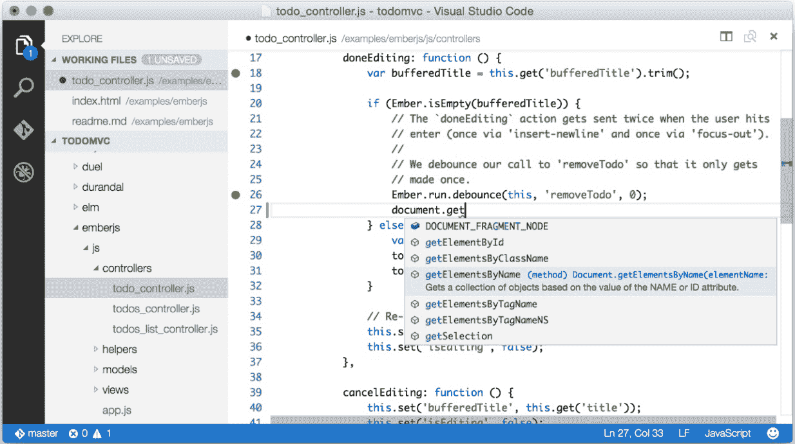
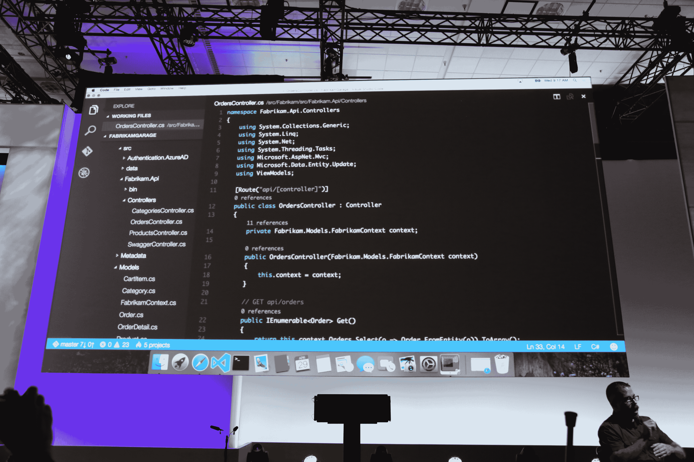
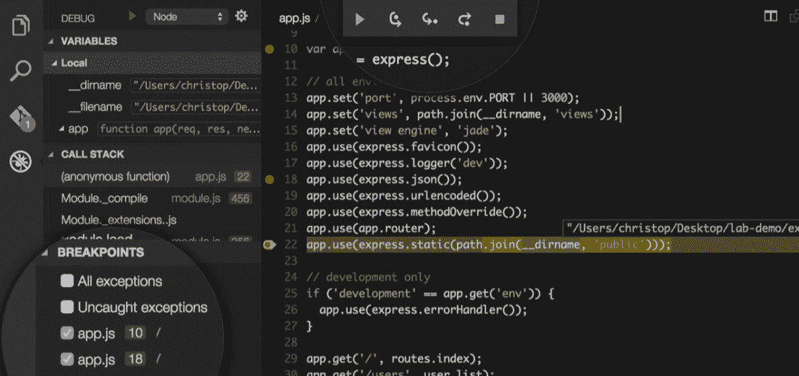

# 微软推出 Visual Studio Code，这是一款免费的跨平台代码编辑器，适用于 OS X、Linux 和 Windows

> 原文：<https://web.archive.org/web/https://techcrunch.com/2015/04/29/microsoft-shocks-the-world-with-visual-studio-code-a-free-code-editor-for-os-x-linux-and-windows/>

# 微软推出 Visual Studio Code，这是一款适用于 OS X、Linux 和 Windows 的免费跨平台代码编辑器

在其 [Build 开发者大会](https://web.archive.org/web/20230301042318/http://www.buildwindows.com/)上，微软今天宣布推出 [Visual Studio Code](https://web.archive.org/web/20230301042318/http://go.microsoft.com/fwlink/?LinkID=533688) ，这是一款轻量级跨平台代码编辑器，用于编写将在 OS X、Linux 和 Windows 上运行的现代网络和云应用。该应用程序仍处于正式预览阶段，但你现在可以在[这里](https://web.archive.org/web/20230301042318/http://go.microsoft.com/fwlink/?LinkID=533688)下载。

这标志着微软首次为开发者提供真正的跨平台代码编辑器。完整的 Visual Studio 仍然只支持 Windows，但今天的声明显示了该公司对支持其他平台的承诺。

“很多人使用 Windows 作为他们的开发环境，但我们也看到很多人使用 Linux 和 Mac，”微软开发部门的副总裁 s .‘Soma’Somasegar 本周早些时候告诉我。“我们不想让他们去窗口，而是希望在他们所在的地方与他们见面。”这些平台上的开发人员通常也非常乐意使用 Sublime Text 这样的常规代码编辑器，而不是 Visual Studio 这样的完整 IDE。

Visual Studio 代码为开发人员提供了对多种语言的内置支持，正如微软在今天的 Build keynote 中指出的那样，编辑器将为所有这些语言提供丰富的代码帮助和导航。JavaScript、TypeScript、Node.js 和 ASP.NET 5 开发者也将获得一套额外的工具。

该编辑器具有现代代码编辑器的所有标准工具，包括语法突出显示、可定制的键盘绑定、括号匹配和代码片段。Somasegar 告诉我，它也可以与 Git 一起使用

正如 Somasegar 告诉我的，新的编辑器部分基于微软为 Visual Studio Online 编写在线 [Monaco 编辑器的经验，但该公司也致力于将 Visual Studio 的一些语言功能引入 Visual Studio 代码。这些包括罗斯林项目，例如，微软的。微软表示，它为 Visual Studio 代码构建的语言服务也将在其他编辑器中提供，包括 Sublime Text、Vi 和 Atom。](https://web.archive.org/web/20230301042318/http://azure.microsoft.com/en-us/documentation/videos/building-web-sites-with-visual-studio-online-monaco/)

这些语言功能中的一些也可供其他编辑使用。例如，不久前，微软为 Sublime Text 推出了一个 [TypeScript 插件](https://web.archive.org/web/20230301042318/https://github.com/Microsoft/TypeScript-Sublime-Plugin)，Somasegar 告诉我，该公司致力于在未来推出类似的项目(毕竟，这都是为了在开发人员所在的地方与他们见面)。

今天的声明肯定会让许多人感到意外。然而，它确实很好地符合该公司的开发团队已经坚持了相当长一段时间的方向，即[开源。NET Core](https://web.archive.org/web/20230301042318/https://techcrunch.com/2014/11/12/microsoft-takes-net-open-source-and-cross-platform/) (跨平台)或者推出免费的 [Visual Studio 社区](https://web.archive.org/web/20230301042318/https://techcrunch.com/2014/11/12/microsoft-makes-visual-studio-free-for-small-teams/)版本。

仅在几年前，今天的声明可能会令人震惊。现在，这更像是一个惊喜。

