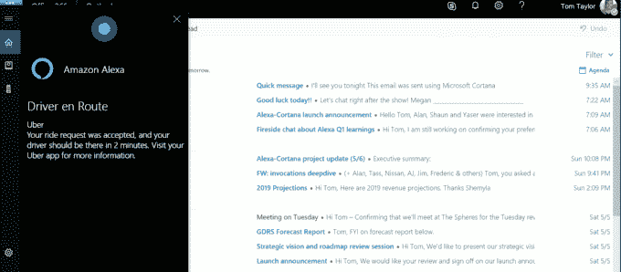

# 微软展示 Alexa-Cortana 集成，推出 news TechCrunch 注册网站

> 原文：<https://web.archive.org/web/https://techcrunch.com/2018/05/07/microsoft-shows-off-alexa-cortana-integration-launches-sign-up-website-for-launch-news/>

微软仍然没有给出其虚拟助手 Cortana 何时支持与亚马逊 Alexa 集成的时间表——这是两家公司去年宣布的事情。但该公司在今天的 Build 开发者大会上展示了这种集成将如何工作，在亚马逊的支持下，它推出了一个新的[网站](https://web.archive.org/web/20221206115827/https://info.microsoft.com/Subscribe-to-receive-news-about-Cortana-Alexa)，供有兴趣接收 Alexa-Cortana 集成新闻和信息的开发者使用。

当微软和亚马逊首次讨论整合他们的虚拟助手时，它被描述为一条双向街道——即 Cortana 可以将请求传回 Alexa，反之亦然。例如，Alexa 客户将能够访问 Cortana 的生产力功能，如预订会议、访问工作日历或阅读工作电子邮件。与此同时，Cortana 用户可以要求 Alexa 控制智能家居设备，在亚马逊购物，或者使用 Alexa 的[大约 40，000 项技能。](https://web.archive.org/web/20221206115827/https://www.techmeme.com/180503/p13)

但是有人担心这些命令会很笨拙，而且像这样的集成也可能是不必要的。

在 Build 上，微软首席执行官塞特亚·纳德拉强调了更加开放的系统的价值，他说:“我们希望让我们的客户能够充分利用他们的个人数字助理，而不是被束缚在某个有围墙的花园里。”

不过，也许微软真正想要的是从 Alexa 的势头中获益。

在一个简短的演示中，微软 Cortana 总经理梅根·桑德斯和亚马逊 Alexa SVP·汤姆·泰勒展示了 Alexa 和 Cortana 如何合作。它看起来并不像你想象的那样笨重。

桑德斯将她的回声扬声器指向“打开 Cortana”，看到数字助理用不同的声音回应道:“Cortana 在这里，我能帮什么忙？”

这种体验似乎更像是启动和使用第三方技能，而不是一系列棘手的口头命令。

然后，她可以向 Cortana 询问她的日历信息，而不必再说“Cortana”或“Alexa”——只需“我今天过得怎么样？”

她告诉 Cortana“给汤姆·泰勒发一封电子邮件，说‘今晚见’”——同样，不需要指名道姓地命令助手。

在 Alexa 到 Cortana 的演示结束后，泰勒展示了相反的情况——从 Cortana 调用 Alexa。

他一边在 PC 上使用 Cortana，一边对微软的助手说:“嘿 Cortana，打开 Alexa。”Alexa 用自己的声音回应道:“你好，我是 Alexa。我能帮什么忙？”

泰勒使用 Alexa 订购了一台使用第三方优步技能的优步，并告诉她关灯。

他还问 Alexa 对 Cortana 的看法，亚马逊的助理用她典型的干酪式幽默回答说:“我喜欢 Cortana。我们都有戴戒指的经验，尽管她的戒指更像是光环。”*哦，哈-哈-哈。*

当然，人们真正想听到的是 Cortana-Alexa 集成何时上线，不幸的是，这方面没有任何消息。

桑德斯提到这种体验目前仍处于“有限的测试阶段”，但他提到了一个面向开发者的新网站的推出。

正在为 Cortana 和 Alexa 开发技能的开发者可以去[这个新网站](https://web.archive.org/web/20221206115827/https://info.microsoft.com/Subscribe-to-receive-news-about-Cortana-Alexa)注册，以便在集成上线时得到通知。

桑德斯说:“对于所有正在培养技能的开发人员来说，Cortana 和 Alexa 将使更多人能够通过更多设备进行访问。“我们迫不及待地想看看你的成果。”

