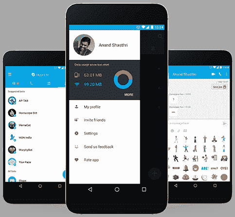

# 微软为印度和其他新兴市场推出 Skype Lite Android 应用程序 

> 原文：<https://web.archive.org/web/https://techcrunch.com/2017/02/21/microsoft-skype-lite/>

# 微软为印度和其他新兴市场推出 Skype Lite Android 应用程序

微软为生活在新兴市场的人们重新设计了 Skype，这是一种商务用户的通讯服务。今天，在印度举行的未来解码活动上，微软揭开了 Skype Lite 的神秘面纱。

这项服务是一款 Android 应用，主要提供核心的视频和语音通话功能，但针对 2G 数据等有限的互联网连接进行了优化。它最初在印度提供，在那里它被本地化为八种语言，并支持阅读和回复短信以及跟踪移动数据使用情况。微软还内置了一系列专注于印度的机器人，以比打开网络浏览器更有效的方式帮助自动化任务和获取内容，如新闻。同样，为了节省潜在的数据使用，通过对话传输的任何照片、视频或其他文件都将被压缩。该应用程序本身只有 13 MB，以帮助节省低端手机上的有限空间，这些手机在印度等新兴市场占据主导地位。

该公司表示，它计划整合印度国家数字身份方案 [Aadhaar](https://web.archive.org/web/20221206234838/https://indiastack.org/aadhaar/) ，从 6 月开始启用某些服务。微软在一篇博客文章中说，这可以“使 Skype 用户能够在各种需要身份验证的情况下验证未知来电者的身份，包括求职面试、商品和财产销售”。

有趣的是，微软指出 Skype Lite 是“在印度为印度用户制造的”，这表明该公司在印度的移动革命上下了很大的赌注。互联网接入在印度的发展速度比地球上任何其他地方都要快，这将带来巨大的社会和经济变化，但它仍处于初级阶段。根据 Counterpoint Research 的数据，[全国 12.5 亿人口中只有 3 亿人拥有智能手机。](https://web.archive.org/web/20221206234838/http://www.counterpointresearch.com/press_release/indiahandset2016q4analysis/)

微软并不是唯一一家进军印度的公司。谷歌已经推出了一系列服务，包括[公共 Wi-Fi 项目](https://web.archive.org/web/20221206234838/https://beta.techcrunch.com/2016/09/27/google-station-free-wifi-hotspots/)、[对](https://web.archive.org/web/20221206234838/https://beta.techcrunch.com/2016/09/27/google-youtube-go-app/)[一系列流行应用](https://web.archive.org/web/20221206234838/https://beta.techcrunch.com/2017/01/17/google-for-android-gets-new-feature-to-deal-with-inconsistent-internet-connections/)的离线支持，以及对其 Allo 和 Duo 消息服务的本地化调整。尽管有这些大牌，脸书在印度仍然处于领先地位——其 WhatsApp 服务声称拥有超过 1.6 亿用户，其核心社交网络在非消息用途上占主导地位，拥有 1.55 亿用户。

撰写本文时 Skype Lite 还不可用，但它今天应该会在印度上线，链接为[此链接](https://web.archive.org/web/20221206234838/https://play.google.com/apps/com.skype.m2)。微软没有提供何时在世界其他地区上市的指引。