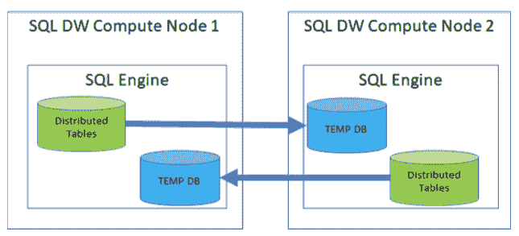

# 微软加速其 Azure SQL 数据仓库 

> 原文：<https://web.archive.org/web/https://techcrunch.com/2018/07/12/microsoft-speeds-up-its-azure-sql-data-warehouse/>

# 微软加速其 Azure SQL 数据仓库

微软的 [Azure SQL 数据仓库](https://web.archive.org/web/20221210060705/https://azure.microsoft.com/en-us/services/sql-data-warehouse/)，该公司为大数据工作负载提供的基于云的数据库服务，今天再次减速。几个月前，该公司通过其第二代计算优化层的全面上市加快了服务速度，今天，由于推出了新的即时数据移动技术，它的查询性能翻了一番。

微软 Azure Data 首席技术官 Raghu Ramakrishnan 告诉我，即时数据移动是该公司数十年来在数据库技术上投资的结果。“鉴于我们现在已经做了几十年的数据管理，我们可以将数据存储和管理结合起来，”他指出并强调 I/O 带宽往往是微软客户使用 SQL 数据仓库的许多分析工作负载的主要瓶颈。在像数据仓库这样的分布式系统中，移动数据成为一个问题——这个问题通常由系统中的另一层来管理。Ramakrishnan 说:“在这些系统中，当你进行简单的标准操作如连接时，如果表还没有很好地按属性组织起来，你就必须按这个或那个排序，所以你必须在网络上快速移动数据。

为了消除这一瓶颈，微软现在已经将数据移动层集成到支持其数据仓库服务的 SQL Server 引擎中。因此，每个 SQL Server 节点现在都可以创建中间结果，并根据需要移动数据。

毫不犹豫地将其服务与竞争对手进行比较，微软还指出，Azure SQL 数据仓库现在可以支持多达 128 个并发查询，而亚马逊 Redshift 目前只能支持 50 个。