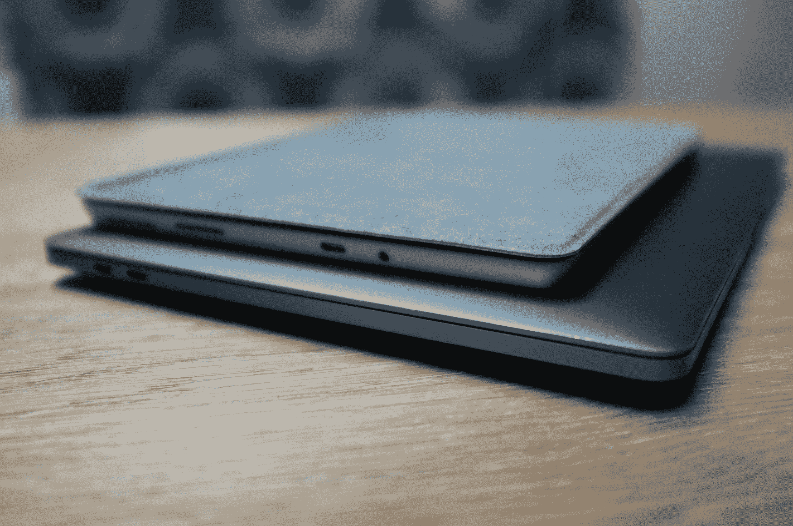
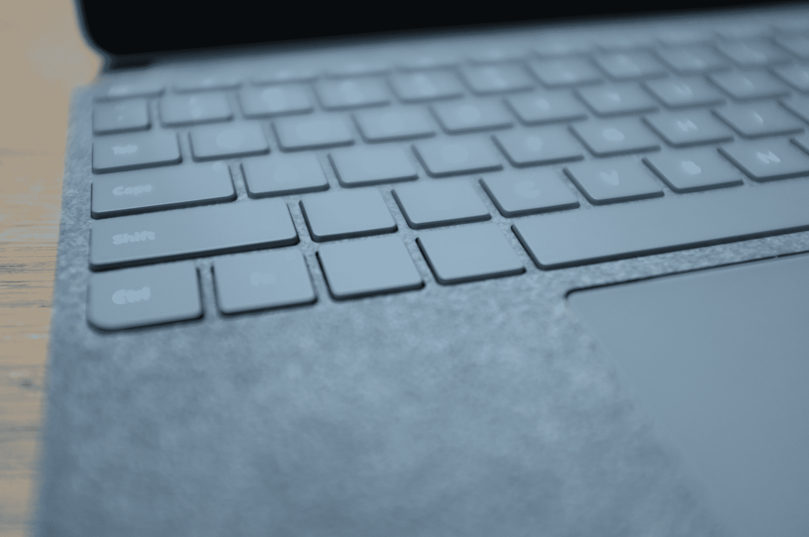
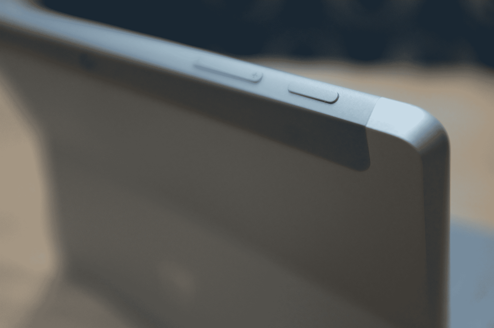
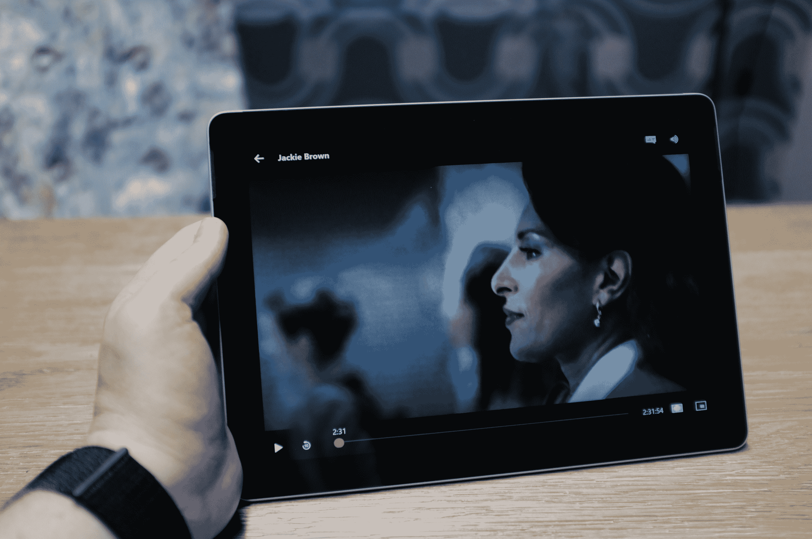
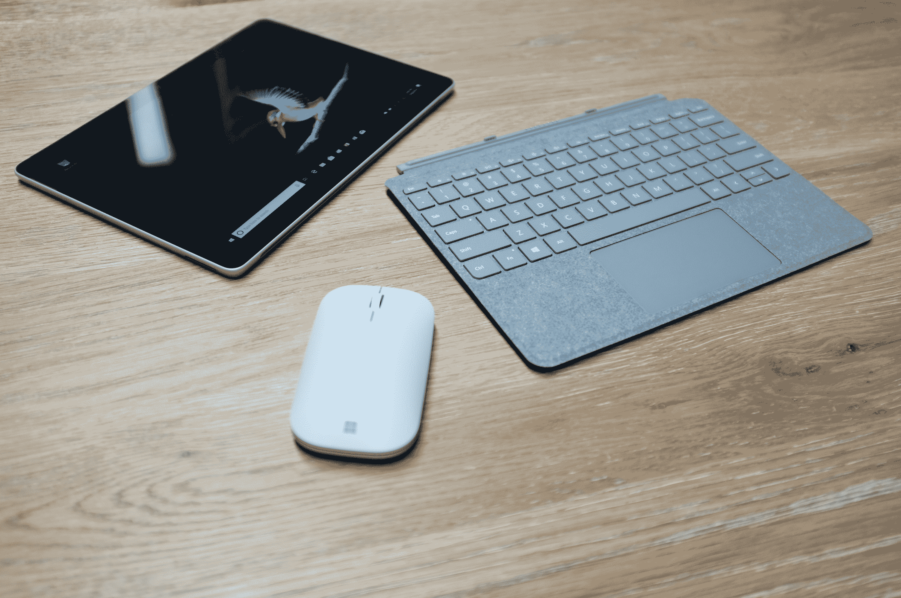

# 微软 Surface Go 评测

> 原文：<https://web.archive.org/web/https://techcrunch.com/2018/08/02/microsoft-surface-go-review/>

这个[表面走](https://web.archive.org/web/20230310023800/https://techcrunch.com/2018/07/09/this-is-microsofts-399-surface-go/)是一件奇怪的事情。不是因为设备本身，而是微软最终是如何实现它的。这款平板电脑是逆向工程产品，是高端 Surface 系列的低端产品。

该公司最终达成的是迄今为止它向 [iPad/iPad Pro](https://web.archive.org/web/20230310023800/https://techcrunch.com/tag/ipad-pro/) 竞争对手提供的最接近的东西。然而，就其本身而言，微软将该产品定位为其他 Surface 设备的便携式低成本替代品。

诚然，这有点品牌混乱，但这从未阻止过微软。简而言之，这基本上是表面线。该公司有资源和基础设施来碰壁，看看有什么坚持下来——在很大程度上，这与 Surface 系列合作得很好，后者已经有效地从概念验证转变为 Windows 旗舰系列。

在很多方面，Surface Go 都是一种奇怪的中间设备。外形基本上是 Surface Pro 的外形，缩小到 10 英寸，圆角。当然，更小的尺寸也带来了一些牺牲，包括双核英特尔奔腾黄金 4415Y，这是对 [Surface Pro](https://web.archive.org/web/20230310023800/https://techcrunch.com/2017/10/31/microsoft-will-launch-a-surface-pro-with-built-in-lte-advanced-in-december/) 上的英特尔酷睿 m3/i5/i7 的显著降级。电池的额定时间为 9 小时，比 iPad Pro 上的电池要小。

端口的情况更接近于你在平板电脑上看到的情况，而不是完整的电脑，只有一个 USB-C，一个耳机插孔和专有的 Surface Connect 端口。鉴于这里的房地产有限(更不用说你可以通过 USB-C 充电)，后一点似乎是一个奇怪的选择，但微软显然对留住现有的 Surface 用户感兴趣，就像它正在转化新的用户一样。这部分意味着要确保该系统与旧配件向后兼容，以满足多个拥有 Surface 的超级用户的需求。

这款键盘要价 400 美元，外加 99 美元。这是这种设备的标准配置，真的。对于制造商来说，这是一种苏菲的选择，当他们制造这种变形时——使用全旋转键盘，像 Pixelbook 一样，或者把它作为一个附件。

后一种决定更适合那些主要用于平板模式的设备，但最终键盘外壳不会提供与专用键盘相同的打字体验。Surface line 长期以来一直是最好的键盘保护套之一，但如果你打算将该产品主要用作文字处理设备，它就不是一个合适的替代品。也就是说，它仍然比试图用触摸屏写故事强多了。

我已经在会议中使用了一点，但仍然发现很难习惯它。按键很软，必然缺乏我在我的全职笔记本电脑上习惯的那种触感。还有一个不争的事实是，这类设备确实从笔记本电脑等式中去掉了“膝上”部分。

微软发布了快乐用户盘腿而坐的照片，设备和键盘温暖地放在他们的腿上。在我最初的简报中，我问一位代表他是否认为这是一个合理的用例。他小心翼翼地试图重现这个姿势——也就是说，这是可能的，但不是特别方便。

你最终会绷紧你的肌肉，这样整个事情就不会分开。在这一领域，三星的 Galaxy Tab S4 T2 拥有竞争优势。似乎做一个键盘套很容易，经过一番碰撞后可以粘在一起——但是，我从来没有尝试过自己做一个。

可爱的织物套一直是该服务系列的标志，在 10 英寸的型号上也有。这一点，再加上多种配套的外设，意味着 Go 可以作为一种非常体面的时尚配件进出手袋。然而，该设备本身有点笨重，这也是 Surface 系列的一个标志。

Windows 10 S 也回来了。被锁定的操作系统当然也受到了批评，但 Windows RT 却没有。使用微软操作系统的缺陷版本有很多影响，但其中最主要的是禁止不是从 Windows 应用商店下载的应用。这使该设备相对于 iPad 处于明显的劣势，iPad 显然拥有约 130 万个专门针对平板电脑外形优化的应用程序。

这些调整是出于安全目的，因此规格较低的系统可以处理工作负载——后者在这里当然有意义。

然而，最重要的是，这一内容暴露了微软对这款设备更广泛的意图。10 S 有两个不同的目标:学生和年纪较大、不太了解的用户，他们不想被完全开放的操作系统的细微差别和要求所困扰。

第一类是这里的 tell。在后 Chromebook 时代，微软一直在努力寻找回归教育的正确途径。就像该公司的许多做法一样，它采取了一切都在厨房水槽的方法，包括从 1000 美元的 Surface 笔记本电脑到 189 美元的第三方设备的新类别。这种方法有很多优点。毕竟，没有两个学校/学生/老师是一样的。当你拥有微软的规模和资源时，为什么不为尽可能广泛的用户群做点什么呢？

在教育领域，Surface Go 代表了一种中间立场。它介于 Chromebook 和成熟的平板电脑之间。像大多数敞篷车一样，它并没有获得完全正确的平衡。但是，没有一种设备能满足所有人的所有需求。然而，价格点肯定会使它对许多教室来说过于昂贵。

对于那些更喜欢 Windows 阵营的学校来说，由于其在课堂以外的更主流用途，当你可以走出去以 189 美元的价格购买一台 Windows 10 S 笔记本电脑时，最终很难证明这种溢价是合理的。毕竟，可转换功能的主要卖点是能够切换到平板电脑模式进行娱乐。现在的孩子已经够让人分心的了，对吧？

然而，Windows 确实为用户提供了 iPad 所没有的切换到桌面模式的能力。苹果的纯移动平板电脑方式是成为完全成熟的笔记本电脑替代品的一大障碍。这正是三星全力以赴开发 S4 标签桌面模式的原因。

Windows 可以做到这两者，这就是为什么这种可转换设备是微软操作系统的最佳选择。该公司多年来也带来了一些不错的新功能，比如 Windows Hello face 登录和一些笔输入功能。微软的磁性笔可以磁性地吸附在设备的侧面，这对我们这些经常放错外设的人来说是个好消息。

当然，微软一直有一些最强的生产力产品。然而，鉴于这里的相对限制，我不认为我会想依赖 Surface Go(或任何其他平板电脑优先的可转换设备)作为我的主要工作设备。另一方面，当你不想随身携带更大的笔记本电脑时，作为会议的补充便携式设备，它肯定有一定的意义。

显而易见，微软为什么要这么做。在停滞不前的平板电脑领域，敞篷车是一个罕见的亮点。这也是 Surface 系列产品给该公司带来惊喜的部分原因。该公司希望硬件的声望将最终推动微软在更主流的平板电脑上取得成功。

归根结底，Surface Go 是一款不错的小设备。400 美元是平板电脑中价格较高的一款，为了保持相对于增强版 Surface Pro 的低价，已经做出了一定的牺牲。与其他 Surface 设备不同的是，Go 不仅仅是为 Windows 10 开创了一个类别，而是简单地为混合产品添加了一个更低成本的便携式替代品。因此，这种产品在市场上遇到了相当多的竞争。首先，宏碁(Acer)和联想(Lenovo)有几款手机价格低于 Go 的要价。

对于 Windows 爱好者来说，寻找更小、更便携、时尚感更好的东西，Go 值得一看。也值得看看周围的竞争。更好的交易应该不难找到。