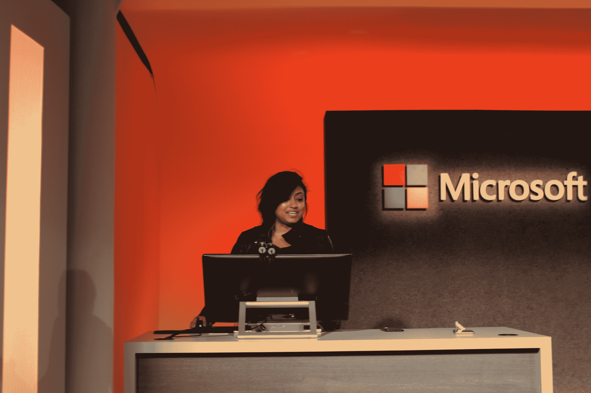
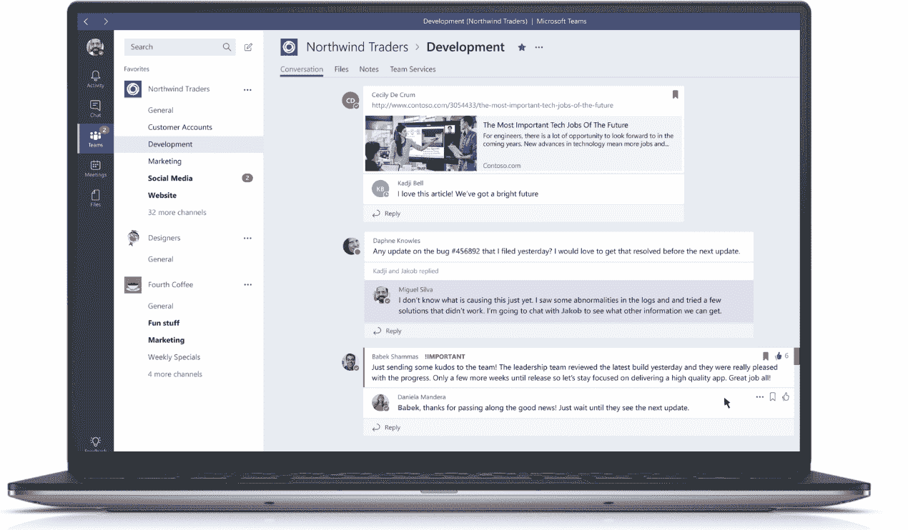
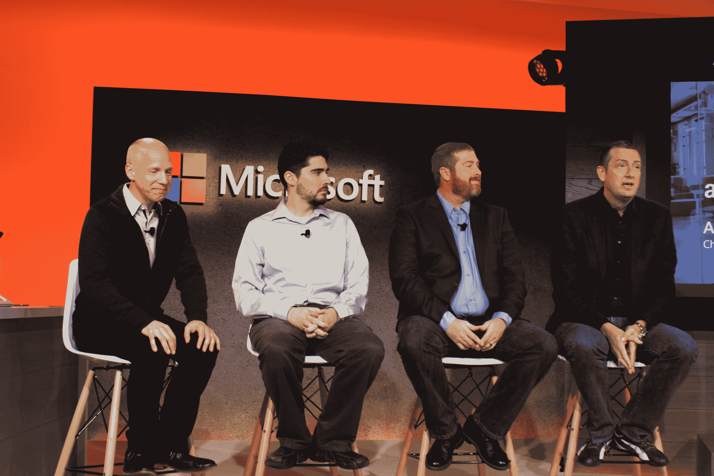
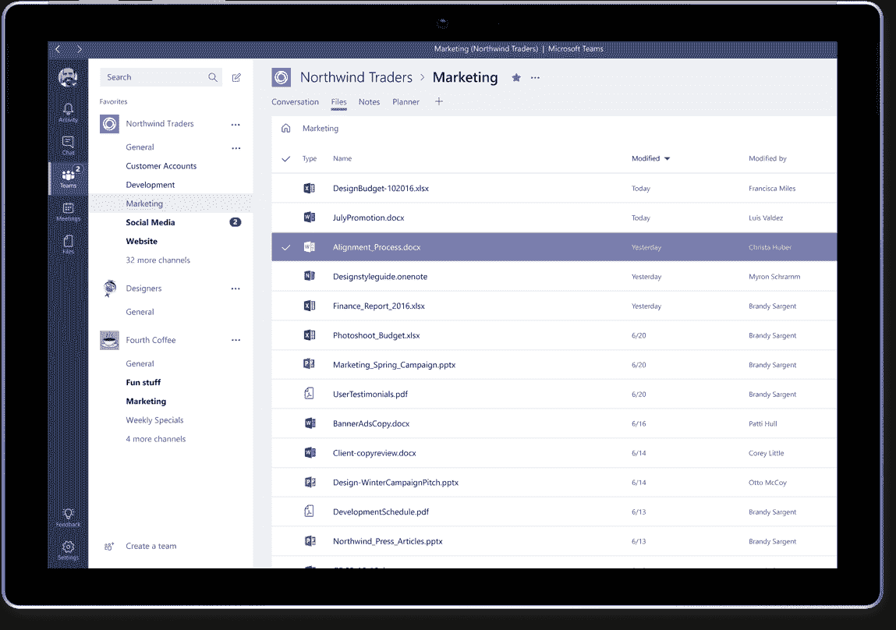

# 微软的 Slack 竞争对手团队今天发布预览

> 原文：<https://web.archive.org/web/https://techcrunch.com/2016/11/02/microsoft-teams/>

对于微软来说，这是一个忙碌的秋天。在举办了一场盛大的 Windows/Surface 派对一周后，这个软件巨头又回到了纽约，带来了最新的新闻。显然，该公司太兴奋了，以至于无法保密其 Office 365 的最新产品，[在活动正式开始前发布了一个发布视频](https://web.archive.org/web/20230321054232/https://techcrunch.com/2016/11/02/microsoft-teams-its-new-slack-rival-is-launching-today-as-part-of-office-365/)。

https://www.youtube.com/watch?v=nKU-FMzZFF0

今天的活动以同样的视频开始，在几个关于感觉“我们上周刚刚在这里”的愚蠢笑话之后。首席执行官塞特亚·纳德拉登上舞台谈论合作，公司称之为“团队的艺术”，列举了从管弦乐队到运动队的不同团队不同的工作方式。

纳德拉将[团队](https://web.archive.org/web/20230321054232/https://blogs.office.com/2016/11/02/introducing-microsoft-teams-the-chat-based-workspace-in-office-365/)描述为“一个基于聊天的工作空间……旨在促进实时协作，同时积累团队的机构知识。”该应用程序旨在将各种工具整合到一个平台上，包括会议、笔记、计划，当然还有聊天。

正如预测的那样，该应用程序具有线程聊天功能，将不同的对话分组在一起，并与 Skype 深度集成，用于内置在应用程序中的语音和视频通话。事实上，该公司已经在应用程序中内置了许多自己的产品，包括 Word、Excel、PowerPoint 和 OneNote。Office 365 群组构成了应用程序的基础，允许用户在不同的应用程序之间共享信息。

定制也是一个重要的方面，让用户通过内置于标签和微软机器人集成的云服务来设计自己的体验。当然，这是一个生产力应用程序，但如果不吸引千禧一代，你就无法与 Slack 这样的公司竞争，因此，该公司正在整合表情符号、贴纸、gif 和定制迷因等东西——然而，最后一点应该选择表现出来。

不同的非聊天功能填充在顶部仪表板的一系列选项卡的顶部，因此用户可以在不同的信息之间切换，无论是 OneNote 中存储的笔记还是 BI 中的图形。这是一种干净的方式，可以将大量不同的信息源整合到一个地方，而不会淹没一个频道。

该公司还展示了一些机器人，包括 T-Bot，这是一个集中的帮助系统，可以抓取信息索引，回答问题。类似地，WhoBot 搜索人，因此用户可以通过询问上下文问题来搜索同事。

微软正在一系列移动平台上推出这款应用，包括 iOS、Android，当然还有 Windows Phone。在演示中，该应用程序的移动版本本质上是桌面版本的缩小版本。

安全性已经内置到桌面和移动产品中，包括数据加密和符合 U 型条款、ISO 27001、SOC 2 和 HIPAA 等标准。“就像我们所有的商业服务一样，”该公司在官方声明中解释说，“我们有一个透明的运营模式，不能长期访问客户数据。”

该应用程序现已在 181 个国家提供预览版。明年第一季度就可以提供给大家了。微软今天也向第三方开发者提供这款应用。

它已经招募了许多高调的平台，包括 Asana，Hootsuite 和 Zendesk。该应用程序还可以设置为接收来自 Twitter 和 GitHub 等服务的通知。