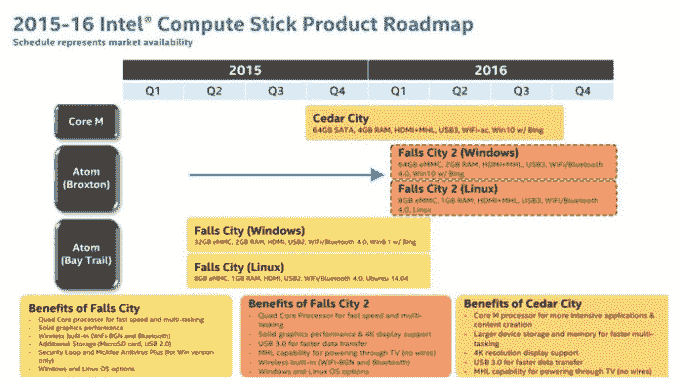

# 微软有望提供低成本、支持 Bing 的 Windows 10 Build 

> 原文：<https://web.archive.org/web/https://techcrunch.com/2015/06/03/microsoft-tipped-to-offer-low-cost-bing-supported-windows-10-build/>

# 微软有望提供低成本、支持必应的 Windows 10 版本

和 Windows 8 一样，[Windows 10](https://web.archive.org/web/20221205064706/http://www.neowin.net/news/windows-10-with-bing-shows-up-on-intels-roadmap)也是如此，至少在微软操作系统的构建依赖 Bing 赚钱的时候是如此。必应作为微软的搜索引擎而闻名，但它也是该公司针对自己的应用程序应用的更大的搜索层。

一张[泄露的据称展示产品路线图的英特尔幻灯片](https://web.archive.org/web/20221205064706/http://liliputing.com/2015/06/intel-compute-stick-roadmap-core-m-and-64gb-model-in-2015-broxton-models-in-2016.html)提到了“Win 10 W/Bing”除非该公司故意让人厌烦，否则这是一个很好的证明,“与 Bing 一起”计划将会持续下去。我已经要求微软对此事发表评论，并就有问题的幻灯片的真实性联系了英特尔。 *( **更新:**两家公司都做了书面上的动作，看着窗外的雨，静静地摇头。)*

去年三月证实的带有 Bing 的 Windows 8.1，对个人电脑制造商来说成本[很低或者为零](https://web.archive.org/web/20221205064706/http://www.windowscentral.com/windows-81-bing-costs-10-oems-10-configuration-discount)。该代码是为售价较低的小型平板电脑和设备设计的。为什么免费卖 Windows？如果微软将 Windows 的常规成本应用于小型电脑，它们在市场上将完全没有竞争力。

因此，如果微软想要在更小外形的硬件中占据市场份额，它必须发布其他产品，例如旨在利用服务而不是预付费用来赚钱的 Windows 版本。我不认为许多人认为 Windows 8.1 和 Bing 是微软 Windows 10 战略的完整序言，但我们现在看到了。

微软计划向许多当前的 Windows 用户提供免费的 Windows 10 升级。既然如此，为什么还要继续“与冰”的计划呢？Windows 10 的免费升级将在某个时间段后停止，微软仍希望为新用户提供一种廉价的方式来获取 Windows 10。在这种情况下,“与必应”的构建似乎是合理的。