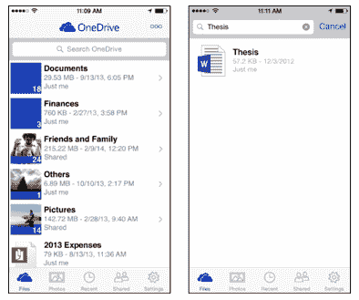
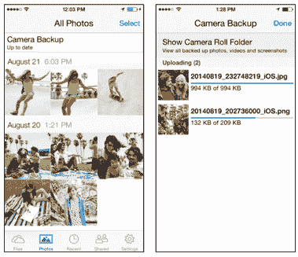
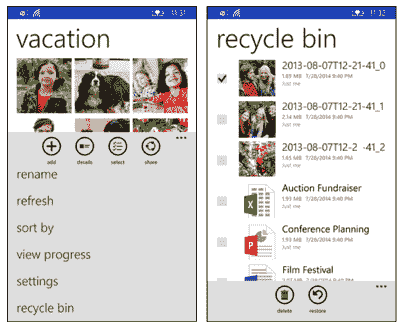

# 微软更新 OneDrive 应用程序，利用业务分区为 Android 专业用户提供服务 

> 原文：<https://web.archive.org/web/https://techcrunch.com/2014/08/28/microsoft-updates-onedrive-apps-makes-play-for-android-prosumers-with-business-partitions/>

微软[更名后的](https://web.archive.org/web/20221006183602/https://beta.techcrunch.com/2014/02/19/microsoft-officially-rebrands-skydrive-to-onedrive/)基于云的存储和文件共享服务 OneDrive 今天发布了其移动应用的更新，这是该公司[将该服务与其他服务区分开来并吸引更多用户的更大努力的一部分。虽然 iOS、Windows Phone 和 Android 应用程序都在获得新功能，但随着 OneDrive for Business 的推出，Android 应用程序是三者中最有趣的。](https://web.archive.org/web/20221006183602/https://beta.techcrunch.com/2014/06/23/microsoft-more-than-doubles-onedrives-free-cloud-storage-to-15-gigabytes/)

在这里，也许所有人都太清楚 KNOX 和其他以 Android 为中心的努力对微软在移动企业市场的地位产生了什么样的影响，微软已经选择 Android 在 OneDrive 上进行大规模集成。针对 prosumer 市场，即介于狂热消费者和高维护业务人员之间的用户群体，它将首次让 OneDrive 用户能够将他们作为个人创建的照片和其他文档汇集在一起，与用户在工作中消费和创建的内容放在一起。

与 Evernote 等公司将 Evernote Business 的文档与用户个人 Evernote 账户的文档放在一起构建的系统没有什么不同，用户可以在以智能手机为中心的生活中查看文件，微软表示，这里的想法是提供一个“全面解决”每个人需求的解决方案。就像微软今天更大的精神——为所有人做所有事情一样，这似乎也是该公司对 OneDrive 发展的看法:它现在面向想要一个有用应用的人，想要高效员工的企业，以及想要安全性和合规性的 it 经理。

这在实践中意味着，用户现在可以看到文件是工作文件还是个人文件，在两者之间设置了一个分区，但可以从同一个应用程序和同一个帐户访问。对于那些寻求特定文档或整个应用程序的进一步安全性的人，您现在也可以将文件设置为密码保护，通过您可以设置的四位数访问代码访问。

OneDrive 的产品经理 Michal Gideoni 不愿评论为什么选择 Android 作为 OneDrive 上个人/工作整合的第一个平台，但她强调，未来它会进入其他平台——它自己的 Windows Phone 和 iOS(目前正在与 IBM 合作移动企业解决方案)。

“这是有史以来第一个统一的应用程序，它碰巧在 Android 上，”她说。“但这只是一个开始，你应该预计 iOS 和 Windows Phone 将在短期内实现这一点。我们致力于跨设备。”

此外，这并不意味着 iOS 和 Windows Phone 受到了亏待。iOS 获得了原生搜索体验，用户可以在 OneDrive 上向下滑动应用程序来查找文件和文件夹。这是对微软的 bing 搜索与苹果和 iOS 在过去的[和现在的](https://web.archive.org/web/20221006183602/https://beta.techcrunch.com/2013/06/10/apple-slips-default-bing-integration-on-ios-7/)中的关系越来越密切的一个提示。

iOS 应用的其他更新包括现在可以以卡片格式浏览 OneDrive 上的照片，OneDrive 已经向其[网络应用](https://web.archive.org/web/20221006183602/https://onedrive.live.com/?qt=allmyphotos)的用户提供了这一功能。

Windows Phone 8.1 用户是微软最忠实的用户，他们似乎在今天的新闻中受到了最大的亏待——他们正在获得“大量错误修复”，现在可以访问他们的 OneDrive 回收站来恢复意外删除的文件。:(

