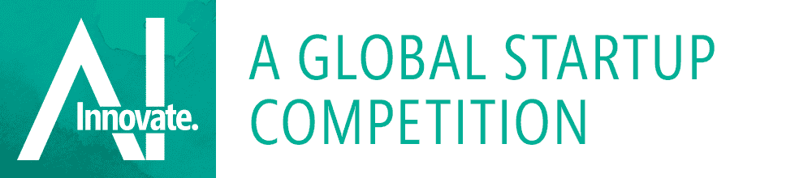

# 微软风险投资公司、Madrona 和其他公司发起 350 万美元的人工智能创业大赛 

> 原文：<https://web.archive.org/web/https://techcrunch.com/2017/10/10/microsoft-ventures-madrona-and-others-launch-3-5m-ai-startup-competition/>

# 微软风险投资公司、Madrona 和其他公司发起了 350 万美元的人工智能创业竞赛

[微软风险投资](https://web.archive.org/web/20230205193348/https://microsoftventures.com/)今天宣布了一项新的[人工智能创业大赛](https://web.archive.org/web/20230205193348/http://microsoftventures.com/innovateai)，获胜者将获得 350 万美元的总奖金。

该公司与 [Madrona Venture Partners](https://web.archive.org/web/20230205193348/http://www.madrona.com/) 、[inconce Capital](https://web.archive.org/web/20230205193348/https://www.notioncapital.com/)和 [Vertex Ventures](https://web.archive.org/web/20230205193348/http://www.vertexventures.com/) 合作举办此次比赛，旨在寻找北美、欧洲和以色列的(非常)早期人工智能初创公司。[创新。AI](https://web.archive.org/web/20230205193348/http://microsoftventures.com/innovateai) 竞赛将为每个地区(北美、欧洲和以色列)的一家初创公司提供 100 万美元的资金，此外还有 50 万美元的“AI for Good”奖金。所有的奖项都有 50 万美元的 Azure 积分(尽管参与的初创公司没有使用 Azure 的预期)。

Peggy Johnson 是微软的业务发展执行副总裁，通过微软风险投资公司监管公司的战略投资。她告诉我们，微软通常投资于后期公司，但微软风险投资现在也让它有能力进行早期投资。该基金的一些以人工智能为中心的投资包括 [Bonsai.ai](https://web.archive.org/web/20230205193348/https://bons.ai/blog/bonsai-industrial-ai-investment) 和 [Element.ai](https://web.archive.org/web/20230205193348/https://techcrunch.com/2016/12/12/microsoft-ventures-launches-new-fund-for-ai-startups-and-backs-element-ai-incubator/) 等，以及微软今年早些时候收购的 [Maluuba](https://web.archive.org/web/20230205193348/https://techcrunch.com/2017/01/13/microsoft-acquires-maluuba-a-startup-focused-on-general-artificial-intelligence/) 。她认为该基金是对微软加速器计划的补充，该公司目前在世界各地的许多城市开展该计划。“在该基金成立之前，我们没有任何途径投资这些公司，”她指出。

因此，对于这个新的竞争，约翰逊告诉我这是 Madrona Ventures 的一个想法，微软及其合作伙伴正在寻找非常早期的创业公司。“比赛背后的想法是，我们希望看到最早阶段的创新者——也许是那些尚未引起任何人注意的人，”约翰逊说。

与类似的比赛一样，微软及其合作伙伴将收集符合条件的初创公司的申请，根据他们的想法和执行潜力进行评判，然后在明年年初举行的[战场般的](https://web.archive.org/web/20230205193348/https://techcrunch.com/startup-battlefield/)决赛中让他们相互竞争(尽管 Madrona 董事总经理 s .“Soma”Somasegar 将其描述为更类似于“美国偶像”)。要符合资格，初创公司不能筹集超过 400 万美元的资金，他们显然需要解决某种人工智能/人工智能相关的问题。

正如约翰逊告诉我的，如果一家公司与微软自己的核心领域保持一致，那么这也是一个很好的早期信号。该团队还在寻找独特的用例，以便将早期投资抛在身后。

值得注意的是，这个比赛不是关于现金奖励。相反，微软及其合作伙伴将投资这些公司。约翰逊告诉我，这里的融资条款与微软风险投资公司的任何其他投资都是一样的。

Innovate.ai 比赛现已开放申请，初创公司可在 12 月 31 日前申请。