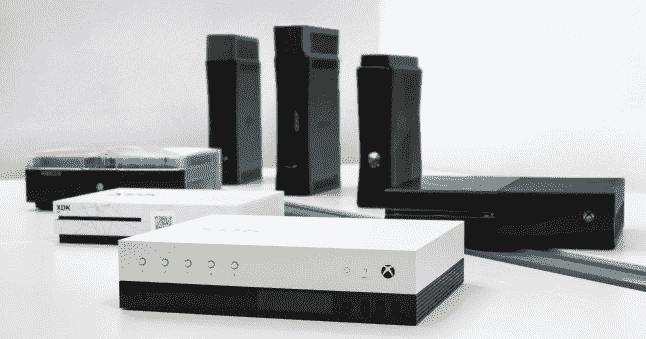

# 微软将于 6 月 11 日在 E3 展示 Project Scorpio Xbox 游戏机细节 

> 原文：<https://web.archive.org/web/https://techcrunch.com/2017/04/13/microsoft-will-reveal-project-scorpio-xbox-console-details-at-e3-on-june-11/>

# 微软将于 6 月 11 日在 E3 展示 Project Scorpio Xbox 游戏机的细节

微软刚刚向媒体成员发出邀请，邀请他们参加 Xbox Project Scorpio 的大型发布会，据该公司称，这款升级版游戏机将成为“第一款真正面向游戏玩家的 4K 游戏机”。我们一直期待 E3 的新闻发布会是天蝎座在消费者中的首次亮相，但微软在周四的一篇博客文章中明确表示，它确实会是这场秀的明星。

E3 新闻发布会将于 6 月 11 日周日下午 2 点(美国东部时间下午 5 点)举行，届时天蝎座将向全世界全面亮相。我们已经看到了很多即将到来的控制台背后的技术细节，这要归功于关于天蝎座的[开发者套件包含什么](https://web.archive.org/web/20221206184707/https://beta.techcrunch.com/2017/04/06/the-xbox-one-scorpio-is-a-six-teraflop-gaming-beast/)的全面报道，以及开发者提供的规格，以便帮助他们为该设备的消费者发布准备软件。

一些让你兴奋的顶级规格——Scorpio 的 GPU 大约是 Xbox One 的 4.5 倍，比 PlayStation 4 Pro 的 1.4 倍。它还将有一个集成的电源模块，所以你只需要隐藏一根细长的电线，它将集成 4K 蓝光播放器。

我们将在 E3 发现最终的消费者控制台是什么样子的，希望什么时候能看到它，以及它的价格。目前，Gamasutra 提供了开发套件硬件的外观，这可能会提供一些关于航运控制台工业设计的线索:

