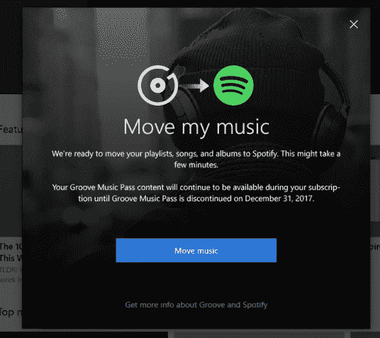

# 微软将很快关闭其音乐商店和流媒体服务，将用户转移到 Spotify 

> 原文：<https://web.archive.org/web/https://techcrunch.com/2017/10/02/microsoft-will-soon-shutter-its-music-store-and-streaming-service-move-users-to-spotify/>

你不能责怪微软的尝试，但它的竞争对手 Spotify 的 Groove Music 从未成功。今天，该公司承认失败。微软今天宣布，将很快关闭 Groove Music Pass 流媒体服务以及在 Windows 商店购买歌曲和专辑的功能。

考虑到 Spotify 和苹果(Apple)等竞争对手目前拥有流媒体和在线购买音乐的市场，这一举动并不令人意外。然而，令人惊讶的是，微软已经与 Spotify 合作，将其所有 Groove Music Pass 客户转移到 Spotify。

 从 12 月 31 日开始，Groove 音乐应用将失去流媒体、购买和下载音乐的功能。微软承诺，向 Spotify 的转移将非常无缝，Groove 用户多年来创建的几乎所有歌曲和播放列表都将转移到这项新服务。

Windows 内部人员将能够在下一次更新中测试这一点，下一次更新计划于下周推出。不过，用户至少可以在 2018 年 1 月 31 日之前完成迁移。

在很大程度上，Spotify 提供了 Groove 音乐目录的超集，因此除了少数例外情况，没有理由认为转移到 Spotify 会给 Groove Music Pass 客户带来巨大损失。因为 Spotify 也可以在 Windows Phone 上使用，即使是微软失败的移动平台上的少数用户也不会错过。

至于 Groove Music 本身，微软表示，实际的应用程序不会很快消失。它仍可用于播放和管理本地存储的音乐。

微软不太可能站出来直截了当地说，它未能在这个领域占据任何相关的市场份额，但这一举动几乎是一个明确的承认。9.99 美元的 Groove Music Pass 订阅从未提供任何功能来将其与 Spotify、iTunes 和类似服务区分开来。公平地说，这是一个完全胜任的音乐流媒体服务，但没有什么特别之处。

值得注意的是，Windows Store 还提供游戏、视频内容和书籍。在这方面，微软也面临着强大的竞争对手，从 Steam(至少在个人电脑游戏方面)到网飞和亚马逊。虽然听起来我们不应该期望在这些领域有类似的“合作关系”，但这是有意义的，因为游戏和视频内容在 Xbox 生态系统中也扮演着重要角色。至于书，我无法想象微软在这方面赚了很多钱，或者提供电子书商店给了它很大的优势。