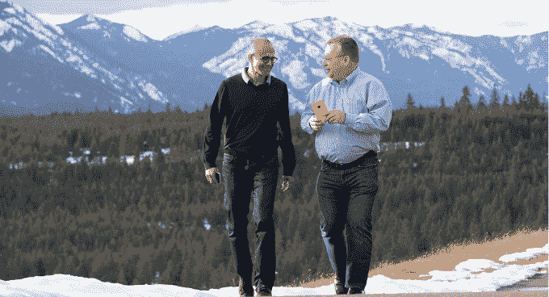

# 微软以 72 亿美元收购诺基亚设备业务的交易现已完成

> 原文：<https://web.archive.org/web/https://techcrunch.com/2014/04/25/microsofts-7-2bn-acquisition-of-nokias-devices-business-is-now-complete/>

微软以 72 亿美元收购诺基亚设备和服务业务的交易已经完成。诺基亚在一份新闻稿中确认了交易的完成，指出它已经“完成了向微软出售几乎所有的设备服务业务”(使用了它在整个过程中使用的措辞)。

诺基亚表示，预计最终价格将“略高于”去年 9 月[宣布该交易时€给出的最初数字 54.4 亿，原因是该交易“可能会调整购买价格”:](https://web.archive.org/web/20230405010410/https://techcrunch.com/2013/09/02/microsoft-enters-into-7-1b-deal-to-buy-nokias-devices-and-services-business-and-license-key-patents/)

> 对净营运资本和现金收益所做调整的估计对诺基亚而言略显积极，我们目前预计，在根据经核实的期末资产负债表进行最终调整后，总交易价格将略高于之前宣布的 54.4 亿欧元的交易价格。

另一项调整是条款，诺基亚在印度钦奈和韩国马山的制造工厂不会转移到微软。诺基亚在印度一直面临持续的税务诉讼，这可能阻碍了这笔交易——因此有了变通办法，诺基亚指出，它已与微软达成服务协议，为微软生产移动设备。(有点讽刺的是，从技术上来说，诺基亚并没有完全退出手机制造业。)

新闻稿指出，韩国工厂将被诺基亚关闭，失去 200 个工作岗位。但诺基亚表示，它计划将其“桥梁计划”的“元素”扩展到钦奈和马桑的员工，该计划在其他地方为离开公司创办自己的企业的员工提供支持。

> 由于我们在钦奈的员工面临不确定性，并且我们在马山的工厂计划关闭，诺基亚计划提供一项支持计划，包括财政援助，让我们的员工有机会从良好的财政基础出发探索诺基亚以外的机会。该公司计划将其桥梁计划的元素带到钦奈和马桑，我们已经为其他工厂受公司变化影响的员工提供了该计划。

监管机构的阻挠(可能还有正在进行的与印度工厂相关的税务事件)导致交易的完成被略微推迟。两家公司最初表示，他们预计交易将在 Q1 完成，但上个月[将这一时间框架提前到了 4 月，称他们仍在某些市场等待批准。](https://web.archive.org/web/20230405010410/https://techcrunch.com/2014/03/23/microsoft-and-nokia-now-expect-their-massive-7-2b-deal-to-close-in-april/)

本月早些时候，这笔交易在中国[获得了批准](https://web.archive.org/web/20230405010410/https://techcrunch.com/2014/04/08/nokia-soft-china-approval/)，尽管中国商务部确实对微软的专利许可行为可能会在收购后改变有些担忧。并要求该公司同意一系列与专利相关的承诺以获得批准。

今天[微软公司负责诺基亚整合的副总裁汤姆·吉本斯在一份声明中评论交易的完成时说，这将带来的好处是两个实体之间更密切的关系——自 2011 年宣布“战略合作伙伴关系”以来，他们当然一直在公开合作开发 Windows 手机——和更高的效率。](https://web.archive.org/web/20230405010410/http://www.microsoft.com/en-us/news/features/2014/apr14/04-25nokia.aspx)

吉本斯补充说:“客户应该看到一系列出色的端到端体验，这些体验真正让他们能够为他们想要完成的事情提供非常愉快、非常全面的解决方案，无论你谈论的是智能手机还是功能手机。”。“微软的功能手机产品家族将开始在这些手机上提供更多的微软服务。”

具体来说，微软将其获得的信息总结如下:

> 随着交易的完成，微软收购了诺基亚的智能手机和移动电话业务，其设计团队，其大部分制造和组装设施和运营，以及销售和营销支持……此次收购还为微软带来了供应链、分销、运营流程和系统方面的关键能力以及管理硬件利润的技能。合并后的公司将受益于更快的执行速度和一流的业务运营。

看看微软如何处理基于 Android 开源项目的诺基亚 X 系列智能手机将会很有趣，它位于诺基亚的功能手机和全尺寸的 Windows Phone Lumia 设备之间。

吉本斯关于在“功能手机”上推广微软服务的评论在微软如何处理诺基亚 X 设备的问题上是不透明的——以及新首席执行官塞特亚·纳德拉(下图是与前诺基亚首席执行官史蒂芬·埃洛普的合影，他现在已经回到了雷德蒙的怀抱)是否愿意给诺基亚的“Lumia feeder”战略一些喘息的空间(或者不)。

