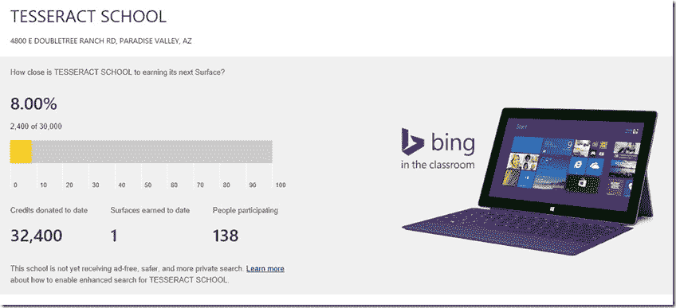

# 微软无广告的“Bing In The Classroom”计划退出测试，向美国所有学校开放 

> 原文：<https://web.archive.org/web/http://techcrunch.com/2014/04/23/microsofts-ad-free-bing-in-the-classroom-program-exits-beta-opens-to-all-u-s-schools/>

# 微软的无广告“Bing In The Classroom”项目退出测试，向美国所有学校开放

一年前，微软[推出了其无广告的“](https://web.archive.org/web/20230129095014/http://www.bing.com/blogs/site_blogs/b/search/archive/2013/06/24/bing-for-schools.aspx) [Bing For Schools](https://web.archive.org/web/20230129095014/http://www.bing.com/classroom) ”计划的测试版，该计划承诺为 K-12 学生提供无广告的搜索体验，增加了内容过滤器、隐私保护和一些专门的学习功能，以提高数字素养。今天，它将这个项目——现在被称为“课堂上的必应”——退出测试。据此，该计划现已向美国所有 K-12 学校开放。

微软表示，该计划此前吸引了美国五大地区的学校，目前约有 450 万学生在使用该计划。微软说，它总共提供了大约 3500 万次无广告查询。考虑到这个项目中有 450 万学生，每个学生只有不到 8 次查询——考虑到大多数人每天可能会进行 8 次以上的谷歌搜索，这个数字并不算很高。然而，微软告诉我，在今天的发布之前，这个程序每天都在以超过一百万的查询量增长。

除了名称更改之外，今天的发布还包括对该计划的许多更新。例如，Bing 现在将为教师和家长提供一套新的每日数字素养课程计划。迄今为止，该团队已经制作了大约 500 份免费教案。

作为这项计划的一部分，社区和家长也可以将他们的 Bing 奖励捐赠给学校，让他们购买 Surface 平板电脑。到目前为止，人们已经向 8K 所不同的学校捐赠了大约 200 万 Bing 奖励积分。也就是每所学校 250 个学分(假设它们是平均分配的，但很可能不是)。获得一个免费的 Surface 需要 30，000 个积分，因此，到目前为止，微软似乎已经送出了多达 66 个 Surface。

毫无疑问，像这样的程序背后的想法是让学生尽早习惯使用 Bing。毕竟，微软痛苦地意识到，对大多数人来说，网络搜索就是谷歌的代名词。