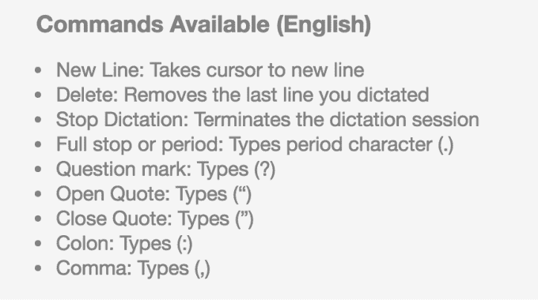
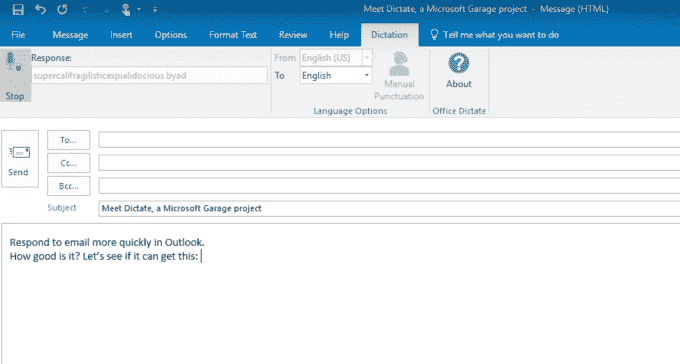

# 微软的听写使用 Cortana 的语音识别功能来实现 Office TechCrunch 中的听写

> 原文：<https://web.archive.org/web/https://techcrunch.com/2017/06/20/microsofts-dictate-uses-cortanas-speech-recognition-to-enable-dictation-in-office/>

微软实验研发小组 Microsoft Garage 的一个新项目“听写”今天发布，它提供了一种在包括 Outlook、Word 和 PowerPoint 在内的办公程序中使用语音打字的方式。作为微软软件的一个插件，Dictate 采用了与 Cortana 相同的语音识别技术，用于将语音转换为文本。

这也是微软认知服务中使用的相同的语音识别和人工智能，包括微软翻译，该公司在关于新插件的[公告](https://web.archive.org/web/20221206135704/https://blogs.microsoft.com/firehose/2017/06/20/type-with-your-voice-using-dictate-a-new-microsoft-garage-project/#sm.00001tiqpp7becel3xaz4k2m7mw9y)中说。

微软指出，Dictate 的想法来自于一个黑客马拉松项目，后来被来自 40 个国家的 1500 多名员工在微软内部使用。

该插件在某种程度上与其他解决方案相竞争，例如 Nuance 的[对 Office 365 或 Office 365 Online 中听写的支持](https://web.archive.org/web/20221206135704/http://nuance.custhelp.com/app/answers/detail/a_id/15132/kw/microsoft%20office)，甚至是内置的操作系统级听写支持，这已经是 Windows[和 Mac](https://web.archive.org/web/20221206135704/https://support.microsoft.com/en-us/help/14198/windows-7-dictate-text-using-speech-recognition)[操作系统中的一项功能。](https://web.archive.org/web/20221206135704/https://support.apple.com/en-us/HT202584)

与此同时，口授只在办公室有效。但是，它支持许多命令，如“换行”、“停止听写”和“回车”，以及其他标点符号和动作。您也可以选择手动插入标点符号，或者让软件在您说话时自动插入。

今天早上发布到 YouTube 的一个介绍性视频提供了该软件如何在 Word、PowerPoint 和 Outlook 中工作的预览。

安装插件后，生产力应用程序的工具栏中会出现一个新菜单，允许您单击开始听写。在演示中，显示了听写处理无意义的单词“supercalifragilisticepialidocious”，以及在简单的电子邮件中输入文本。

它还支持 20 多种语言的听写，并能实时翻译成 60 种语言。这也许是它最聪明的一招，因为这意味着你可以用你的语言说话，而听写用另一种语言打字。(然而，这在多大程度上适用于更长的句子和复杂的单词组合还有待观察。)

[https://web.archive.org/web/20221206135704if_/https://www.youtube.com/embed/AKs-cIfGCQc?feature=oembed](https://web.archive.org/web/20221206135704if_/https://www.youtube.com/embed/AKs-cIfGCQc?feature=oembed)

视频

该外接程序适用于 32 位和 64 位 Office，并且要求用户使用 Windows 8.1 或更高版本、Office 2013 或更高版本以及。Net framework 4.5.0 或更高版本。

因为这是一个车库项目，它可能会也可能不会进一步发展。(车库项目不是官方支持的产品，而是实验。)这个应用程序是免费下载的[在这里](https://web.archive.org/web/20221206135704/http://dictate.ms/)。