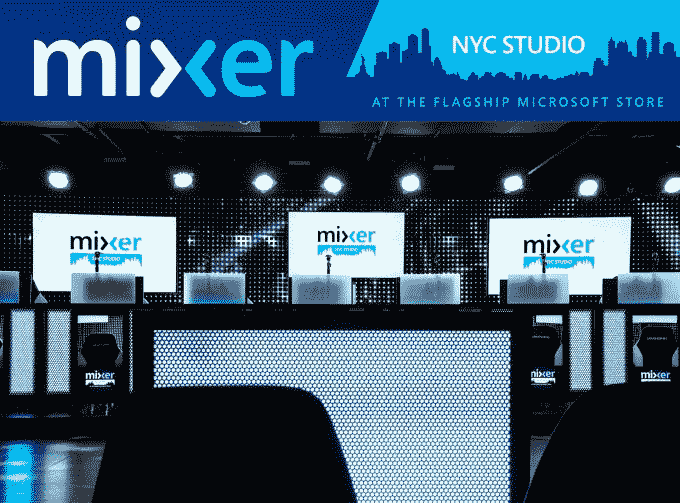

# 微软的游戏流媒体服务 Beam 更名为 Mixer，增加了 co-streaming、指南和移动广播 

> 原文：<https://web.archive.org/web/https://techcrunch.com/2017/05/25/microsofts-game-streaming-service-beam-rebrands-as-mixer-adds-co-streaming-a-guide-mobile-broadcasting/>

微软的直播服务 Beam 于去年被收购，不久前[在 TechCrunch Disrupt 初创公司战场上胜出](https://web.archive.org/web/20221206211819/https://beta.techcrunch.com/2016/05/11/beam-wins-techcrunch-disrupt-ny-2016/)，今天它有了一个新名字:Mixer。这个名字意在表达这项服务将人们聚集在一起的方式，[团队解释道，](https://web.archive.org/web/20221206211819/https://blog.mixer.com/welcome/)但事实证明，这并不是今天推出的唯一变化。Mixer 还推出了新功能，包括 co-streaming，一款适用于 iOS 和 Android 的移动广播应用程序，一款用于查找其服务中当前流媒体内容的新指南，等等。

随着 co-streaming 的推出，Mixer 现在允许最多四个流媒体将它们的流合并到一个页面中，在一个分屏视图中显示。这使得观众可以同时观看所有的流，同时还可以参与集中聊天。博客[帖子](https://web.archive.org/web/20221206211819/https://blog.mixer.com/welcome/)提到，虽然这项功能可以用来广播《英雄联盟》的合作会议，但它不一定要用来播放相同的内容。

[https://web.archive.org/web/20221206211819if_/https://www.youtube.com/embed/NJwnLdAfl3o?feature=oembed](https://web.archive.org/web/20221206211819if_/https://www.youtube.com/embed/NJwnLdAfl3o?feature=oembed)

视频

朋友们可以玩不同的游戏，甚至可以播放一些与游戏无关的内容，比如乐队的音乐或多人棋盘游戏。

最近几个月，竞争对手 Twitch 也在专注于利用直播平台进行游戏之外的活动。这家亚马逊(Amazon)旗下的公司增加了新的创意内容频道、vlogging 工具，以及让观众找到与非游戏兴趣相关的流媒体的方式，以此扩大其用户群，使其超越铁杆游戏玩家。

这种共同流功能今天向所有 Mixer 用户推出，几周后，Xbox One 用户将能够邀请朋友直接从指南中共同流。

Mixer 还推出了一款名为 Mixer Create into beta 的新手机应用。该应用程序可以在 iOS 和 Android 设备上运行，目前允许你进行自我广播。很快，该应用程序将允许直接从智能手机向 Mixer 服务传输移动游戏。当此功能启动时，您还可以与在 PC、控制台或移动设备上进行广播的朋友进行同步播放。

“频道一”也是新的，它是一个关于 Mixer 服务的指南。这旨在通过突出显示新发布的内容、直播活动、提示和技巧、电子竞技更新和其他内容，帮助观众找到可看的内容。该功能还可以作为新用户的入门指南，这些新用户可能不知道从哪里开始使用该服务，因为有一系列可供观看的内容。

Xbox One 仪表板也将添加一个混音器页面，这将是探索服务中流行内容的另一种方式。

虽然微软尚未披露 Mixer 的数字，但很明显该公司在为用户带来跨平台直播体验方面投入了大量资金。Mixer(当时叫 Beam)通过今年早些时候的 Creators 更新来到 Windows 10 平台[，](https://web.archive.org/web/20221206211819/https://beta.techcrunch.com/2017/03/29/microsofts-windows-10-creators-update-will-launch-april-11/)和[同时冲击 Xbox One](https://web.archive.org/web/20221206211819/https://beta.techcrunch.com/2017/03/29/xbox-one-gets-beam-streaming-a-new-guide-and-more-starting-today/) 。

由于增加了对共同流媒体和直播的支持，微软也在准备一个平台，该平台可以扩展到游戏之外，为流媒体提供一种向观众直播任何内容的方式，包括他们自己的 vlogs。

除了所有这些更新，Mixer 还在纽约的微软商店宣布了一个新的数字制作工作室，称为 [Mixer NYC Studio](https://web.archive.org/web/20221206211819/http://www.mixer.com/MicrosoftStore) 。

这个想法是，该工作室将提供广播设施，并主办游戏和电子竞技活动，这些活动将通过 Mixer 服务向观众直播。利用实体零售店举办展示公司技术的真实世界活动也是苹果正在做的事情，最近扩展了以艺术家、摄影师和音乐家为特色的[教育节目](https://web.archive.org/web/20221206211819/https://beta.techcrunch.com/2017/05/16/apple-launches-a-new-website-for-its-expanded-set-of-educational-classes-now-open-for-sign-ups/)。

Mixer 表示，该工作室支持 2D 和 3D 图形效果，这是一个数字音频系统，可以带来舞台、音乐会音质、全互动照明控制、LED 视频墙、shoutcaster 桌子和玩家休息室，以及舞台、观众和评论设置。

*更新，2017 年 6 月 1 日:微软出面纠正其早先的声明，并澄清该移动应用程序目前仅通过 TestFlight 在 iOS 上可用，而不是在公共应用程序商店中。测试版在 Android 上公开发布，公开版本将在未来几周内在 iOS 和 Android 两个平台上发布。*